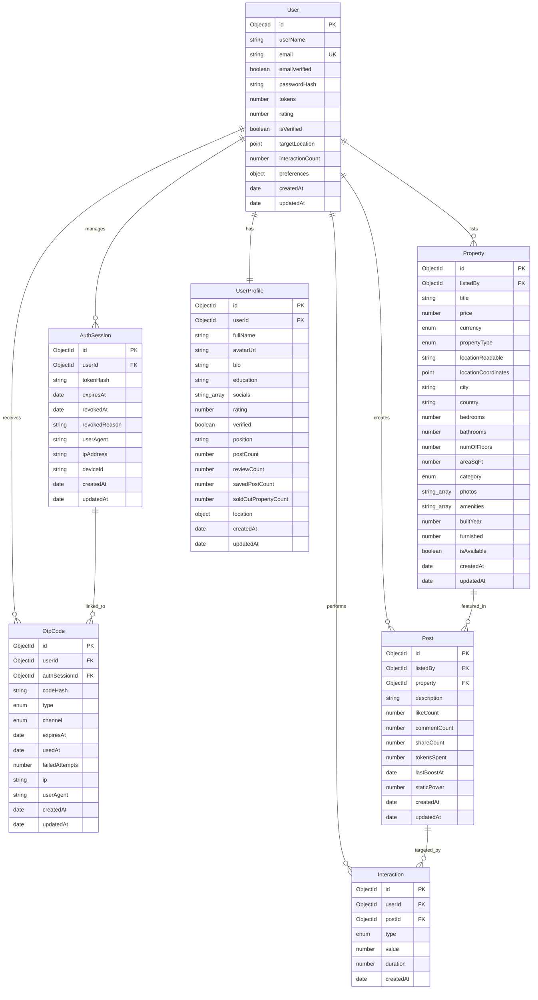

# Database ERD

The following diagram illustrates the relationships between the Mongoose models in the Home4You ecosystem.

```mermaid
erDiagram
    User ||--o{ AuthSession : "manages"
    User ||--o{ OtpCode : "receives"
    User ||--o{ Property : "lists"
    User ||--o{ Post : "creates"
    User ||--|| UserProfile : "has"
    User ||--o{ Interaction : "performs"
    
    Property ||--o{ Post : "featured_in"
    AuthSession ||--o{ OtpCode : "linked_to"
    Post ||--o{ Interaction : "targeted_by"

    User {
        ObjectId id PK
        string userName
        string email UK
        boolean emailVerified
        string passwordHash
        number tokens
        number rating
        boolean isVerified
        point targetLocation
        number interactionCount
        object preferences
        date createdAt
        date updatedAt
    }

    UserProfile {
        ObjectId id PK
        ObjectId userId FK
        string fullName
        string avatarUrl
        string bio
        string education
        string_array socials
        number rating
        boolean verified
        string position
        number postCount
        number reviewCount
        number savedPostCount
        number soldOutPropertyCount
        object location
        date createdAt
        date updatedAt
    }

    AuthSession {
        ObjectId id PK
        ObjectId userId FK
        string tokenHash
        date expiresAt
        date revokedAt
        string revokedReason
        string userAgent
        string ipAddress
        string deviceId
        date createdAt
        date updatedAt
    }

    OtpCode {
        ObjectId id PK
        ObjectId userId FK
        ObjectId authSessionId FK
        string codeHash
        enum type
        enum channel
        date expiresAt
        date usedAt
        number failedAttempts
        string ip
        string userAgent
        date createdAt
        date updatedAt
    }

    Property {
        ObjectId id PK
        ObjectId listedBy FK
        string title
        number price
        enum currency
        enum propertyType
        string locationReadable
        point locationCoordinates
        string city
        string country
        number bedrooms
        number bathrooms
        number numOfFloors
        number areaSqFt
        enum category
        string_array photos
        string_array amenities
        number builtYear
        number furnished
        boolean isAvailable
        date createdAt
        date updatedAt
    }

    Post {
        ObjectId id PK
        ObjectId listedBy FK
        ObjectId property FK
        string description
        number likeCount
        number commentCount
        number shareCount
        number tokensSpent
        date lastBoostAt
        number staticPower
        date createdAt
        date updatedAt
    }

    Interaction {
        ObjectId id PK
        ObjectId userId FK
        ObjectId postId FK
        enum type
        number value
        number duration
        date createdAt
    }
```
