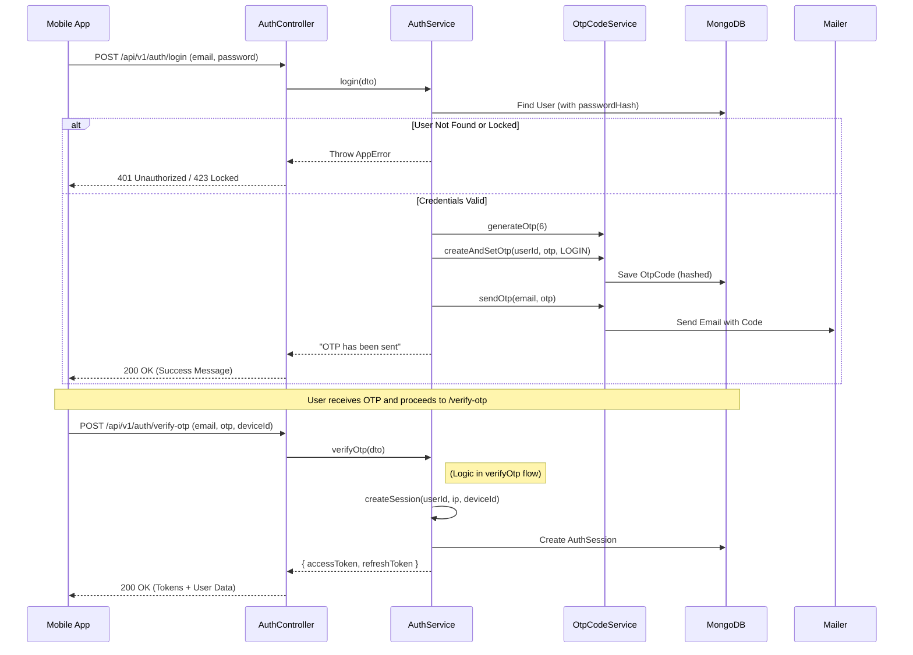

# Authentication: User Login Flow

This diagram illustrates the two-step login flow (Credentials -> OTP -> Session).

```mermaid
sequenceDiagram
    participant App as Mobile App
    participant Ctrl as AuthController
    participant Svc as AuthService
    participant OTP as OtpCodeService
    participant DB as MongoDB
    participant Mail as Mailer

    App->>Ctrl: POST /api/v1/auth/login (email, password)
    Ctrl->>Svc: login(dto)

    Svc->>DB: Find User (with passwordHash)

    alt User Not Found or Locked
        Svc-->>Ctrl: Throw AppError
        Ctrl-->>App: 401 Unauthorized / 423 Locked
    else Credentials Valid
        Svc->>OTP: generateOtp(6)
        Svc->>OTP: createAndSetOtp(userId, otp, LOGIN)
        OTP->>DB: Save OtpCode (hashed)
        Svc->>OTP: sendOtp(email, otp)
        OTP->>Mail: Send Email with Code
        Svc-->>Ctrl: "OTP has been sent"
        Ctrl-->>App: 200 OK (Success Message)
    end

    Note over App, DB: User receives OTP and proceeds to /verify-otp

    App->>Ctrl: POST /api/v1/auth/verify-otp (email, otp, deviceId)
    Ctrl->>Svc: verifyOtp(dto)
    Note right of Svc: (Logic in verifyOtp flow)
    Svc->>Svc: createSession(userId, ip, deviceId)
    Svc->>DB: Create AuthSession
    Svc-->>Ctrl: { accessToken, refreshToken }
    Ctrl-->>App: 200 OK (Tokens + User Data)
```
