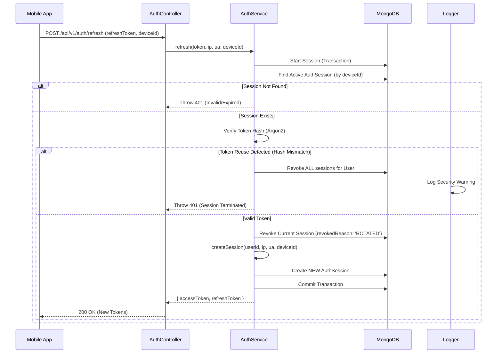

# Authentication: Token Refresh Flow

This diagram illustrates the secure refresh token rotation mechanism.

```mermaid
sequenceDiagram
    participant App as Mobile App
    participant Ctrl as AuthController
    participant Svc as AuthService
    participant DB as MongoDB
    participant Log as Logger

    App->>Ctrl: POST /api/v1/auth/refresh (refreshToken, deviceId)
    Ctrl->>Svc: refresh(token, ip, ua, deviceId)

    Svc->>DB: Start Session (Transaction)
    Svc->>DB: Find Active AuthSession (by deviceId)

    alt Session Not Found
        Svc-->>Ctrl: Throw 401 (Invalid/Expired)
    else Session Exists
        Svc->>Svc: Verify Token Hash (Argon2)

        alt Token Reuse Detected (Hash Mismatch)
            Svc->>DB: Revoke ALL sessions for User
            Log->>Log: Log Security Warning
            Svc-->>Ctrl: Throw 401 (Session Terminated)
        else Valid Token
            Svc->>DB: Revoke Current Session (revokedReason: 'ROTATED')
            Svc->>Svc: createSession(userId, ip, ua, deviceId)
            Svc->>DB: Create NEW AuthSession
            Svc->>DB: Commit Transaction
            Svc-->>Ctrl: { accessToken, refreshToken }
            Ctrl-->>App: 200 OK (New Tokens)
        end
    end
```
