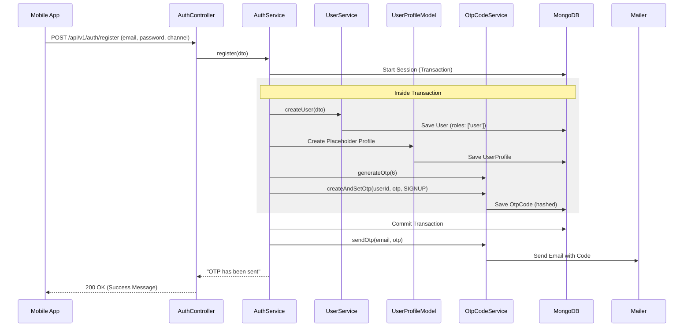

# Authentication: User Registration Flow

This diagram illustrates the flow when a new user registers via Email.

```mermaid
sequenceDiagram
    participant App as Mobile App
    participant Ctrl as AuthController
    participant Svc as AuthService
    participant UserSvc as UserService
    participant Profile as UserProfileModel
    participant OTP as OtpCodeService
    participant DB as MongoDB
    participant Mail as Mailer

    App->>Ctrl: POST /api/v1/auth/register (email, password, channel)
    Ctrl->>Svc: register(dto)
    
    Svc->>DB: Start Session (Transaction)
    
    rect rgb(240, 240, 240)
    Note over Svc, DB: Inside Transaction
    Svc->>UserSvc: createUser(dto)
    UserSvc->>DB: Save User (roles: ['user'])
    Svc->>Profile: Create Placeholder Profile
    Profile->>DB: Save UserProfile
    Svc->>OTP: generateOtp(6)
    Svc->>OTP: createAndSetOtp(userId, otp, SIGNUP)
    OTP->>DB: Save OtpCode (hashed)
    end
    
    Svc->>DB: Commit Transaction
    
    Svc->>OTP: sendOtp(email, otp)
    OTP->>Mail: Send Email with Code
    
    Svc-->>Ctrl: "OTP has been sent"
    Ctrl-->>App: 200 OK (Success Message)
```
