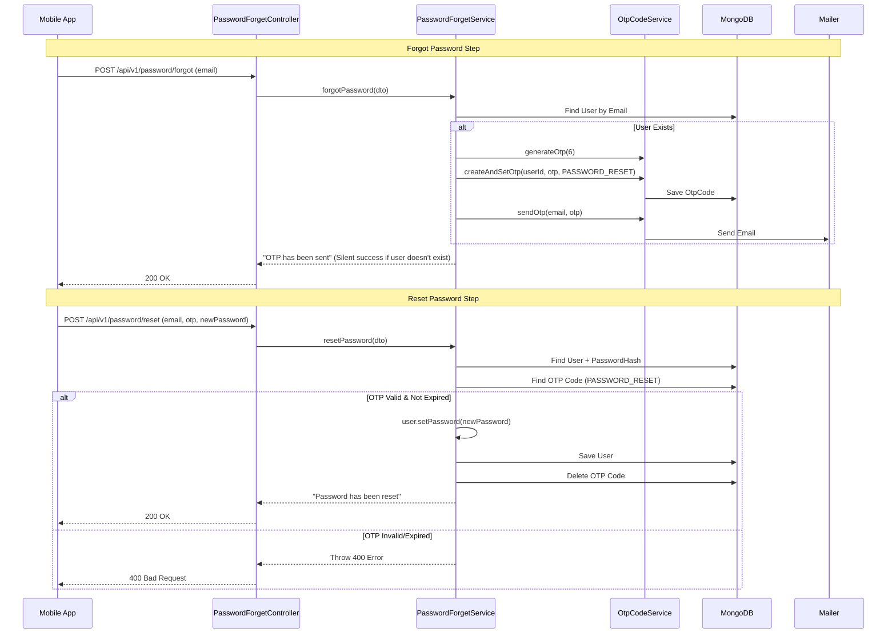

# User Management: Password Recovery Flow

This diagram illustrates the forgot password and reset flow.

```mermaid
sequenceDiagram
    participant App as Mobile App
    participant Ctrl as PasswordForgetController
    participant Svc as PasswordForgetService
    participant OTP as OtpCodeService
    participant DB as MongoDB
    participant Mail as Mailer

    Note over App, Mail: Forgot Password Step
    App->>Ctrl: POST /api/v1/password/forgot (email)
    Ctrl->>Svc: forgotPassword(dto)
    Svc->>DB: Find User by Email

    alt User Exists
        Svc->>OTP: generateOtp(6)
        Svc->>OTP: createAndSetOtp(userId, otp, PASSWORD_RESET)
        OTP->>DB: Save OtpCode
        Svc->>OTP: sendOtp(email, otp)
        OTP->>Mail: Send Email
    end

    Svc-->>Ctrl: "OTP has been sent" (Silent success if user doesn't exist)
    Ctrl-->>App: 200 OK

    Note over App, Mail: Reset Password Step
    App->>Ctrl: POST /api/v1/password/reset (email, otp, newPassword)
    Ctrl->>Svc: resetPassword(dto)

    Svc->>DB: Find User + PasswordHash
    Svc->>DB: Find OTP Code (PASSWORD_RESET)

    alt OTP Valid & Not Expired
        Svc->>Svc: user.setPassword(newPassword)
        Svc->>DB: Save User
        Svc->>DB: Delete OTP Code
        Svc-->>Ctrl: "Password has been reset"
        Ctrl-->>App: 200 OK
    else OTP Invalid/Expired
        Svc-->>Ctrl: Throw 400 Error
        Ctrl-->>App: 400 Bad Request
    end
```
