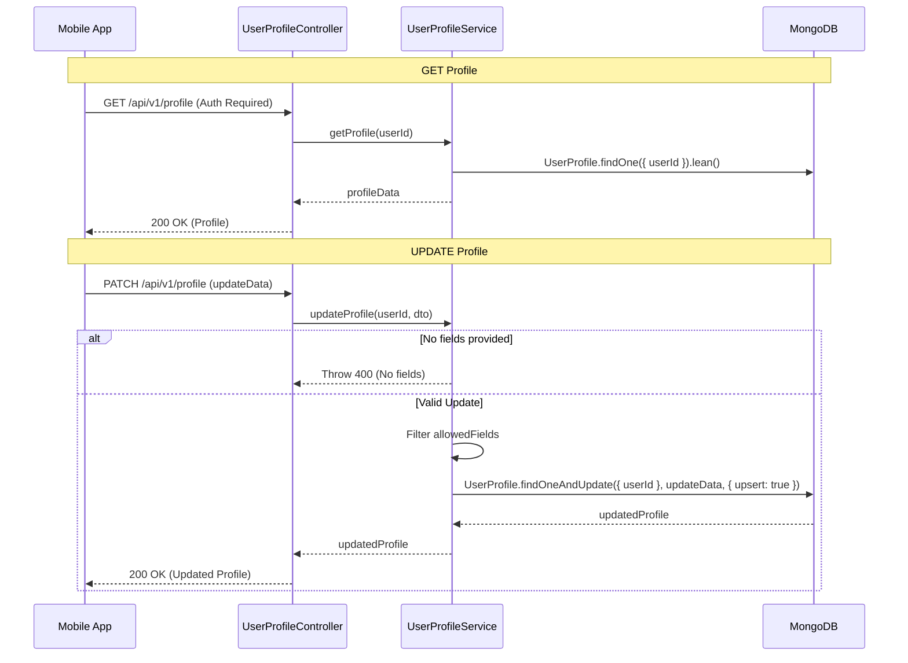

# User Management: User Profile Flow

This diagram illustrates how user profiles are retrieved and updated.

```mermaid
sequenceDiagram
    participant App as Mobile App
    participant Ctrl as UserProfileController
    participant Svc as UserProfileService
    participant DB as MongoDB

    Note over App, DB: GET Profile
    App->>Ctrl: GET /api/v1/profile (Auth Required)
    Ctrl->>Svc: getProfile(userId)
    Svc->>DB: UserProfile.findOne({ userId }).lean()
    Svc-->>Ctrl: profileData
    Ctrl-->>App: 200 OK (Profile)

    Note over App, DB: UPDATE Profile
    App->>Ctrl: PATCH /api/v1/profile (updateData)
    Ctrl->>Svc: updateProfile(userId, dto)
    
    alt No fields provided
        Svc-->>Ctrl: Throw 400 (No fields)
    else Valid Update
        Svc->>Svc: Filter allowedFields
        Svc->>DB: UserProfile.findOneAndUpdate({ userId }, updateData, { upsert: true })
        DB-->>Svc: updatedProfile
        Svc-->>Ctrl: updatedProfile
        Ctrl-->>App: 200 OK (Updated Profile)
    end
```
