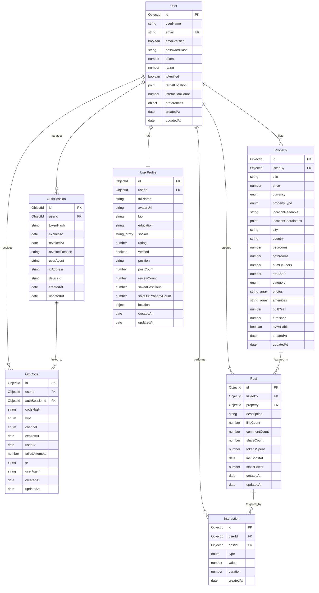
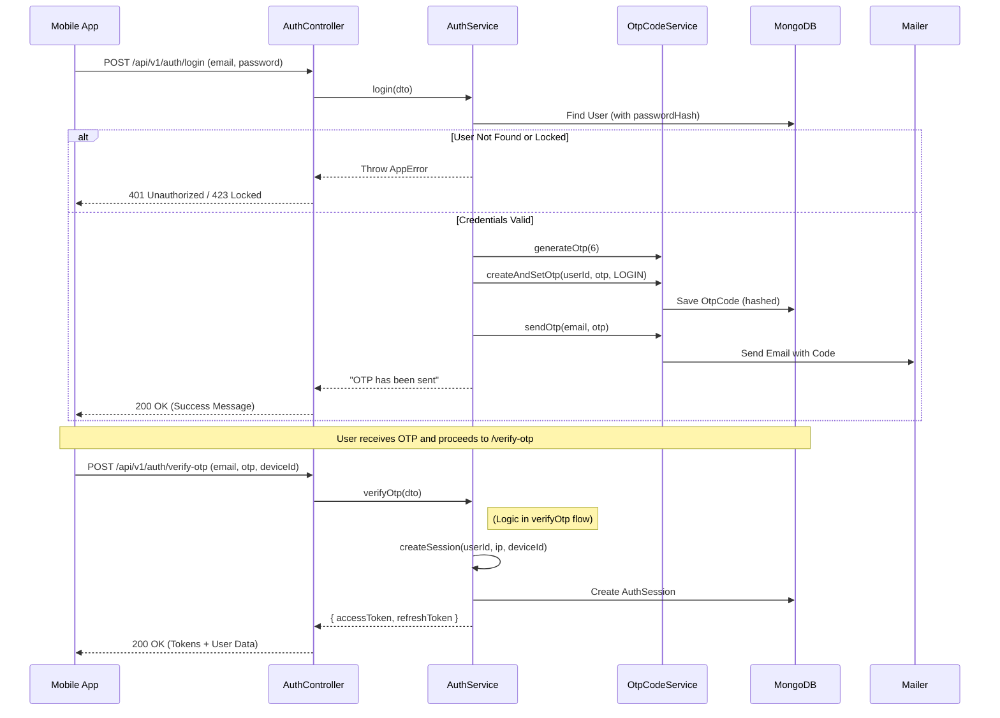
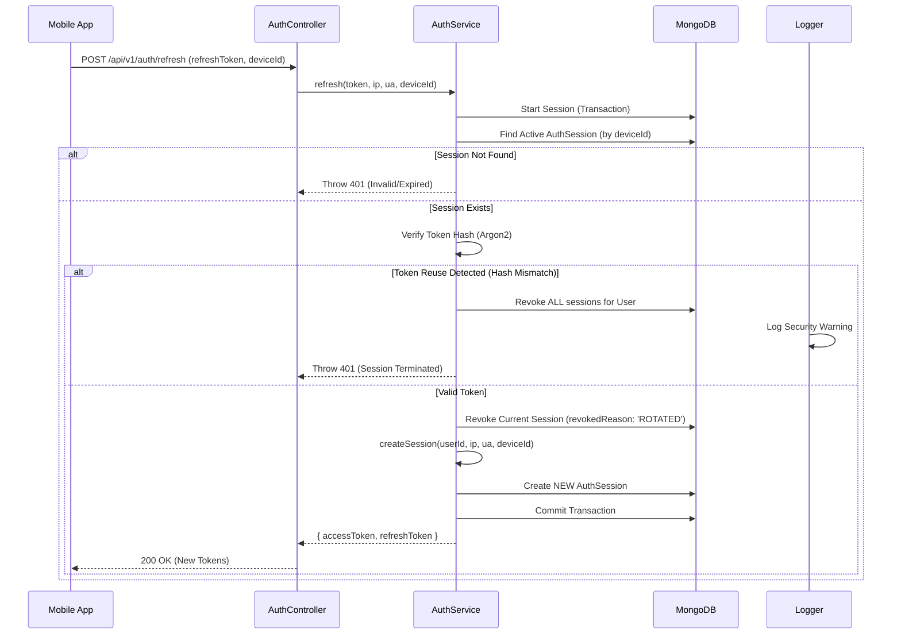
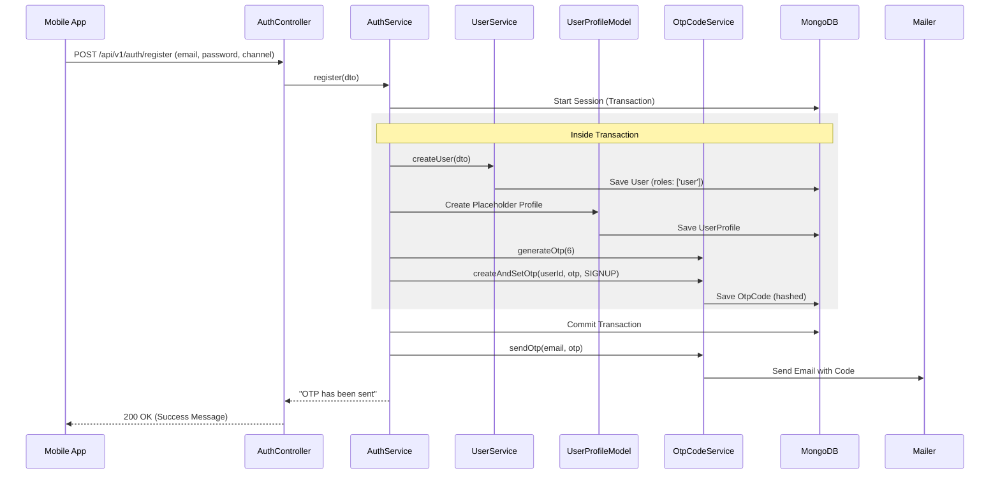
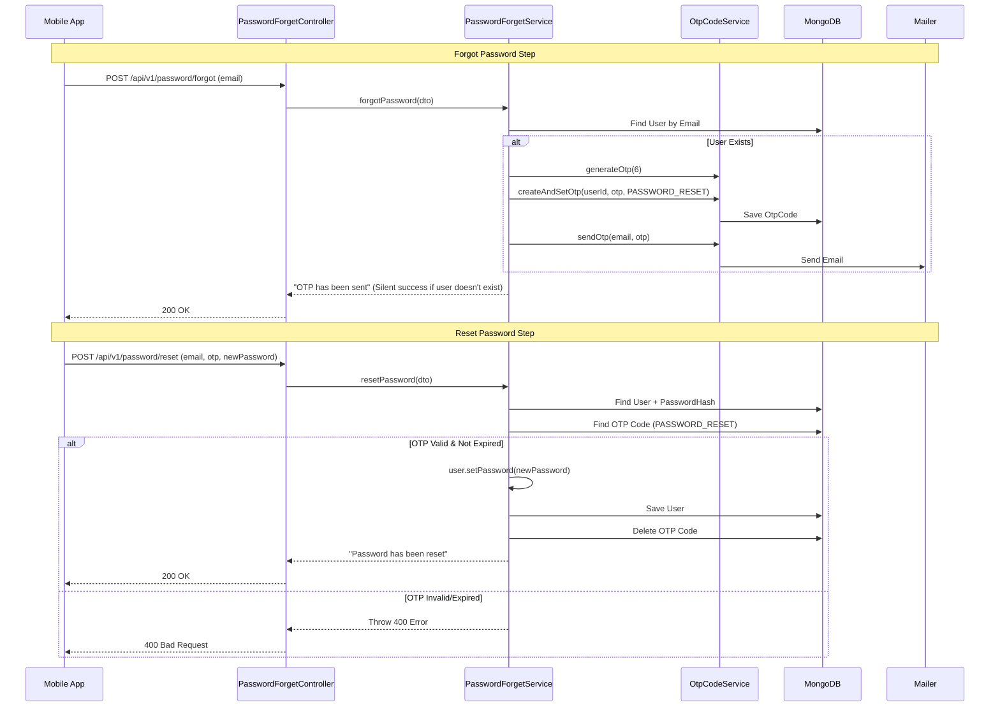
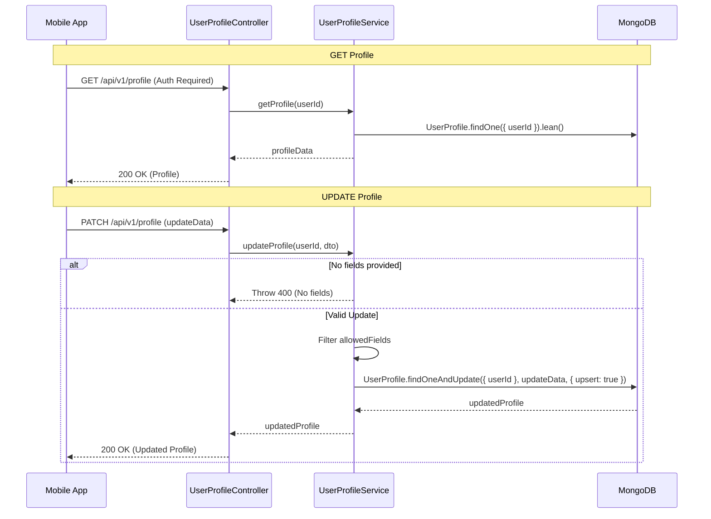

(Files content cropped to 300k characters, download full ingest to see more)
================================================
FILE: DOCKER.md
================================================
# Docker Setup

This project is containerized using Docker and Docker Compose.

## Prerequisites

- Docker Engine 20.10+
- Docker Compose 2.0+

## Quick Start

### Production

1. **Create a `.env` file** in the project root with all required environment variables (see `src/shared/validations/env.validation.mts` for the complete list).

   Required variables:
   - `DATABASE_URL` (defaults to `mongodb://mongo:27017/home4you` in docker-compose)
   - `DATABASE_REPLICA_SET` (defaults to `rs0` in docker-compose)
   - `REDIS_URL` (defaults to `redis://redis:6379` in docker-compose)
   - `JWT_SECRET`
   - `JWT_REFRESH_SECRET`
   - `SMTP_HOST`
   - `SMTP_USER`
   - `SMTP_PASS`

2. **Build and start all services:**

   ```bash
   docker-compose up -d
   # or use Makefile
   make up
   ```

3. **View logs:**

   ```bash
   docker-compose logs -f app
   # or use Makefile
   make logs
   ```

4. **Stop all services:**

   ```bash
   docker-compose down
   # or use Makefile
   make down
   ```

### Development

For development with hot reload:

```bash
# Using docker-compose directly
docker-compose -f docker-compose.dev.yml up -d

# Or using Makefile (recommended)
make dev          # Start and follow logs
make dev-up       # Start in background
make dev-logs     # View logs
```

The development setup automatically rebuilds TypeScript on file changes and restarts the server.

## Services

- **app**: The main application (port 8000 by default)
- **mongo**: MongoDB database (port 27017 by default)
- **mongo-init**: One-time initialization service for MongoDB replica set
- **redis**: Redis cache (port 6379 by default)

## Building the Image

To build the Docker image separately:

```bash
docker build -t home4you:latest .
```

## Development

For development with hot reload, use `docker-compose.dev.yml`:

```bash
# Start development services
docker-compose -f docker-compose.dev.yml up -d

# View logs
docker-compose -f docker-compose.dev.yml logs -f app

# Stop development services
docker-compose -f docker-compose.dev.yml down
```

Or use the Makefile commands:

```bash
make dev          # Start dev and follow logs
make dev-up       # Start dev services
make dev-logs     # View dev logs
make dev-down     # Stop dev services
make dev-shell    # Open shell in dev container
```

The development setup includes:

- **Hot reload**: Automatically rebuilds TypeScript on file changes in `src/`
- **Volume mounts**: Source code is mounted for instant changes
- **Development defaults**: Sensible defaults for JWT secrets and other configs
- **Separate volumes**: Uses `-dev` suffixed volumes to keep dev/prod data separate

## Environment Variables

All environment variables can be set in a `.env` file or passed directly to `docker-compose up`. The `docker-compose.yml` file provides sensible defaults for local development.

## Health Checks

- The app service includes a health check that pings `/health`
- MongoDB and Redis have health checks to ensure they're ready before the app starts

## Troubleshooting

- **MongoDB replica set not initialized**: The `mongo-init` service runs once to initialize the replica set. If it fails, you can manually run:

  ```bash
  docker-compose exec mongo mongosh --eval "rs.initiate({_id: 'rs0', members: [{_id: 0, host: 'localhost:27017'}]})"
  ```

- **Port conflicts**: If ports 8000, 27017, or 6379 are already in use, modify the port mappings in `docker-compose.yml` or set `PORT`, `MONGO_PORT`, or `REDIS_PORT` in your `.env` file.


================================================
FILE: lefthook.yml
================================================
jre-commit:
  parallel: true
  commands:
    service-core:
      root: "services/core/"
      glob: "*.{mts,ts,js,mjs,json}"
      run: |
        npm run lint:fix {staged_files}
        npm run fmt {staged_files}
        git add {staged_files}


================================================
FILE: Makefile
================================================
# root-level Makefile

COMPOSE_DIR := infrastructure/docker
PROD_COMPOSE := $(COMPOSE_DIR)/docker-compose.yml
DEV_COMPOSE  := $(COMPOSE_DIR)/docker-compose.dev.yml

# ------------------------------
# Production commands
# ------------------------------
build: ## Build production images
	@echo "Building production images..."
	docker compose -f $(PROD_COMPOSE) build

up: ## Start production services
	@echo "Starting production services..."
	docker compose -f $(PROD_COMPOSE) --env-file .env up -d

up-logs: ## Start production services to debug(don't actually use it in prod)
	@echo "Starting production services with logging(use for debugging prod server)..."
	docker compose -f $(PROD_COMPOSE) --env-file .env up

down: ## Stop production services
	@echo "Stopping production services..."
	docker compose -f $(PROD_COMPOSE) down

logs: ## Follow production logs
	docker compose -f $(PROD_COMPOSE) logs -f core

restart: ## Restart production services
	@echo "Restarting production services..."
	docker compose -f $(PROD_COMPOSE) restart

clean: ## Remove production containers and volumes
	@echo "Cleaning production containers..."
	docker compose -f $(PROD_COMPOSE) down -v

deploy: ## Pull latest images + restart
	@echo "Deploying latest images..."
	docker compose -f $(PROD_COMPOSE) pull
	docker compose -f $(PROD_COMPOSE) up -d --remove-orphans
	docker image prune -f

# ------------------------------
# Development commands
# ------------------------------
dev-up: ## Start development services
	@echo "Starting development services..."
	docker compose -f $(DEV_COMPOSE) --env-file .env up --watch

dev-down: ## Stop development services
	@echo "Stopping development services..."
	docker compose -f $(DEV_COMPOSE) down

dev-logs: ## Follow development logs
	docker compose -f $(DEV_COMPOSE) logs -f core

dev-restart: ## Restart development services
	@echo "Restarting development services..."
	docker compose -f $(DEV_COMPOSE) restart core

dev-clean: ## Remove development containers and volumes
	@echo "Cleaning development containers..."
	docker compose -f $(DEV_COMPOSE) down -v

dev-build: ## Build development images
	@echo "Building development images..."
	docker compose -f $(DEV_COMPOSE) build

dev-shell: ## Open shell in dev container
	docker compose -f $(DEV_COMPOSE) exec core sh

dev: dev-up dev-logs ## alias: start dev + follow logs

# ------------------------------
# Database / Redis
# ------------------------------
db-shell:
	docker compose -f $(PROD_COMPOSE) exec mongo mongosh

db-shell-dev:
	docker compose -f $(DEV_COMPOSE) exec mongo mongosh

redis-cli:
	docker compose -f $(PROD_COMPOSE) exec redis redis-cli

redis-cli-dev:
	docker compose -f $(DEV_COMPOSE) exec redis redis-cli

# ------------------------------
# Utilities
# ------------------------------
ps:
	@echo "Production containers:"
	docker compose -f $(PROD_COMPOSE) ps
	@echo "\nDevelopment containers:"
	docker compose -f $(DEV_COMPOSE) ps

prune:
	@echo "Pruning Docker resources..."
	docker system prune -f

setup: install
	@echo "Setup complete"

# ------------------------------
# Code commands
# ------------------------------

CORE_SERVICE_DIR := ./services/core
core-lint:
	cd $(CORE_SERVICE_DIR) && npm run lint:fix

core-fmt:
	cd $(CORE_SERVICE_DIR) && npm run fmt

core-check:
	cd $(CORE_SERVICE_DIR) && npm run lint && npm run fmt:check

# ------------------------------
# Aliases
# ------------------------------
prod: build up logs


================================================
FILE: .dockerignore
================================================
# Dependencies
node_modules
npm-debug.log

# Environment files
.env
.env.local
.env.*.local

# Git
.git
.gitignore
.gitattributes

# IDE
.vscode
.idea
*.swp
*.swo
*~

# OS
.DS_Store
Thumbs.db

# Logs
logs
*.log
*.log.gz

# Testing
coverage
.nyc_output
.vitest

# Husky
.husky
_/

# Test files
src/tests
*.test.ts
*.test.mts
*.spec.ts
*.spec.mts

# Documentation
README.md
*.md

# Docker
Dockerfile
docker-compose.yml
.dockerignore

# Other
dump.rdb
tsconfig.tsbuildinfo
xh/
postman/


================================================
FILE: .env.example
================================================
----------------------------------------------------------------------

SERVER CONFIGURATION

----------------------------------------------------------------------

PORT = 8080
NODE_ENV = development
LOG_LEVEL = info # Options: error, warn, info, http, verbose, debug, silly

Optional: Comma-separated list of allowed origins (e.g., http://localhost:3000)

CORS_ORIGINS =

----------------------------------------------------------------------

DATABASE CONFIGURATION

----------------------------------------------------------------------

DATABASE_URL = mongodb://localhost:27017/my_app

Maximum number of connections in the pool (Default: 10)

MONGO_MAX_POOL_SIZE = 10

Minimum number of connections in the pool (Default: 2)

MONGO_MIN_POOL_SIZE = 2

----------------------------------------------------------------------

RATE LIMITING & REDIS (Used for session storage and rate limiting)

----------------------------------------------------------------------

REDIS_URL = redis://localhost:6379

GLOBAL (App-wide) Limits

The following limits apply across ALL users/requests.

GLOBAL_LIMIT = 100         # Max requests allowed (Default: 100)
GLOBAL_WINDOW_SIZE = 15    # Time window in minutes (Default: 15)
GLOBAL_SUB_WINDOW_SIZE = 5 # Time sub-window in seconds (Default: 5)

USER (Per-User) Limits

The following limits apply to each authenticated user.

USER_LIMIT = 100
USER_WINDOW_SIZE = 15
USER_SUB_WINDOW_SIZE = 5

----------------------------------------------------------------------

AUTHENTICATION & SECURITY

----------------------------------------------------------------------

JSON Web Token Secrets (must be long and complex strings)

JWT_SECRET = replace_with_a_long_random_string
JWT_REFRESH_SECRET = replace_with_a_different_long_random_string

Auth Logic

Max failed login attempts before account lock (Default: 10)

FAILED_LOGIN_ATTEMPT = 10

How long an account is locked after too many failed attempts (in milliseconds)

Default: 300000ms (5 minutes)

ACCOUNT_LOCK_DURATION = 300000

Lifetime of the Refresh Token (in days) (Default: 30 days)

REFRESH_TOKEN_EXPIRY_DAYS = 30

One-Time Password (OTP) Expiration (in milliseconds)

Default: 300000ms (5 minutes)

OPT_EXPIARY = 300000

----------------------------------------------------------------------

EMAIL / SMTP CONFIGURATION

----------------------------------------------------------------------

SMTP_HOST = https://www.google.com/search?q=your.smtp.host.com
SMTP_PORT = 2525 # Common alternatives: 587 (TLS), 465 (SSL)
SMTP_USER = your_smtp_username
SMTP_PASS = your_smtp_password


================================================
FILE: doc/ARCHITECTURE.md
================================================
# Architecture Documentation

Welcome to the Home4You API architecture documentation. This directory contains detailed diagrams and descriptions of the system's data models and business logic flows.

## Core Principles

As outlined in [GEMINI.md](../GEMINI.md), this project follows several core architectural principles:

- **Mobile First:** Optimized for low-bandwidth and high-latency mobile environments.
- **Stateless API:** Leveraging Redis for session management to allow horizontal scaling.
- **Security:** Argon2 hashing, JWT for access tokens, and database-backed refresh tokens for secure session rotation.
- **Performance:** Lean MongoDB queries and functional composition.

## Documentation Index

### 1. Data Models (ERD)
The Entity Relationship Diagram (ERD) provides a high-level view of the database schema and the relationships between different entities.
- [Database ERD](./ERD/DATABASE_ERD.md)

### 2. The Feed Algorithm
Detailed mathematical model for the Home4You Discovery Engine, balancing explicit preferences with implicit behavioral data.
- [Feed Algorithm Definition](./FEED_ALGORITHM.md)

### 3. Business Logic Flows (Sequence Diagrams)
Sequence diagrams help visualize the interaction between different components (Controllers, Services, Models, and External Systems like Redis/Mailers).

- **Authentication Flows:**
  - [User Registration](./SD/AUTH_REGISTRATION.md)
  - [User Login](./SD/AUTH_LOGIN.md)
  - [Token Refresh](./SD/AUTH_REFRESH.md)
- **User Management:**
  - [User Profile Management](./SD/USER_PROFILE.md)
  - [Password Recovery](./SD/PASSWORD_FORGET.md)

---

*Last updated: March 29, 2026*


================================================
FILE: doc/FEED_ALGORITHM.md
================================================
# Feed Algorithm: The Home4You Discovery Engine (v2.0)

This document defines the mathematical model and execution flow for the Home4You algorithmic feed, emphasizing the balance between explicit user preferences and implicit behavioral data.

## 1. The Ranking Formula

The final rank of a post for a specific user is determined by:

$$Rank Score = (Relevance \times Freshness) + (Trust Score + Boost Modifier)$$

### A. Boost Modifier (Commercial)
$$Boost Modifier = 1 + \log_{10}(1 + Tokens Spent)$$

### B. Freshness (Temporal Decay)
$$Freshness = e^{-(\lambda_{base} - \lambda_{user}) \times t}$$
- $t$: Age of post in hours.
- $\lambda_{base}$: Standard platform decay rate.
- $\lambda_{user}$: Counter-decay value based on user's lifetime spend/tier.

### C. Relevance (The $\alpha/\beta$ Balance)
Relevance transitions from explicit preferences to implicit behavior as the user interacts with the app.

$$Relevance = \alpha \times Explicit + \beta \times Implicit$$

- $\beta = \min(0.7, \frac{interaction\_count}{100})$: As interactions increase, behavioral data takes more weight (up to 70%).
- $\alpha = 1 - \beta$: Explicit preferences/GPS dominate for new users.

#### Explicit Data Component
1. **Preference Value:** 1.0 if location/type matches perfectly, scales down based on distance.
2. **GPS Fallback:** If no preferences are set, uses current GPS ping (1.0 for proximity, 0.3 for distance).
3. **Gaussian Distance Decay:** $Distance Value = e^{-\frac{d^2}{2r^2}}$ ($d$=distance, $r$=radius).
4. **Target Location Cache:** A behavioral "Target Location" that updates silently if a user in Point A keeps looking at Point B.

#### Implicit Data Component
Uses an event stream (likes, saves, dwell time) to calculate affinity.
$$Implicit Weight = \sum(Interaction Value \times Time Decay)$$
- This counters sudden interest shifts and prioritizes long-term behavioral trends (e.g., favoring "Agent" listings over "P2P").

### D. Trust Score (Safety)
$$Trust Multiplier = 0.7 + (Rating \times 0.1) + Verification Bonus$$
- **Linear Shift (0.7):** Ensures visibility even for lower-rated users, preventing "unrecoverable" scores.
- **Verification Bonus:** A flat multiplier for verified badge holders.

---

## 2. Execution Flow

### Phase 1: Filter (Hard Constraints)
- **Scope:** Filter by `Country` and `Status`.
- **Status:** Database Level (Indexed).

### Phase 2: Scoring (Background/Static)
- **Trigger:** On Post Creation, Update, or Token Boost.
- **Components:** Calculate `Trust Score` + `Boost Modifier`.
- **Storage:** Persisted as `static_power` in the `Post` model.

### Phase 3: Dynamic (Real-time/On-Refresh)
- **Trigger:** `GET /feed`.
- **Calculations:**
    1. **Personalization Balance:** Calculate $\alpha$ and $\beta$ based on `interaction_count`.
    2. **Distance Decay:** Based on `Target Location` (GPS or Behavioral Cache).
    3. **Freshness:** Based on `last_boost_at`.
    4. **Implicit Weights:** Pull from the Interaction Event Stream.

---

## 3. Data Requirements

| Entity | Field | Purpose |
| :--- | :--- | :--- |
| **User** | `tokens` | Currency balance for boosting |
| **User** | `rating` | 1-5 trust score |
| **User** | `isVerified` | Boolean status |
| **User** | `targetLocation` | Behavioral GPS center |
| **User** | `interactionCount` | To calculate $\alpha / \beta$ weights |
| **Post** | `tokensSpent` | Total tokens allocated |
| **Post** | `lastBoostAt` | Reference for Freshness |
| **Post** | `staticPower` | Pre-calculated Trust + Boost |
| **Interaction** | `type/value` | Event stream for Implicit Data |


================================================
FILE: doc/ERD/DATABASE_ERD.md
================================================
# Database ERD

The following diagram illustrates the relationships between the Mongoose models in the Home4You ecosystem.




================================================
FILE: doc/SD/AUTH_LOGIN.md
================================================
# Authentication: User Login Flow

This diagram illustrates the two-step login flow (Credentials -> OTP -> Session).




================================================
FILE: doc/SD/AUTH_REFRESH.md
================================================
# Authentication: Token Refresh Flow

This diagram illustrates the secure refresh token rotation mechanism.




================================================
FILE: doc/SD/AUTH_REGISTRATION.md
================================================
# Authentication: User Registration Flow

This diagram illustrates the flow when a new user registers via Email.




================================================
FILE: doc/SD/PASSWORD_FORGET.md
================================================
# User Management: Password Recovery Flow

This diagram illustrates the forgot password and reset flow.




================================================
FILE: doc/SD/USER_PROFILE.md
================================================
# User Management: User Profile Flow

This diagram illustrates how user profiles are retrieved and updated.




================================================
FILE: experiments/sunfire/README.md
================================================
# Sunfire Engine

**Sunfire Engine** is a high-performance, personalized ranking and feed architecture designed for dynamic content delivery. It balances user intent, temporal relevance, and ecosystem health to produce a normalized, diverse, and engaging feed. The main engine being used for Home4You's feed service. This repo contains pure mathematical representation for the pipeline with some code for simulation.

The project includes a `Makefile` for streamlined data generation and simulation.

- **Generate Users**:
  ```bash
  make user
  ```
- **Generate Properties**:
  ```bash
  make property
  ```
- **Calculate Scores**:
  ```bash
  make score
  ```
- **Run Full Simulation**:
  ```bash
  make simulate
  ```

## Directory Structure

- `generators/`: Core logic for synthetic data generation and scoring.
  - `user_gen.py`: Generates user profiles and interaction history.
  - `property_gen.py`: Generates property listings with metadata.
  - `score.py`: The main ranking engine implementation.
- `simulators/`: Jupyter notebooks and scripts for experimentation and visualization.
  - `scores.ipynb`: Deep dive into scoring distributions.
  - `normal_simulation.ipynb`: End-to-end feed simulation.
- `parameters.py`: Centralized configuration for all ranking constants (decay rates, weights, thresholds).
- `sunfire.md`: Detailed mathematical documentation of the ranking algorithms.

## Simulation & Visualization

The `simulators/` directory contains tools to visualize the engine's performance. You can find radar charts and bar visualizations (`sunfire_radar_viz.png`, `sunfire_bars_viz.png`) that illustrate how different parameters affect the final ranking.

---
*For a deep dive into the underlying mathematics, refer to [sunfire.md](./sunfire.md).*


================================================
FILE: experiments/sunfire/__init__.py
================================================
[Empty file]


================================================
FILE: experiments/sunfire/Makefile
================================================
user:
	python3 -m generators.user_gen

post:
	python3 -m generators.post_gen

score:
	python3 -m generators.score

log:
	python3 -m generators.post_gen
	python3 -m generators.user_gen

simulate:
	python3 -m generators.post_gen
	python3 -m generators.user_gen
	python3 -m generators.score


================================================
FILE: experiments/sunfire/parameters.py
================================================
"""
Sunfire Engine – Parameter Configuration

This file defines all tunable parameters used in the ranking pipeline,
directly mapping to the mathematical models in sunfire.md.
"""

# =========================================================
# 1. RELEVANCE (Personalization & Session Intent)
# =========================================================

# β_max (Implicit Bias Max): The hard limit preventing behavior from 
# completely overriding explicit filters.
# Effect: If set to 1.0, a user who clicks on 10 cats will only see cats, 
# ignoring their "I want dogs" filter. 
# Example: 0.8 ensures 20% of the score always comes from explicit intent.
BETA_MAX = 0.8

# K (Interaction Threshold): Number of interactions needed to reach BETA_MAX.
# Effect: Controls the learning curve. Small K = fast adaptation; Large K = stable feed.
# Example: K = 50 means the system "trusts" your behavior fully after 50 actions.
K_THRESHOLD = 50

# r (Comfort Zone Radius): Gaussian radius in km for geographic matching.
# Effect: Controls the "softness" of location filters. 
# Example: r = 5.0 means properties 5km away keep ~60% of their distance score.
R_COMFORT_ZONE = 5.0

# λ_time (Historical Decay): Decay constant for historical interactions.
# Effect: How fast the system "forgets" your past behavior.
# Example: 0.005 is slow; a click from a month ago still has some weight.
LAMBDA_HISTORICAL = 0.005

# λ_session (Session Decay): Aggressive decay for in-session actions.
# Effect: High values make the "Right Now" behavior very reactive.
# Example: 0.1 means an item clicked 10 minutes ago is much more relevant than one from 2 hours ago.
LAMBDA_SESSION = 0.1

# γ (Session Weight): Integration factor between history and current session.
# Effect: Controls how much the current session "hijacks" the feed.
# Example: 0.5 means a 50/50 blend of "who you are" vs "what you are doing now".
GAMMA_SESSION_WEIGHT = 0.5


# =========================================================
# 2. FRESHNESS (Temporal Dynamics)
# =========================================================

# λ_base (Global Decay): Standard exponential decay rate for content age.
# Effect: Higher values rotate the feed faster.
# Example: 0.05 means a post loses ~50% of its freshness score in ~14 hours.
LAMBDA_BASE = 0.05

# λ_user (Decay Resistance): Bonus earned by highly active/trusted users.
# Effect: Allows "Power User" content to stay fresh longer than average posts.
# Example: 0.002 makes a post from a top creator decay slightly slower.
LAMBDA_USER_RESISTANCE = 0.002

# θ (Freshness Floor): Minimum decay to ensure content eventually rotates out.
# Effect: Prevents very old content from getting stuck at the top.
# Example: 0.001 ensures even a 1-year-old post has a non-zero (but tiny) freshness.
FRESHNESS_FLOOR = 0.001


# =========================================================
# 3. TRUST & ACTIVITY (Ecosystem Health - B Score)
# =========================================================

# φ (Reach Ceiling): Maximum possible activity boost for a contributor.
# Effect: Limits how much "grinding" (posting a lot) can boost a user's visibility.
# Example: 0.5 ensures that even the most active user can't double their score on activity alone.
PHI_REACH_CEILING = 0.5

# σ (Grind Factor): The slope of the activity reward curve.
# Effect: Controls how rewarding each additional post is.
# Example: 0.1 creates a logarithmic curve that rewards the first 10 posts more than the next 100.
SIGMA_GRIND_FACTOR = 0.1

# Minimum compliance floor (C). Values < 0.4 usually trigger filtering.
COMPLIANCE_FLOOR = 0.4


# =========================================================
# 4. EXPLORATION (Anti-Bubble)
# =========================================================

# ε_new (Exploration Rate - New User): Randomness for users with little data.
# Effect: Helps the system discover what a new user likes quickly.
# Example: 0.2 means 20% of the feed is randomized to test preferences.
EPSILON_NEW_USER = 0.2

# ε_old (Exploration Rate - Veteran User): Randomness for established users.
# Effect: Keeps the feed stable while allowing for occasional discovery.
# Example: 0.01 provides just enough "surprise" to break the filter bubble.
EPSILON_OLD_USER = 0.01


# =========================================================
# 5. DIVERSITY & PIPELINE
# =========================================================

# γ^n (Diversity Penalty Base): The decay factor for repeated categories.
# Effect: Drastically reduces the score of the Nth item from the same category.
# Example: 0.5 means the 2nd Condo gets half score, the 3rd gets 25%, etc.
GAMMA_DIVERSITY_FACTOR = 0.5

# T_new (Cold Start Window): Duration in hours for the "New Post" bonus.
# Effect: Gives every new post a guaranteed window of high visibility.
# Example: 48.0 ensures all posts are treated as "New" for the first two days.
T_NEW_WINDOW = 48.0

# Bonus (Cold Start Bonus): Flat additive boost for new content.
# Effect: Forces new content to the top regardless of relevance.
COLD_START_BONUS = 2.0


# =========================================================
# 6. SIMULATION SETTINGS (Generator Weights)
# =========================================================

# Weights and dwell time ranges for synthetic interaction generation.
INTERACTIONS = {
    "view":    {"weight": 0.1, "chance": 0.6, "dwell_range": (5, 30)},
    "click":   {"weight": 0.5, "chance": 0.3, "dwell_range": (30, 120)},
    "like":    {"weight": 1.5, "chance": 0.08, "dwell_range": (60, 300)},
    "share":   {"weight": 3.0, "chance": 0.02, "dwell_range": (120, 600)},
    "contact": {"weight": 5.0, "chance": 0.005, "dwell_range": (200, 600)}
}

# Average time spent per session in the simulation.
USER_TIME_SPENT = 720


================================================
FILE: experiments/sunfire/requirements.txt
================================================
contourpy==1.3.3
cycler==0.12.1
fonttools==4.62.1
haversine==2.9.0
kiwisolver==1.5.0
matplotlib==3.10.8
numpy==2.4.4
packaging==26.0
pandas==3.0.2
pillow==12.2.0
pyparsing==3.3.2
python-dateutil==2.9.0.post0
six==1.17.0


================================================
FILE: experiments/sunfire/sunfire.md
================================================
# Sunfire Engine: The Global Ranking & Feed Architecture

The Sunfire Engine is a high-performance ranking pipeline designed to balance user intent, temporal relevance, and ecosystem health. It transforms raw property data into a personalized, diverse, and normalized feed.

---

## 1. Relevance Score ($Relevance_{final}$)
The core of personalization, blending long-term preferences with immediate session behavior.

### 1.1 Base Relevance ($Relevance$)
$$Relevance = (1 - \beta) \times Explicit + \beta \times Implicit$$
* **$\beta$ (Implicit Bias):** $\min(\beta_{max}, \frac{Interaction\ Count}{K})$. Shifts from explicit intent to observed behavior as data grows.
* **$\beta_{max}$:** Hard limit to prevent implicit data from completely overriding explicit filters.
* **$K$:** The interaction threshold required to reach maximum implicit weighting.

#### 1.1.1 Explicit Intent ($Explicit$)
Determined by the **Centroid of Intent** ($Target_{lat, lng}$) and cosine similarity.
* **$Target_{lat, lng}$:** The weighted center of where a user actively clicks/searches.
* **$d$:** Haversine distance between $Target$ and actual $Property_{lat, lng}$.
* **$d$ :**  $haversine( (Target_{lat},\ Target_{lng}) ,\ (Property_{lat},\ Property_{lng}))$
* **$Distance\ Score$:** $e^{\frac{-d^2}{2r^2}}$ (Gaussian decay).
* **$r$:** The radius of the user's geographic consideration "comfort zone."
* **$Cosine\ Similarity$:** Vector match between User ($A$) and Property ($B$).
$$Cosine\ Similarity = \frac{\sum A_i B_i}{\sqrt{\sum A_i^2} \sqrt{\sum B_i^2}}$$
* **$Explicit = Preference\ Score(Cosine\ Similarity) \times Distance\ Score$**.

#### 1.1.2 Implicit Intent ($Implicit$)
Calculated from historical interactions and dwell time.
* **$Implicit = log(1 + Implicit_{raw})$**
* **$Implicit_{raw} = \sum (Value_i \times D_i \times e^{-\lambda_{time} \Delta t_i})$**
* **$Value_i$:** Numeric weight assigned to an event (e.g., Like=2, Message=5).
* **$D_i$ (Dwell Factor):** $\ln(e + dwell\ time_{sec} \times activity\ factor)$.
* **$\lambda_{time}$:** Decay constant for historical interactions.
* **$\Delta t_i$:** Time elapsed since the interaction occurred.

### 1.2 Session Intent ($Session\ Intent$)
Captures "in-the-moment" interest within the current app session.
$$Session\ Intent = \sum (Weight_j \times Match_j \times D_j \times e^{-\lambda_{session} \Delta t_j})$$
* **$Weight_j$:** The importance of the specific session event.
* **$Match_j$:** How well the current post matches the session event's metadata.
* **$\lambda_{session}$:** Aggressive decay constant (session interests change fast).

### 1.3 Final Relevance Integration
$$Relevance_{final} = Relevance \times (1 - \gamma) + Session\ Intent \times \gamma$$
* **$\gamma$:** The "Session Weight" (how much current behavior overrides history).

---

## 2. Freshness ($Freshness$)
Ensures the feed remains dynamic and new content surfaces.
$$Freshness = e^{-\lambda_{effective} \times t}$$
* **$\lambda_{effective}$:** $\max(\lambda_{base} - \lambda_{user}, \theta)$.
* **$\lambda_{base}$:** Standard global decay rate.
* **$\lambda_{user}$:** Bonus decay-resistance earned through high user engagement.
* **$\theta$:** The "Freshness Floor" (minimum decay to ensure eventual rotation).
* **$t$:** Age of the post in hours.

---

## 3. Trust & Activity ($B$)
The "Ecosystem" score that rewards high-quality contributors.
$$B = Compliance\ Score + Activity\ Modifier + Boost_{Logic}$$
* **$Compliance\ Score$:** Safety/Verification floor ($0.4 < C < 1.0$).
* **$Activity\ Modifier$:** $\phi \times \ln(1 + P_{recent} \times \sigma)$.
* **$\phi$ (Phi):** The "Reach Ceiling" (max possible activity boost).
* **$P_{recent}$:** Count of quality posts in a sliding window (e.g., 7 days).
* **$\sigma$ (Sigma):** The "Grind Factor" (slope of the reward curve).
* **$Boost_{Logic}$:** Time-decayed artificial boost for promoted content.

---

## 4. Exploration & Diversity
* **$\epsilon$ (Exploration Rate):** Controls randomness ($\epsilon_{new} \approx 0.5$, $\epsilon_{old} \approx 0.02$).
* **$\gamma^n$ (Diversity Penalty):** Decay factor (0.7–0.9) raised to the power of $n$ (count of same-category items already shown).

---

## 5. Combining All Together
$$score_{norm} = percentile(score)$$
* **$score$:** $log(1 + score_{raw})$
* **$score_{raw}$:** $(R_{final} \times F) \times (1 + B) + \mathbb{1}_{t < T_{new}} \, \text{Bonus}$

---
## 6. The Unified Pipeline (Final Equation)
The complete mathematical flow from raw data to a normalized $0.0 - 1.0$ score.


$$
\text{Final Score} = \operatorname{percentile}\left(
\left(
\left(
\left( R_{\text{final}} \cdot F \right) \cdot (1 + B) + \mathbb{1}_{t < T_{\text{new}}}\,\text{Bonus}
\right)
(1 - \epsilon)
+ \text{Rand} \cdot \epsilon
\right)
\cdot \gamma^n
\right)
$$


### Final Variable Summary
| Variable | Context | Definition |
| :--- | :--- | :--- |
| $R_{final}$ | Relevance | Blended Explicit, Implicit, and Session scores. |
| $F$ | Freshness | Temporal decay based on age ($t$) and user activity. |
| $B$ | Authority | Combined Trust, Activity Modifier, and Boosts. |
| $\mathbb{1}_{t < T_{new}}$ | Cold Start | Boolean (1 if post is within $T_{new}$ window, else 0). |
| $\epsilon$ | Explore | Randomness factor to break filter bubbles. |
| $\gamma^n$ | Diversity | Category-based penalty to ensure feed variety. |
| Percentile | Normalization | Rank-based normalization within candidate set (0–1). |


================================================
FILE: experiments/sunfire/sunfire_score.csv
================================================
id,property_type,final_score_log,norm_score,explicit,implicit,session,freshness,B
0ed96939,material,1.76119,1.0,0.11983783187305466,27.488028217640924,10.542944843116283,0.7632116584534685,2.169205970098181
e27dd27b,construction,1.708559,0.999,2.1513989010207666e-05,0.935286444229941,8.021974370233395e-10,0.9787054023120345,2.274195227160816
a40d7e00,house,1.687161,0.998,6.926676506822937e-06,8.2914834100927,2.79277336649097e-06,0.1177928624053715,2.391840350729611
2413d6b7,land,1.673639,0.997,2.9600785473345526e-07,2.7317788196585266,0.021401976138852107,0.325334686639471,2.239800996732273
197799ce,condo,1.647098,0.996,5.789726287194567e-07,0.5339697177691748,1.6792066608861611e-09,0.10775572559328518,2.2116184971665236
d20485db,apartment,1.484428,0.995,5.817898538660163e-11,0.9132748261012982,1.988563509556677e-19,0.9200193091924239,1.1797428113853372
4d476003,material,1.197655,0.994,9.337172667349876e-07,3.5581951757035237,0.16408663664394996,0.7042390011086781,2.326883006912678
a5c3cfcc,construction,1.158284,0.993,2.0844950896175753e-05,1.3897682583125923,2.6030530605847137e-07,0.7034051081156231,2.1613776753649483
71abb404,house,1.103191,0.992,4.142675271847652e-11,1.1998765188659626,5.449371636050394e-13,0.23702798441433798,1.9835361915318934
43cc6893,condo,1.099098,0.991,9.620763958562776e-07,0.45404081067459473,0.0005979358743538833,0.3379672898141396,1.9833301901071128
6a1b3c96,land,1.039813,0.99,9.397018644395903e-06,0.6348245235494078,9.901295463881416e-05,0.1610592963628353,1.6550741236461428
d215085f,apartment,0.919462,0.989,0.035453107679277465,9.5733946182695,2.5825772862759258e-11,0.12032870275317617,0.9948500698196509
f4be1f2d,material,0.744036,0.988,1.212222407234566e-05,10.67977618785434,0.15273796692314162,0.9023298391408403,2.0292144999281456
fee33c59,construction,0.706959,0.987,0.1393108583689063,5.033387211559981,5.84214049283379e-09,0.45547719058361036,1.9611713943386948
4411dc46,condo,0.690139,0.986,2.821875807232337e-11,0.7162510227739712,7.208462134405111e-12,0.25774712947616063,1.9499558672636703
8e352dd5,land,0.643354,0.985,5.7397804971246675e-06,1.4534786355071916,0.00020248399984752765,0.34318451227629765,1.5223311274165587
4e660ebf,house,0.561905,0.984,6.287089873957164e-06,27.087947409713387,0.9358212955709821,0.104399070557413,0.9594417929494253
59831f38,apartment,0.494231,0.983,7.454316779592696e-06,1.6627118483061778,7.356780185298138e-05,6.846051546566397e-13,2.5751531724361953
de26124b,material,0.439044,0.982,1.315202029740492e-10,3.5432423557477386,2.0983939944537237e-09,0.2580979420885227,2.3459005858527497
dec162e8,construction,0.410973,0.981,0.13736450219838897,5.194396573420626,9.282914035589697e-08,0.33289786792031173,1.95978401238338
e3b7df19,condo,0.37934,0.98,0.0884439235358262,2.1716186593094955,3.846941313399045e-10,0.33825759395037536,1.5910439226481827
a144b699,land,0.366223,0.979,6.122062577717647e-06,0.6291682000506089,3.322704479453782e-14,0.224231984763445,1.5208153381282357
b4a06eab,house,0.285188,0.978,0.04193679386917508,0.7053489429555166,1.0062901484136715e-10,8.627268664467864e-07,2.660623080419821
4a19a17e,apartment,0.275091,0.977,0.14709839176763229,1.4466528583079337,3.803052086087976e-10,2.0170286704949748e-13,2.551751211200013
4adfd305,material,0.241127,0.976,1.970024772339345e-05,4.359270986478901,0.08411579909094365,0.9095779787406392,1.9975009071999752
d2bc2442,construction,0.226376,0.975,0.31418252347677483,6.953038821372418,0.0005372190273214257,0.6248958449248394,1.8354528772868357
b7b0cd98,condo,0.167511,0.974,0.060712679193374114,1.4670418608335611,4.529967554722037e-09,0.9213339569558415,0.6006103565766406
0459b0e7,land,0.152709,0.973,0.07661620992624717,4.327679443481317,0.0005434972654458025,0.0026124603651867698,2.660029676914408
dd02d3d2,house,0.152128,0.972,2.164186648157928e-07,0.3033389537231535,0.00582066389773673,0.13200472630357257,0.6349013136480899
ce916773,apartment,0.141256,0.971,6.258999179826468e-11,26.15398971531461,0.008526822993773803,0.00016770720585516702,2.4461380840748244
a08ece8c,material,0.127188,0.97,8.806365690409459e-07,1.6437814776292623,5.170647667473431e-17,0.5609573609638672,2.1750249225724603
39db5a4f,construction,0.118861,0.969,1.1917405620871104e-05,4.78351399334341,2.5990889712993113e-05,0.2847262295235199,1.9655825539063585
63a3bbc0,condo,0.078684,0.968,1.0169863690465834e-10,0.5825893154152978,0.00021498820132524976,5.247900321745931e-07,2.645240533471232
8be086e2,land,0.078649,0.967,2.873516982075835e-07,0.09352680920943882,1.0060851430859887e-12,0.5515160239082424,0.6142654464788031
f0dc0c60,house,0.078096,0.966,1.9326970668628114e-05,15.194874465875015,6.161813174541807e-07,0.0005474620311223288,2.619110697795989
950634b0,apartment,0.072826,0.965,1.3740764995169134e-05,21.957646617852888,0.008645951627573596,2.645172371737424e-08,2.4377033478779158
a6b4e101,material,0.064863,0.964,1.5859292194002075e-05,2.4607555945097292,0.0010420759228984393,0.11735544630762083,2.2849606569212124
9d0a0f89,construction,0.061144,0.963,2.6887342805747495e-05,0.6995869740532203,3.259578825098383e-05,0.7933522703927398,1.8750953798890917
23274fbc,condo,0.039916,0.962,4.729698096051009e-11,2.5562684562843403,2.7962482225346206e-12,3.4691337157486166e-06,2.627733354098038
1bb2019b,land,0.038327,0.961,9.743302702137305e-06,2.3002058491547386,6.214026263381702e-05,0.051432072141115476,2.5004379124341005
f1ba7088,house,0.037775,0.96,2.328388822327828e-07,1.2319740982008232,7.875628973432037e-05,1.589261437698418e-06,2.481706820558076
1f62c0c4,apartment,0.036998,0.959,5.200094539348787e-06,8.914515368045945,0.2874520640812274,6.903271836042204e-08,2.432636824143449
13f4fc63,material,0.032063,0.958,0.13630130738920232,8.45991294523711,2.08879938089994e-06,0.44223980384724226,2.027235895432206
8e3268dc,construction,0.030197,0.957,8.364334486779872e-07,0.3209169746861307,3.765000119178671e-11,0.9080447083761055,1.8508387959913843
470980ec,condo,0.020038,0.956,3.2935281351880044e-07,15.475328295178088,0.05191869470118829,1.5975663993582243e-13,2.6128089607000513
83f67dca,land,0.019233,0.955,5.043404447174696e-11,2.0019874999171283,1.3172755243099292e-10,0.1493130168057154,0.448
4d89fbf2,house,0.019026,0.954,0.12240091778930198,0.8128727729529475,0.025745615609619757,5.028928228096469e-13,2.476946915351981
a4d29a5d,apartment,0.018543,0.953,2.510618004458337e-07,1.331730497626505,1.6062588662716099e-06,4.406256573740089e-14,2.4157310627218673
b0f64ad5,material,0.015994,0.952,0.13646528418618928,0.3669508877360628,1.6276122892526913e-13,0.1763782899104916,2.1416941491071944
f1240253,construction,0.015012,0.951,2.278050806388269e-05,0.07573166421865386,1.8119805731008468e-15,0.9512714229425482,1.879884953375544
ed4aa79d,condo,0.009765,0.9499,3.97859215006495e-11,11.989207542846723,7.47154697762107e-12,6.214674747737425e-15,2.5304327365421795
7bac2420,land,0.00965,0.9489,4.071353945141053e-06,2.8556104415218053,1.8138398593174032e-05,7.478184036455636e-14,2.5034913676467916
47aaf1b6,apartment,0.009265,0.9479,3.124297099039342e-11,3.1130119705065513,6.8917143219437195e-12,6.568244940802376e-08,2.3999916486775033
70892c75,house,0.008979,0.9469,1.5635971126219593e-05,2.400688554498288,1.4347070678403537e-05,5.695571857322253e-09,2.3268389431982595
9b9fd37b,material,0.007556,0.9459,0.16716349579871984,0.0,0.0,0.6707481000606584,1.9035249845736018
24a561ee,construction,0.00753,0.9449,1.0264339940384468e-05,1.255241410060518,0.0373622439200202,0.5120738589012365,1.7154538627119422
ab4ea386,condo,0.004795,0.9439,1.0218422978701198e-10,2.552546189564898,0.0061415206681719415,0.10266373128896457,0.4435297447302235
e54e1cb6,land,0.004607,0.9429,2.346840161397481e-07,8.465096454396281,0.037034938792959396,5.094703260982648e-07,2.3806673762829518
4b5aebb4,apartment,0.004552,0.9419,0.1101043099171124,8.585923725238455,5.767543770001879e-14,1.165905854424716e-13,2.3579947320067918
f3046014,house,0.004485,0.9409,4.010659006704643e-07,4.660007162700918,5.326104650917453e-08,1.664993006400137e-14,2.317102255087602
1d2cbbdd,material,0.003712,0.9399,9.536406301415749e-07,1.6969304328820325,6.50651668077241e-15,0.9437597011633666,1.4926328031580725
c8afb8ff,construction,0.003638,0.9389,9.081463011449087e-07,1.4861331064844703,1.7902676275933729e-07,0.11881593187102031,1.7205500950768253
c86ebd38,condo,0.002365,0.9379,0.11646761393913387,0.44851637506736747,3.263539202089436e-05,0.0002826965598704691,2.44209817598306
5abcb450,land,0.002286,0.9369,1.2370137125390383e-05,0.8145220308023222,0.00012460468495955745,0.07058260545432556,2.3448559243266995
7f493e81,house,0.002238,0.9359,8.373296323487821e-06,1.8155181029162508,2.984231167407215e-08,2.2631971242500363e-11,2.316954094180212
0525f0b4,apartment,0.002234,0.9349,1.706528183259109e-05,1.4551203339205983,0.0164344547109568,8.833645022397035e-13,2.3050640769188617
5ee786ff,material,0.001832,0.9339,9.257988111014305e-11,1.1460611792608146,2.5960086894017557e-14,0.16210613744920765,1.73300599187625
ca03ab68,construction,0.001816,0.9329,9.80683932329748e-07,0.6218725896840946,2.72412291898232e-11,0.2956882667790326,1.6912816346219333
ecfcde1c,condo,0.001156,0.9319,2.9555792723135686e-07,11.417248865072779,2.3599838540769844e-07,0.05933031200413405,2.360073762240663
ca23ad78,land,0.001124,0.9309,1.516765352867558e-05,0.9947947925914624,8.081752155327718e-05,1.899647955146616e-09,2.317243714284624
63df33c8,apartment,0.001111,0.9299,8.494406170794005e-11,0.37667318069551303,0.006521138291887393,3.8914368332244086e-08,2.2988117941034854
41d3aa57,house,0.001107,0.9289,1.0145275744054614e-10,7.520250570921536,0.06909323926170671,1.5683433767250185e-07,2.284335696377869
cf8cac0e,material,0.000914,0.9279,6.622239074098823e-07,0.8431825107725016,3.6353659336919455e-17,0.1418499043657944,1.7350521543954391
1b82818e,construction,0.000904,0.9269,1.2107671265667317e-10,7.74403189208278,0.00025337212123659485,0.36403442019041155,1.590499941157054
5ebbb41f,condo,0.000577,0.9259,1.218920623223987e-10,1.2927404839076413,0.0014536959749439531,6.605534850971873e-13,2.3861991291355378
ecd3706b,land,0.00056,0.9249,2.556677430813512e-07,2.8617840147049387,0.1881657047349041,4.785946251526417e-13,2.308581837454692
19459f25,house,0.000551,0.9239,6.45190867458225e-11,8.201628340456383,0.0017856460014973878,0.0005781215081919612,2.278183754709792
3198ea34,apartment,0.000551,0.9229,8.20383546094912e-06,2.6980680818140694,1.0284612498277723e-11,3.9576298399719327e-08,2.2715995181481485
de941e31,material,0.000456,0.9219,3.5139970756650354e-05,3.4775623617387867,0.018202831967972597,0.3853603619791604,1.6117357275919988
664be10a,construction,0.000446,0.9209,1.292632767146999e-06,16.633626233032704,3.5643385540661705,0.42678186203182594,1.2993119944271925
f11d3f1b,condo,0.000285,0.9199,3.8211691806928796e-07,10.700634143744315,0.1919205811698298,0.00023324579269858392,2.3550693231840736
39e06e54,land,0.000279,0.9189,1.0825026951727793e-05,2.1642209810853665,0.00018841787325381748,3.863238743289502e-11,2.30146357731751
2ff0e0c6,apartment,0.000275,0.9179,1.9648204937877947e-07,20.208705626771415,0.04040629836520256,5.199694571202946e-12,2.2770605437796907
3090db9b,house,0.000275,0.9169,8.25288692171373e-07,0.5757186434651015,2.7265001367644453e-06,1.0864890171368114e-05,2.266101708334885
14ae17cd,material,0.000225,0.9159,1.4568274361751653e-10,0.03987108488384755,1.1506811049389066e-16,0.2178544230023315,1.7205077240687774
df6b9a8c,construction,0.000213,0.9149,2.424684931155915e-05,0.543528299915255,0.020081269069851592,0.10626087703391882,1.5055469685472493
9472a7f7,condo,0.000138,0.9139,1.0716766253090608e-05,6.682131370487716,0.005798778891991998,4.000034034016568e-11,2.284315405007902
505e6002,house,0.000137,0.9129,6.04785498779797e-11,1.2535607844508212,4.296948487062478e-06,2.1962589013881362e-07,2.266259896055522
f16b5b28,apartment,0.000137,0.9119,4.047556630541082e-11,5.02636419048599,1.8666286229876766e-11,4.939158001099937e-06,2.2629540941802118
8736280b,land,0.000136,0.9109,2.1416325132046273e-07,0.575041983046631,1.4849123156733293e-08,6.744504108998014e-06,2.242667376282952
d18f7345,material,0.000109,0.9099,1.2358436645412547e-10,0.33598584580549495,2.1275315070634665e-14,0.31136547134419396,1.5518930073444892
29f10fab,construction,0.000101,0.9089,1.6928382985951388e-10,1.6100351212285202,6.339235439369386e-06,0.15332987940096895,1.271904399798732
debbb116,house,6.8e-05,0.9079,8.006398534315596e-06,17.284695163340153,0.009544588256163718,3.591458716796868e-14,2.2465764322014823
1d1ac63f,apartment,6.8e-05,0.9069,0.03650690499763077,1.155449266203894,1.599689063975995e-14,1.9928143470512922e-05,2.2323697063125207
4193e01c,land,6.7e-05,0.9059,8.266324084431571e-06,3.29575877466026,3.2856399281576336e-09,4.753995663893635e-11,2.2152346801891656
1d3b1c69,condo,6.6e-05,0.9049,6.89587588313213e-11,1.2981294527637437,1.6716577811176464e-18,2.285388453798173e-09,2.186530227909495
daf126f3,material,5.4e-05,0.9039,1.0162020548256006e-06,1.7962741084791483,9.479690077574287e-09,0.21291625393215363,1.5011447334856665
d603cea0,construction,4.9e-05,0.9029,1.7555604968890698e-10,5.583903688126667,1.535804703656338e-10,0.8756212477659537,0.9046835719186457
8c139f43,house,3.4e-05,0.9019,2.9501533278533444e-07,1.117349457682991,4.684689676725005e-11,0.000150119612865657,2.246250052012141
061c6083,apartment,3.3e-05,0.9009,5.262964504108433e-06,0.5904007844568427,6.459717648405241e-05,9.660897499671486e-15,2.1966086018922804
a5cbcb5d,land,3.3e-05,0.8999,8.108805186885405e-06,0.16407778511802212,5.358247651878649e-15,7.170246956908728e-12,2.1947813608827653
1ad31b9b,condo,3.3e-05,0.8989,1.1707351354551558e-10,1.4281676845131877,1.4328322387537214e-20,7.29675740187311e-11,2.1780249225724604
9d0bb974,material,2.6e-05,0.8979,1.323846422776149e-10,4.933460831026058,2.28243463436859e-05,0.13207880925973545,1.3517179548817138
c1e10b7d,construction,2.3e-05,0.8969,9.660340358262316e-07,2.0693444157739815,1.5326163182067835e-11,0.1760945474977613,0.9304417929494253
12ec1a91,house,1.7e-05,0.8959,2.4645509738911677e-07,0.8740792511822763,4.258791641153853e-13,1.795291096179755e-08,2.2382770138972896
abf3080b,land,1.7e-05,0.8949,6.446695751793565e-06,5.834485353854938,9.343260877175493e-05,8.283241457669358e-05,2.18830062779993
4c27eac5,apartment,1.6e-05,0.8939,0.03675546343920647,1.6204202071376976,5.7402260916361e-15,0.0033015174833694837,2.121171394338695
1b608a6f,condo,1.5e-05,0.8929,6.488751129345774e-11,18.815323867428546,0.03448505544744143,3.54874143006532e-08,2.046491154303933
297aadf5,material,1.3e-05,0.8919,1.1906642981920257e-06,2.386038988355154,0.22414333636278677,0.7124438459929627,1.0402900074093355
0c30146d,construction,1.1e-05,0.8909,2.4742984268938968e-05,2.060210322932833,7.993571249866674e-06,0.2458256387842829,0.7576358884209289
6869612e,house,8e-06,0.8899,1.4038979045881717e-10,1.5571355151986386,2.6334509462749728e-14,9.034085563333149e-06,2.2374347523882636
1a9b118f,land,8e-06,0.8889,3.838559505313477e-07,1.4661895999975614,1.4330132846754959e-05,1.9744718904666995e-15,2.1565194120562903
8b522e41,apartment,8e-06,0.8879,8.339406856177428e-06,2.601900959556176,0.00010930233884986258,8.545080867713722e-13,2.1204666795937452
67ecb6f9,condo,8e-06,0.8869,7.034890420355356e-11,1.0409820399515017,5.110047837443908e-08,0.0021606507609578645,2.025544545644488
1ef14531,material,6e-06,0.8859,1.395732373976293e-10,10.674708962711598,0.1362195340599292,0.20774006702714282,1.121319712940585
30c6a3c6,construction,5e-06,0.8849,0.16548409888974047,1.2309452038390611,2.7516200961677574e-07,0.26730928948076754,0.7153429106307229
522ecf17,house,4e-06,0.8839,1.2361896845662873e-05,1.5134473012382348,1.1209155877113967e-10,1.0521754147979106e-09,2.224582318868828
d077b6da,land,4e-06,0.8829,1.2800462936446118e-05,5.781266297012224,4.2595198495403926e-06,1.0100875023631069e-05,2.124194561572614
ab9c8f1e,apartment,4e-06,0.8819,9.069754771914862e-06,1.8480813159210283,7.045075539774192e-22,0.0001220178248681593,2.0191576389583217
e2016c9b,condo,4e-06,0.8809,0.04431428858311952,4.128440172383347,3.440546813327639e-16,1.4179833760047012e-05,1.9945261415657736
d29b05b7,material,3e-06,0.8799,1.0506200402197765e-05,4.836784361632056,2.3908715352312334e-08,0.13945404902327493,1.107684162324984
30d65e2b,construction,3e-06,0.8789,6.426228063829455e-07,4.808023233904426,2.2508376258801963e-08,0.4926659101523397,0.5759990013313365
23f11010,house,2e-06,0.8779,7.638663012058853e-06,0.4340412434851957,2.3391822890499704e-29,1.6319881375984855e-10,2.1989158675585827
45d1b5c1,land,2e-06,0.8769,4.5289519971554817e-07,10.941880493000257,0.2490462152914807,1.605760404728895e-15,2.06109817598306
956bcf21,apartment,2e-06,0.8759,0.07220999068220316,20.08187168747734,0.008441384770953611,0.0031255158027942587,2.000582318868828
8ace9af9,condo,2e-06,0.8749,5.005752312001396e-11,8.893128823305846,5.826365662811256e-06,1.118228071687804e-12,1.98625645694701
63f79a1e,material,1e-06,0.8739,2.716099876666934e-10,8.92625128987548,3.980882681848265e-05,0.19033168193126715,0.9920210438880119
aa0b6b42,construction,1e-06,0.8729,0.11651254151258639,0.097427414984999,1.8732271297451792e-29,0.8748251400657834,0.6797493335296856
796aa921,house,1e-06,0.8719,3.056047749977345e-07,12.55106193101302,3.6879362482072465e-05,2.084068651422744e-14,2.138168181267347
b3bdb6f7,land,1e-06,0.8709,0.09946058057232629,2.922707505521085,0.017489158885972023,1.9251235342895324e-06,2.0476147239081977
7ce32eaa,apartment,1e-06,0.8699,2.1481106065610392e-07,1.2552202406820614,1.0891054351777725e-17,1.3515174904817653e-05,1.988736852743898
e4804da0,condo,1e-06,0.8689,7.767862442595006e-11,0.16139661078124412,3.69199477762803e-14,4.9135711132215664e-14,1.8582835103342414
9e650a6b,material,1e-06,0.8679,3.8055807823176666e-05,7.810047383396593,0.006280596290417408,0.5735319637276179,0.6349199590641655
405ae4a3,construction,1e-06,0.8669,8.918670880224055e-07,2.6673906038136725,0.018140757572018506,0.3362972288532029,0.5853165862957335
14c947a2,house,1e-06,0.8659,2.8917318023811016e-07,0.22020154871992226,1.2095769200712358e-08,0.037356671258037016,2.115036710993871
85163074,land,0.0,0.8649,4.848638612800811e-06,0.685002798764199,0.0006482326334085848,2.6266264003453328e-09,2.0269586890807854
d78e1bec,apartment,0.0,0.8639,1.024852916371431e-05,1.2915859437456523,4.2163731287647756e-05,4.49768400926861e-15,1.9651372067614021
0f164bee,condo,0.0,0.8629,0.0686340872130562,12.014700457588196,3.1337183697443017e-09,2.1810599104454437e-15,1.7857325248235805
c750eb0b,material,0.0,0.8619,1.1432059422108287e-10,0.17606113615661148,4.1943890272069987e-08,0.8887011045342558,0.7607379927154388
2d92c0b0,construction,0.0,0.8609,1.3534091087358515e-10,0.2992081661892454,2.8402664600273882e-05,0.25687353579911254,0.6496835719186457
89dcf5cc,house,0.0,0.8599,0.067217555566252,3.554685267314232,0.03567231665559468,0.00077058412154902,2.0937721741709483
15dd14df,apartment,0.0,0.8589,5.611961738182844e-07,4.139930596073808,4.6743356399444646e-09,2.9608412323362473e-08,1.964524984573602
fb7bb996,land,0.0,0.8579,4.481526465553727e-06,0.7538677161205556,0.0016517437580967232,0.028348661714509903,1.93377816909515
2928648b,condo,0.0,0.8569,5.921919654218613e-07,0.27912075636470374,5.073169938191225e-06,1.0021472136898609e-11,1.7434570061629509
f128ad1d,material,0.0,0.8559,1.679569156455357e-05,0.9593511903910896,5.577750126239468e-10,4.1242698276628604e-13,2.7045949809682046
16ad6ae2,construction,0.0,0.8549,0.13368789790803248,0.6583619647752955,0.0003686568843280761,2.3589202205299664e-14,2.659430902324596
aa91a61c,house,0.0,0.8539,8.5617629306177e-06,4.467803761891508,0.0607783912923304,4.676793686107752e-12,2.0574635247629067
a8634ef2,apartment,0.0,0.8529,3.1607803147710533e-11,0.4959002243071732,8.539974233884853e-08,2.696261212887839e-14,1.9163548446379792
86969ec2,land,0.0,0.8519,0.049339165975470646,0.3928812523311759,1.827348264156587e-20,0.004761564565346911,1.9123365196448066
55e385f0,condo,0.0,0.8509,1.2723131742982419e-05,6.24693857174819,0.30911231088668895,2.563201667196107e-10,1.7390330817481354
782218e2,material,0.0,0.8498,0.2871442537795151,0.5020073507462625,2.8343665235439162e-05,3.437666063528457e-13,2.671251978422297
a4504153,construction,0.0,0.8488,9.432271319441943e-07,2.383209045741289,0.02955193545389478,0.0002247284231027732,2.5978713631545203
52f1ebc3,house,0.0,0.8478,0.08626240948306725,25.283992529576064,0.9546237155734165,4.295694509258215e-05,2.030012488410877
72eb26a9,apartment,0.0,0.8468,9.511625105133032e-11,10.385431892320907,0.044195118730622374,8.192427116979592e-11,1.899120948760314
d5a6b039,land,0.0,0.8458,7.111830143029977e-07,2.6259275173714975,0.00015319679210241394,1.1783715260146e-11,1.882487269124764
49ab5b2c,condo,0.0,0.8448,0.06646849138782962,0.915752565053487,4.064163594946135e-09,1.2954600252470349e-13,1.7202152139818812
96fd264f,material,0.0,0.8438,2.350665927557792e-10,2.227921892547087,1.34314026221818e-10,3.0834989930365662e-06,2.625798067819302
4a1230e5,construction,0.0,0.8428,1.0362624740878745e-05,8.802869810520962,0.0014635310243491504,0.19383580824379668,0.5006103565766407
178b1d72,house,0.0,0.8418,4.567842815169915e-07,0.610695217923209,6.851719900874394e-17,2.7655954597884676e-15,2.029934034727646
c5ec6240,apartment,0.0,0.8408,0.04171338062182613,0.047721453886842985,2.3537342070512387e-18,2.0098265878815412e-14,1.8594870592671169
09482898,land,0.0,0.8398,2.0322790419642627e-07,9.220876217209813,4.643263791998053e-05,1.0613797191841797e-10,1.8524895530239243
3522f445,condo,0.0,0.8388,4.803220439508219e-07,2.03091935249672,0.00025398497472679495,1.270002913998933e-12,1.7140933529112867
dc2557ea,material,0.0,0.8378,1.3794393995397621e-05,1.4468462080024866,0.012118172598687907,0.004121388422768946,2.5797445555340053
be048fcf,construction,0.0,0.8368,1.4512698344291203e-06,0.2793764853899121,0.03421489497958307,0.0019524427263035056,2.5702009437584055
6f2797ac,house,0.0,0.8358,6.505291252166609e-11,1.0573940867235723,1.804230453135861e-06,2.6568026225129062e-11,2.012178447685213
aeee8a16,land,0.0,0.8348,0.0711702986559434,4.828981635745006,1.1928365080069537e-15,1.1858877173380844e-08,1.8447357275919987
5c595943,apartment,0.0,0.8338,6.357008572438325e-06,2.3028567160406768,0.020850065975462906,2.612971980956396e-10,1.8021172199403377
52d64a12,condo,0.0,0.8328,5.185163552932455e-07,0.5243433543980166,3.8500038159400206e-13,3.557037147001364e-14,1.6931462002125006
548693a1,material,0.0,0.8318,1.1635245760242307e-05,8.81283831851475,0.03664839809918576,2.5835902823826374e-08,2.5795893690624734
5eaf6eda,construction,0.0,0.8308,1.1196708282507566e-10,0.14041346610310843,8.1475816722976e-13,1.1206231935724784e-10,2.527547925389805
f6a347aa,house,0.0,0.8298,0.04484556770905747,5.362480512438117,1.6300249904127887e-06,0.0003063666075465824,2.016146200212501
5c4a7482,land,0.0,0.8288,1.080814087967979e-10,0.8816265162847727,3.71086451920932e-09,9.109853920165341e-12,1.79198775794928
4a066188,apartment,0.0,0.8278,5.956190229684744e-11,3.1434409359207844,0.00030401160572886065,9.431467370689973e-11,1.7314331943593557
b9eb11ee,condo,0.0,0.8268,3.314108321388566e-07,6.036196046947334,0.0013914562918301645,6.498525110206112e-08,1.6945173047411186
0da19add,material,0.0,0.8258,2.3502159171987e-10,1.4625977424007375,1.1720275163327148e-07,3.0525619013022856e-15,2.5569916486775033
9420a1fa,construction,0.0,0.8248,1.787096466808795e-06,0.888144006558657,9.182793806640763e-08,0.0024693337160463682,2.508597789561577
7bd2b743,house,0.0,0.8238,5.22760413596271e-11,12.21679808494777,5.898078462237455e-07,2.5078864704018117e-11,1.9910647573775364
56ccfc7c,land,0.0,0.8228,2.0811005177733768e-07,3.170501708824177,0.0003116703983306382,1.2453374162665522e-09,1.7476508872593566
007e1af8,apartment,0.0,0.8218,4.724745056814838e-06,1.6197758126140576,0.14704807807656756,1.5210464931327332e-10,1.6730965337246788
42442576,condo,0.0,0.8208,0.09404147645328238,0.024459168827456912,1.3303444102151438e-21,8.266371268787689e-14,1.6586556307951952
868b1829,material,0.0,0.8198,7.43010240906486e-07,0.4369745731159727,0.12165722833624272,0.08509777640146463,2.5364347523882635
5aa87d01,construction,0.0,0.8188,1.4390862139633774e-10,2.2789847388679925,7.758938628734726e-05,4.614218085429171e-15,2.486718233206059
4010a8b1,house,0.0,0.8178,3.3305332150562204e-07,4.495983289333609,7.035567397613e-12,1.558646282615466e-08,1.969615806540555
2fe90a5c,land,0.0,0.8168,4.282774181682541e-06,5.0800232136884365,2.6807995195291105e-09,1.2430902911696112e-12,1.7136035527420805
13c0a30c,apartment,0.0,0.8158,6.314434834373402e-11,14.822753463038499,3.0284197393828623e-07,2.5567661914700328e-14,1.6674393842245672
9999d220,condo,0.0,0.8148,0.04640096740721537,0.6195532912367585,6.3305375762392106e-21,1.3918696209576906e-10,1.6139307733990547
77783bbf,material,0.0,0.8138,0.13269459149743854,4.2633376146416255,0.009279817105119128,3.991745842025885e-12,2.533036710993871
7f6e4ec2,construction,0.0,0.8128,1.5656557997908289e-06,11.263678982016037,0.0011895290967124362,3.7844774942285475e-11,2.4642916229368037
65ee73e2,house,0.0,0.8118,1.0595568888789139e-05,4.947709176613095,5.522911469005405e-06,6.304457245681547e-08,1.936017372668613
a76619b1,land,0.0,0.8108,7.864262398548001e-11,0.4431998008530569,1.0447858839325868e-05,5.0283389270360545e-08,1.6651531261203756
9f8f49d5,apartment,0.0,0.8098,4.811814696252108e-11,1.453768837056157,3.8771350492535705e-14,0.02152353953356247,1.640072309023275
a7ef303d,condo,0.0,0.8088,6.168178341246542e-06,0.023617277878821633,8.796715710119048e-30,2.813869586293076e-15,1.6143293127936909
91c385f9,material,0.0,0.8078,1.0917590147840273e-10,5.709780019765865,0.019907119668731224,0.08592910907467402,2.4918328847213287
e85d16b9,construction,0.0,0.8068,0.3094278105457612,0.47053377701044924,6.954271800863336e-13,3.6961024881211373e-07,2.454243714284624
c4d54385,house,0.0,0.8058,2.53819969938275e-07,1.5756542120262442,1.9726660296702236e-25,1.353315814168983e-09,1.9133117757621672
8a56222a,land,0.0,0.8048,0.10849566870881205,2.0166153063650247,1.3762798439708677e-16,0.0002976938291466013,1.648437187969281
89c5f4a2,apartment,0.0,0.8038,6.284447274833307e-11,7.687641798386714,0.0010653250954099384,5.1591983547338265e-11,1.6302652543319816
21b215f4,condo,0.0,0.8028,2.4451001563144264e-07,34.07902924556969,1.2732632745015804,1.528301642824756e-10,1.5950933529112867
780ab1d8,material,0.0,0.8018,3.6112546033459064e-10,9.960236408845596,0.12966269049579346,4.631628884843785e-12,2.5237162065966467
6f6d0c58,construction,0.0,0.8008,1.618729387682418e-05,12.062844722299834,0.00016394011077355616,0.0021622626782119886,2.43846357731751
31f465a4,house,0.0,0.7998,0.05994365590269301,6.541423189843574,0.195632765700273,3.5380663297561095e-09,1.895057968183798
e3c31c3a,land,0.0,0.7988,6.549083261377776e-11,3.904792282778495,0.00019442444441257345,2.2400252270805858e-09,1.6326135119702334
61168e10,condo,0.0,0.7978,0.07190228738154134,7.981274262740389,0.17487502140010827,9.430163476336845e-11,1.5793441870868465
1d8a44cc,apartment,0.0,0.7968,4.1459715095765387e-07,23.66221753292749,0.487881483810964,1.2866605263669303e-05,1.5382261445120633
b1375efa,material,0.0,0.7958,2.15533144030648e-05,21.74048542819274,1.1429433960074846e-06,1.9651239039447326e-13,2.5146993805000815
d1da91bf,construction,0.0,0.7948,9.075228042002722e-07,0.12178855302671766,1.1708817216712857e-15,0.0051098260612509475,2.43971448195444
4b84e1e9,house,0.0,0.7938,6.520147557529291e-11,28.794725730765865,0.004959900344248246,3.0071610373832906e-10,1.8459869737102623
f7387650,land,0.0,0.7928,0.050902094037686016,12.913428534709432,1.0121815109981602,6.767413165682421e-09,1.6380775073079343
0f0f8380,condo,0.0,0.7918,0.11204898621049329,8.662984812402271,0.00017185613245100816,3.1517964975532577e-08,1.5681479732959591
7b37cfb9,apartment,0.0,0.7908,1.2828604244497748e-05,6.892304328638332,1.482489660825195e-05,7.080223912426671e-11,1.485290731874155
4593d96d,material,0.0,0.7898,4.703198996772945e-05,3.705765852643897,1.8647020070273799e-07,1.77885858557437e-09,2.5094164831866466
5c295df9,construction,0.0,0.7888,0.254744076708037,10.322500770004686,2.6547719638180856e-06,0.00012176593212094052,2.4147236793432096
8ec33307,house,0.0,0.7878,2.959383529414988e-07,3.3904029269290126,0.011818069688543311,1.0856942250310302e-11,1.8088849533755442
794eb6a7,land,0.0,0.7868,0.07126692834959485,23.83062031366701,0.5969552596386218,3.891916195166074e-05,1.6255111453640005
cde33aa1,condo,0.0,0.7858,0.054750585509690586,3.6835125249239993,0.0011062698669229945,7.713539012121292e-08,1.5461443855896329
96696319,apartment,0.0,0.7848,5.456709207010402e-11,4.2319720596302295,0.00016430070333801517,0.013538285671633449,1.469714966851819
69567213,material,0.0,0.7838,7.724307698675536e-07,22.29502119839981,0.07695074759895794,3.308659015249829e-14,2.479765329726138
3f890cd4,construction,0.0,0.7828,2.357264423352733e-10,1.2412208111425809,3.242695229009055e-07,6.115526479943343e-11,2.4000428666928464
9db77c17,house,0.0,0.7818,0.05828031636862944,1.721171498574551,2.560360363551021e-10,5.882349169289821e-06,1.7703530063192021
d7b27e30,land,0.0,0.7808,7.759580320901194e-11,1.8656877188421983,0.00010225524621891632,2.816482745080043e-06,1.591835509807538
e609c0ec,condo,0.0,0.7798,2.6951319550591513e-07,2.0190847325660575,9.89544992482866e-17,1.1325040442849002e-11,1.5245469685472492
53934dd7,apartment,0.0,0.7788,1.0007934029074705e-05,2.349255648787739,0.017395211787713947,4.756642907844493e-11,1.4515871588865028
fb6c3ae0,material,0.0,0.7778,9.343799882058822e-07,3.375916973230497,0.1402646844775401,6.0640863655795455e-05,2.440296175742758
628f3f1f,construction,0.0,0.7768,0.2403523437271407,0.9902497706688285,1.9659155389633977e-05,4.512388186181266e-09,2.3792170286047485
40053b46,house,0.0,0.7758,0.1382529532066394,1.5904595411080737,7.208263326029331e-09,3.796333732395471e-12,1.7569586890807853
64169673,land,0.0,0.7748,6.188468575315211e-07,5.736193343532795,1.3333962008709036e-08,5.138693703129333e-10,1.535526539733537
8a294de3,condo,0.0,0.7738,6.511036603127198e-06,0.1773981980406922,4.099437525181658e-06,0.004813386522302977,1.4600965337246787
cceba5d5,apartment,0.0,0.7728,2.98665527994248e-11,7.532862899265897,0.0024157991307886453,0.001119026370887427,1.387635947156343
4d7fa7ee,material,0.0,0.7718,5.411849326830731e-07,16.165861584441735,0.0951559275872712,0.0005431000164904029,2.435638229822723
6638fd3e,construction,0.0,0.7708,1.4751650527307598e-06,2.402997279535298,2.8293639399401738e-09,6.591466758242528e-07,2.3800184852424398
3b06ba1f,house,0.0,0.7698,1.2596899592055087e-10,1.4992686486421813,1.4419436164858034e-05,0.009971732368681596,1.7265559817441714
ff4bf0da,land,0.0,0.7688,5.765632454806746e-06,1.2627169946745485,3.528369113331742e-05,1.9498756345613638e-10,1.4790953798890916
8d669d67,condo,0.0,0.7678,7.422163915927777e-06,0.16382557363949626,5.630952364311909e-07,5.703934932757846e-09,1.427168224447957
1a1c7ab5,apartment,0.0,0.7668,0.06287655179957716,0.7969256904405772,9.881111468423029e-18,1.884907354907362e-12,1.3836262017485494
111c408d,material,0.0,0.7658,0.19439685592016154,6.687839977332237,0.00031804971802689737,7.651528105549213e-14,2.4111725373371575
ee0282fc,construction,0.0,0.7648,2.2075508133645842e-05,1.719642545480355,2.2142101471399874e-19,9.271858505257003e-10,2.3707813608827655
44c31206,house,0.0,0.7638,5.386143919512497e-06,4.853857887939539,0.00012442178177271549,5.444033195621193e-14,1.7163311274165587
eff56803,land,0.0,0.7628,8.57428736092326e-06,0.9620824786626331,9.413067017886535e-08,3.225568399390545e-06,1.4650628044835345
95ac0488,condo,0.0,0.7618,0.04418472524522276,4.833633069846556,2.3637530627108062e-06,2.3607219999052943e-09,1.42159737497406
0ea84dc9,apartment,0.0,0.7608,3.9489602497689167e-07,14.778301433270206,1.688677766080141e-08,8.898879153250425e-05,1.275475698792754
822d433e,material,0.0,0.7598,8.508620021771256e-07,1.2628333177264839,5.56392642028172e-09,8.253414145488007e-05,2.4058816562083742
0657d9f7,construction,0.0,0.7588,1.6092042973557437e-10,11.340821396972984,2.3812275597975867e-07,7.914354534525776e-07,2.3711517314315893
3bf273d6,house,0.0,0.7578,0.0892995110732611,8.650401848675484,5.03562015653089e-07,0.00498504528817467,1.6277565481251655
22318c94,land,0.0,0.7568,0.11687653583896081,1.7780112856276733,0.00010282207579413198,1.6663429435735348e-06,1.4644524381216448
3a070c0d,condo,0.0,0.7558,0.052451014871292896,9.402282650348747,0.3816484658422858,3.2057292584411083e-07,1.3901153286678205
3915c474,apartment,0.0,0.7548,0.14264936094092698,0.6626125259203559,1.2006396638601427e-10,7.554004641937616e-15,1.2627339210697859
bd0fbec9,material,0.0,0.7538,0.1762031270744,2.284403798550586,3.5843551625070314e-12,5.955641549457905e-06,2.4003674538116275
745b2d86,construction,0.0,0.7528,2.657751597802305e-05,0.5251829749828041,3.8518391029790854e-07,1.3237129805677964e-08,2.3616010432718877
b8a553e2,house,0.0,0.7518,0.04829983789533806,1.484580215811812,6.949864815913773e-08,0.001731866488641038,1.5513075113497585
dd13baf0,land,0.0,0.7508,8.575867946437927e-06,1.3056007620138619,0.006923533905996873,1.273915711261406e-13,1.4142081404377134
c937e4db,condo,0.0,0.7497,2.2309389535834273e-07,1.593994893479094,5.042708441701498e-11,8.540503526417496e-11,1.3711382163987191
1dfae1e7,apartment,0.0,0.7487,2.9973727208156145e-07,1.747628250177634,6.714630009287672e-06,0.004126784227089876,1.2529247670578498
92b7ebcf,material,0.0,0.7477,1.1186701923732839e-06,11.478102714714055,2.673816914238916,0.0002859134670942231,2.3832364701259454
6b261a16,construction,0.0,0.7467,8.4774138951031e-07,13.777477387642591,2.285163254192754e-06,6.604307256170004e-14,2.3512230484349064
3e730e6e,house,0.0,0.7457,7.031332551636126e-11,55.530144045702826,0.15541950022166312,2.2266807329286532e-15,1.5317254707853023
6fb78017,land,0.0,0.7447,4.476980430179213e-07,8.899476373593833,0.0014887128449422192,3.932604696808996e-13,1.4026849902400538
33bc8adb,condo,0.0,0.7437,2.5936436946071857e-07,1.6096995503462241,3.3088332753647736e-10,1.102480509455314e-15,1.3580779595021855
77a2444c,material,0.0,0.7427,0.20205328800522956,2.7125613734488736,9.119798910907923e-08,3.2094616606791836e-15,2.376746882667752
27aaf3d6,construction,0.0,0.7417,0.1981308304157417,3.1112002692417193,0.4354229238474905,9.056539509437097e-07,2.336578085259397
0372b647,apartment,0.0,0.7407,3.5982395215996433e-07,1.0001024260453908,1.022807729515792e-05,0.005880030896217383,1.159446120869743
455a6d50,house,0.0,0.7397,0.09194843539945476,4.342238071888538,3.2816848137185234e-06,7.8184933086922e-06,1.5062652543319814
79aed738,land,0.0,0.7387,0.08727495939673027,3.3642403540176526,3.078519414375516e-13,1.866509750849185e-11,1.3750939077671216
c02891cd,condo,0.0,0.7377,4.711306623545331e-06,6.266327878120855,1.0270705598516265e-06,2.761113725984469e-13,1.3387028703684183
39167c7c,material,0.0,0.7367,0.1939895246306679,7.978072932028363,0.008877270584802529,0.005297064435535194,2.3713381218772063
29508ec7,construction,0.0,0.7357,3.267625267760471e-05,2.624570940375434,0.003244061976348594,5.882830981800162e-13,2.3218576597035208
a3ff53db,apartment,0.0,0.7347,1.3224054447361395e-10,0.9740422947572547,5.223640033880774e-08,6.103442797955852e-05,1.1193392535891136
728e421b,house,0.0,0.7337,2.7965542392717986e-07,0.14313082103450192,4.888512435137147e-11,9.00343090223505e-09,1.4622225257525754
d1028e2e,land,0.0,0.7327,9.347550556630329e-06,9.067068320953485,1.3568211231905144e-07,0.0024913116348785243,1.353637481366361
49dd95a7,condo,0.0,0.7317,0.10623403955956459,0.15544240850578495,5.4559424466489326e-09,1.8559158857920664e-12,1.3155645541171912
5aba10bd,material,0.0,0.7307,1.5716054416010477e-10,0.26077778148367037,1.9512818620965515e-06,9.504390490550949e-07,2.3604158366810344
ea13586d,construction,0.0,0.7297,0.16462606998758705,0.646889285983227,2.411241892863586e-08,8.232227129951313e-09,2.2939940346655283
3ecad55d,apartment,0.0,0.7287,5.475145861534688e-07,1.270825577430127,5.017034397872303e-14,4.888545429956217e-15,1.0697182317522307
fa5c06b2,house,0.0,0.7277,1.1763211250244466e-05,8.878799259408515,0.44229400938649704,6.0156897653191304e-09,1.4680638674800552
181a121d,land,0.0,0.7267,3.545119593399932e-11,36.83862567116846,0.07913266397745684,3.2990590098403646e-14,1.3483794844472357
d325d353,condo,0.0,0.7257,3.910688229978656e-07,11.637539181361019,6.174439999859677e-09,7.944661749948109e-14,1.301873201916415
46f843cb,material,0.0,0.7247,1.9168548059805845e-05,10.048959998674261,0.01432095529156804,1.9582468816847446e-07,2.3514754714667823
45e06f41,construction,0.0,0.7237,1.2474298693056742e-10,0.8162335399066476,0.002891684653561448,1.9456242309609417e-11,2.294272391869187
67d4c265,apartment,0.0,0.7227,4.956561926638646e-07,0.028422773412764626,6.870487790263988e-28,1.476931975301255e-06,1.0640501719868785
79cc687e,land,0.0,0.7217,3.8156344341293024e-07,12.539041323057981,1.5230791114811096e-05,9.771380737926272e-09,1.2988623200591558
eb360688,condo,0.0,0.7217,1.7074558910752796e-05,2.512350976645271,5.210732140638126e-06,0.0010879621431347391,1.298436771206492
b0f0b69e,house,0.0,0.7197,0.06437394066672474,10.122925559002846,6.180063211170132e-08,9.334122371999946e-06,1.2786358884209288
ab85cc11,material,0.0,0.7187,2.3956687190323833e-05,0.6956927343586259,1.5593942272808454e-14,1.1359890300039834e-08,2.3477418447372584
b8e83a84,construction,0.0,0.7177,3.272726523534535e-05,4.1388758123299745,4.603633165613022e-05,1.9744480943717313e-09,2.277242440803222
2711a55d,apartment,0.0,0.7167,2.7949764011586495e-07,0.4645702588595088,1.0458108086142144e-05,0.0119739100599395,1.0458667405677395
053170f1,house,0.0,0.7157,9.845576019429164e-06,0.035208475785326404,3.6795408827266565e-22,0.0013178757562678288,1.2708946994667631
094fe22d,land,0.0,0.7157,0.042465488089736006,2.0406159418286682,0.007570569976526566,7.101412359013445e-13,1.272714966851819
57b1db37,condo,0.0,0.7157,0.0413891193095545,2.4996064606294257,1.5344207980053827e-12,1.4745767123346866e-07,1.2503260656789523
5bbbd2f1,material,0.0,0.7127,1.1665273151911574e-10,0.4648486763152791,4.160984311484283e-16,0.03636170950096283,2.31278401238338
6e8517ac,construction,0.0,0.7117,2.47415493688163e-10,1.7227726056808421,8.557469747664488e-05,4.1302260686642566e-05,2.271038770321696
9d427b76,apartment,0.0,0.7107,0.11503186435166253,11.502584033264915,0.2730182741087769,7.310560532836227e-10,1.0520228585108797
ade65bd7,land,0.0,0.7097,2.571696471023943e-07,1.2884146193289583,6.622723800505381e-06,3.0548428851363755e-10,1.2627566024530568
064dc11e,house,0.0,0.7087,9.639293989956757e-07,9.090072607442881,3.486582199750247e-05,8.46994949289581e-11,1.2185844384966007
8fe95124,condo,0.0,0.7087,2.117583504653659e-07,0.5427535651811342,7.101555050929393e-07,2.8142950587634707e-13,1.212322923809658
482db119,material,0.0,0.7067,2.950971072715319e-10,0.3578977244361232,1.6743284850675177e-13,7.403381689202655e-07,2.323570391939815
44478552,construction,0.0,0.7067,0.12276159900345257,15.208906928598632,0.0037588405453696837,6.775491361904895e-07,2.2661106977959893
92c497da,apartment,0.0,0.7047,0.05740029151991102,2.8390901413999297,1.5599487366839786e-17,6.058734366129311e-12,1.0390638910863883
b1cf4192,land,0.0,0.7037,3.077054802182425e-07,9.226870062538701,2.200890293922961e-06,1.082851401890257e-10,1.2100613971481853
5fb47aa6,condo,0.0,0.7037,1.2938602527840623e-05,1.0995982587000985,1.1663285033322052e-05,8.87325622264123e-10,1.2033366216042778
17d3cd6a,material,0.0,0.7017,2.191656895997046e-10,0.3768700734209133,1.2406116525683297e-09,1.8659949179791617e-06,2.3092201730235495
e9d44963,construction,0.0,0.7017,6.340539314988457e-07,1.3380304896280846,2.574311305177855e-09,3.860585351287252e-06,2.2596941491071947
50ff2a03,house,0.0,0.7017,5.551708929912747e-11,1.8530832504297332,0.007584509980583252,6.665544823910322e-08,1.1740143117740043
fcfe0553,apartment,0.0,0.6987,9.083657792090899e-11,0.06469465808966891,1.9910580293377663e-13,3.913173466796807e-12,1.0190084427083872
96086f1e,material,0.0,0.6977,3.386105782758369e-05,0.08609536035935075,2.803831082209554e-15,2.366460743463089e-13,2.310760676571105
963b2e3d,land,0.0,0.6977,0.09861933453710957,0.7730701397587817,3.0641439849909425e-06,1.3420012753575306e-14,1.2025669278293658
f622665e,condo,0.0,0.6977,2.5785575096323607e-07,14.526315428185022,0.3284201340661305,0.02937458668092692,1.1597041331259692
1f0a914d,house,0.0,0.6977,9.391097527905582e-11,2.734710937676218,5.219757732438082e-08,4.721165341624025e-13,1.163883187979296
3f9ee33c,construction,0.0,0.6937,0.3396182513585351,25.559578997938885,0.008239525467334086,0.00010088929005678507,2.257157638958322
a557e0f4,apartment,0.0,0.6937,3.63440799581314e-07,2.941820020150927,0.000906103664937028,1.34467139071548e-08,1.0190888481205262
20755138,material,0.0,0.6917,2.644062702320322e-10,9.461420097583133,0.00036962951551197887,6.209454336928539e-12,2.2976614606154735
0de5ce8c,construction,0.0,0.6917,1.0616514611401234e-10,22.00059119165962,0.10754547099959993,2.1426442235859174e-05,2.2425422334141594
f503cbb3,land,0.0,0.6917,0.04530911900171458,6.650644830561656,3.126237795491954e-10,0.00024696285406333127,1.1979025851758642
46635962,condo,0.0,0.6917,6.627296385578527e-11,0.799709614574597,3.581451920738067e-21,1.0259803786848776e-05,1.1775754049028404
e808556b,house,0.0,0.6917,4.946514411126336e-07,2.870459172531226,3.901240669177858e-05,5.526047812980858e-06,1.110136329774296
42c810f9,apartment,0.0,0.6917,4.7567163613043315e-11,0.07132459837546684,3.558058869746175e-16,3.178885419719031e-14,1.0157722108805136
9bd377a3,material,0.0,0.6857,8.940417199645147e-07,5.162730826846181,0.0008264997653891342,1.1924320015857848e-05,2.2954418829323613
0f23feb1,material,0.0,0.6857,1.629048616601117e-10,34.3523624007215,21.42567321372814,2.3236043195209394e-08,2.2850250143081006
6d17ac98,construction,0.0,0.6857,1.84516086591308e-05,1.2525361335708567,0.02256065782431177,7.92177562824136e-14,2.2442309833107306
76411c96,construction,0.0,0.6857,2.3897785561247814e-05,7.196176310464562,5.045419495109944e-08,1.4334316584877658e-05,2.236877235140387
64e895ba,condo,0.0,0.6857,6.946391405394915e-07,1.3634411441624215,3.770928252025406e-07,0.0003366082396899161,1.171999076439781
ad57bcb1,land,0.0,0.6857,6.069998095086717e-11,16.076296937893037,0.05732979233911304,1.3557274718621167e-09,1.1657378220422183
70cd4659,condo,0.0,0.6857,0.09875504416800326,11.07208566753154,0.01671886782540546,0.0006702328123080713,1.1632724850273553
de46def1,land,0.0,0.6857,0.0652164372048384,2.2939181587419366,6.9786355950683885e-09,1.941955291957808e-12,1.1602571621986184
6fd8e4f6,house,0.0,0.6857,1.417934652162975e-05,1.56809863538394,8.839561068866383e-09,6.354597304401444e-08,1.0870228585108797
4dbb8c3d,house,0.0,0.6857,0.11374152106366837,10.137722104559847,6.147270024217455e-11,4.403683828328891e-15,1.0145572274973969
0231b73a,apartment,0.0,0.6857,2.1131737185186263e-07,15.146810720317852,0.0043902740273841735,6.981844235839208e-15,1.01550845023525
add85556,material,0.0,0.6747,0.261506428456127,2.361976348256387,1.951108847143492,3.313104226476532e-06,2.2871274514622906
fd2090bc,material,0.0,0.6747,2.2896781545280728e-05,4.266011913000762,2.0906397156816997e-10,1.4708896357506768e-13,2.2667154883902327
d8692416,material,0.0,0.6747,1.770371921858281e-10,0.0,0.0,4.878986854415717e-15,2.2644327365421795
11bbcd61,material,0.0,0.6747,1.4271160830621496e-05,2.45885998360669,7.892126478060136e-05,8.221002094395834e-07,2.2642824433805955
7b71ade9,material,0.0,0.6747,6.74230694294103e-07,7.880690489312719,3.659520597969761e-09,3.571397203434322e-13,2.261991648677503
a047cf75,material,0.0,0.6747,1.2984659237905329e-10,2.556694863217548,0.7779294833477074,1.1894458567168744e-13,2.251663682835976
b5091e03,material,0.0,0.6747,2.001867585942331e-05,0.42329479246165774,0.04404003589292885,3.1396703128654566e-07,2.2550980486671133
5eb76a71,material,0.0,0.6747,1.6893774623585335e-10,7.930190040990378,2.822839876643599e-09,4.1050874776576495e-05,2.2510743247132643
53945ec4,construction,0.0,0.6747,7.12156647797428e-07,1.3459435067386203,4.41676544154349e-09,3.982863342629042e-14,2.2259191761464505
5909eb76,material,0.0,0.6747,1.257327284909486e-10,1.4654050156119145,6.256007843650261e-13,2.733361430401026e-06,2.2297770619241426
34eca062,construction,0.0,0.6747,0.35246753719001767,0.692424624392428,2.1502800973755665e-14,7.543941193244164e-07,2.2242617566796534
f128b944,construction,0.0,0.6747,2.2471250651300222e-10,1.2556954184491174,1.103252575454094e-08,2.0461728875037446e-08,2.2194565065325715
c29482fd,material,0.0,0.6747,4.640039596721923e-05,5.9307488587326995,0.0023685280646747794,4.284624714375328e-07,2.2193242494102687
0bd9960e,material,0.0,0.6747,0.21919842310706064,1.266597109577296,3.1595441638381495e-06,8.231397482505455e-06,2.2196212752544313
e06c8057,material,0.0,0.6747,3.7049829373129084e-05,0.21407182917964754,2.8068717200208384e-11,0.07253437060623122,2.2032541967556796
dc8fd31e,construction,0.0,0.6747,0.14199028044658812,5.970961385293476,1.7886544175553283e-05,0.0001387059173276117,2.2046202406346382
261e1849,material,0.0,0.6747,6.12815784336027e-07,2.392397175307436,1.4246965134643679e-06,0.040190726184171695,2.184795949113028
72c6ce0a,construction,0.0,0.6747,2.279687392010936e-05,0.12649732763193408,2.651180311860929e-09,8.439619585007949e-08,2.1956010432718878
0090693f,construction,0.0,0.6747,1.5579543620120884e-10,1.141986848848721,1.4092203393021957e-06,0.001662781971996504,2.192540455944302
005e6f94,construction,0.0,0.6747,3.429299712604451e-05,10.832273992235883,0.19537112628594205,2.7111195669265984e-09,2.1915465613344773
4bd04ebf,material,0.0,0.6747,6.531514080969406e-07,1.060947703292447,8.335986553716594e-09,1.5777591115170226e-08,2.18971448195444
a14098cb,material,0.0,0.6747,1.0172366833047116e-06,3.169809684324952,1.2767812015737795e-08,7.505301340518078e-10,2.1868698180459463
df3638dc,construction,0.0,0.6747,1.5712053969895267e-06,0.16952022894016194,6.534584603620792e-09,1.2044980794782405e-13,2.1869167247863133
9d3d23ca,material,0.0,0.6747,2.8228628801620915e-05,4.877768686385219,4.974625494907693e-05,1.6381741472547822e-07,2.181519565129513
8f12ee9e,construction,0.0,0.6747,2.448032735682917e-05,9.719881139267969,0.06676647202010823,4.151820637061928e-06,2.181231897969555
2a5d7c06,material,0.0,0.6747,0.16015367316878773,0.3490430144170169,0.001961534652274878,1.3545225929759892e-12,2.1719469153519815
03862b12,material,0.0,0.6747,9.639456476323674e-07,0.9818664678130026,4.464896497003582e-10,4.1469053612525226e-13,2.1597002997752863
cb3f1d04,construction,0.0,0.6747,0.1354739560484139,9.912404144873836,2.3943310338645156e-08,2.2819787519738767e-11,2.1649109884407167
c7ca940f,material,0.0,0.6747,1.1419374786181526e-06,0.3391875142603775,3.241331278512542e-13,0.011874823656705532,2.163168181267347
2d341f26,construction,0.0,0.6747,0.2855916210140344,11.485771294916947,0.003635325295339563,3.0152339047187184e-11,2.1506227969264753
6dfc3c3e,material,0.0,0.6747,0.16339297989784998,4.402912455280326,3.16204041812864e-08,8.693531785083658e-12,2.1492425620729825
7c6fb00b,construction,0.0,0.6747,1.1761338317692305e-05,5.721733962749233,1.0783706848287004e-05,3.0771943399770386e-08,2.1431627386056906
e1b05eb5,construction,0.0,0.6747,1.620755830834144e-06,0.6123987207919351,1.1771672320428625e-25,1.5556225062303448e-08,2.1338772351403867
bd3382af,construction,0.0,0.6747,2.2823877896286037e-05,4.629001179853911,3.217633276377612e-07,7.537919397038801e-05,2.1306807282712095
80baa405,construction,0.0,0.6747,2.234558093823661e-05,1.1885984807422343,6.233423009708329e-09,0.0017839011073153314,2.131562508716013
3f693a79,construction,0.0,0.6747,0.1090425681233836,0.48581183188214944,1.671116428089223e-07,1.418803269689559e-10,2.1279577837587578
3db031a2,construction,0.0,0.6747,0.322072196476927,0.18502677281265134,3.295185331303164e-07,6.095955087776122e-09,2.1126815574689712
cbb40e8a,material,0.0,0.6747,3.582300093167087e-05,34.63731382954586,23.99863318051117,1.221409733116827e-12,2.119883479914994
e601a43e,construction,0.0,0.6747,1.0409464171570502e-10,3.436845810822619,0.006884706224657455,1.7671001287425157e-10,2.115992623728021
09234355,material,0.0,0.6747,0.1325485576829119,0.827371607808118,1.4288263476002289e-06,1.9056579943432545e-12,2.1045141547326014
c456dd33,construction,0.0,0.6747,8.309705261084531e-07,2.3781913896954836,0.00034427895200995253,0.0012773515247438722,2.102156833187535
465369b1,material,0.0,0.6747,0.09544930892398866,0.3391750448277665,0.0012404039697706114,3.1549622411976816e-05,2.1021381013696354
6cdc0dcb,construction,0.0,0.6747,1.1905583839384055e-05,3.3627831938947526,0.045622779130241625,0.0694863118116091,2.0702540798515408
9ecfd5d4,construction,0.0,0.6747,6.414933362551601e-07,23.86666365029273,4.013609379593226,3.117141702451375e-05,2.0990387703216964
16bcc916,material,0.0,0.6747,2.3399228795550086e-05,1.176188991789613,1.3187622308427669e-09,1.7434460868686293e-15,2.0944565065325715
c7d8dc82,material,0.0,0.6747,1.893387552614106e-10,1.5663945063492264,3.738200028422203e-09,1.6196133952704157e-13,2.0893832092404168
eab5c519,material,0.0,0.6747,2.7113744568991966e-10,9.130439352044982,0.17391148495916542,1.6218873994949617e-05,2.0861059202483045
a4e28e0d,construction,0.0,0.6747,0.18270174067440859,0.26313076777029176,4.914852614082976e-07,3.692296320534652e-09,2.0848314064834828
3bc900d1,construction,0.0,0.6747,0.27604461603320873,7.059922966707354,0.0001016445005111752,1.768319920458835e-07,2.079202580407126
cfab936d,construction,0.0,0.6747,1.5052356431330655e-10,0.9906728528129644,2.2655309695740028e-08,2.9234285654668482e-12,2.064655680741146
ad9848b4,construction,0.0,0.6747,1.6484511517829757e-10,0.7075320840993059,0.1430446525863572,5.568034519258439e-08,2.062156833187535
52a0ede6,material,0.0,0.6747,0.09963941345957043,0.12792383701753812,1.8097118310876083e-14,2.7447598379306815e-07,2.061357989044537
b4a2d1dc,material,0.0,0.6747,0.18033572310045057,1.95628775612834,0.011643873789431677,3.803107316209076e-06,2.0578651354416593
e5be4031,material,0.0,0.6747,2.037448545148071e-10,4.611926102713808,0.0003166425174562731,0.0002370532562872227,2.054826766143382
9da78aa7,construction,0.0,0.6747,3.9238491560776234e-05,0.006698167640922003,3.1337980790040814e-32,1.1657189421395844e-12,2.058582318868828
e5ebcf9d,material,0.0,0.6747,1.0793622443985776e-10,7.932343359098054,0.3118586361909862,0.004698929671571274,2.0455009071999752
ea930c37,material,0.0,0.6747,6.952625782933473e-07,4.8711215966912,0.10381511058747768,8.733948733381225e-15,2.042298492057453
af7ee07e,material,0.0,0.6747,0.11416165525079919,4.562299554564875,0.026920225085186517,2.9221057443229586e-13,2.0357122937664434
4928fab8,material,0.0,0.6747,0.3683118530649038,0.06080515724906517,2.805874995110414e-20,0.0014566484105468273,2.042695936266502
9f92e7b1,construction,0.0,0.6747,1.0948512276540571e-10,22.62859600176268,1.578909608342829,2.515757757603475e-11,2.0397445555340052
164bfe14,material,0.0,0.6747,3.023732794081961e-10,0.3464135006915857,0.0007495666722350607,1.4335815256083892e-13,2.0399798274593204
4c4b6211,construction,0.0,0.6747,0.3019253354565648,3.0271252080869413,1.0890713286690674e-05,2.270357049825914e-14,2.0319568891505244
7fb54161,construction,0.0,0.6747,1.8166002110177907e-10,0.8963644497419939,3.145701465364651e-10,0.008317201610312668,2.0250572144700483
4df8cb21,construction,0.0,0.6747,2.5990450981370927e-05,12.869479183602236,0.04993625436504051,2.682988870861325e-11,2.0178482363054955
f0d3b63f,construction,0.0,0.6747,8.770430556912499e-07,2.9678377759531234,0.0003581702752598607,0.0034122404292025775,2.0227074565848167
503116d3,material,0.0,0.6747,0.12834331565605656,0.9707071800123928,9.938900972462401e-05,0.00040123806242835014,2.007130769431382
515fce8b,construction,0.0,0.6747,2.3991880733240097e-05,0.3020163507197443,3.004417480728427e-07,4.381579969381892e-09,2.0004158366810345
41932cd1,construction,0.0,0.6747,0.14494177363121752,20.951627998745842,0.007336397819981226,0.01877056207025403,1.9908454413351833
6025575e,construction,0.0,0.6747,2.859078756180141e-05,4.214356815044423,4.666552697985414e-12,1.0497946493456263e-06,1.9936624067126871
8a2f51b9,construction,0.0,0.6747,0.21809532508974994,0.7763052115581746,9.779404697602563e-07,2.2698711736555045e-13,1.991381394617549
12a9ff6e,material,0.0,0.6747,0.20126310549767212,1.5071763817170831,7.862132155175001e-19,1.6567451158596494e-05,1.99075582108328
6a6d4924,construction,0.0,0.6747,1.421196986696111e-06,2.921970113447924,0.0026452640815607512,4.182465764720303e-13,1.98517533230747
d27efe27,material,0.0,0.6747,1.1227965933157774e-10,13.302412063202787,2.2863764304697445,1.553304840916044e-14,1.9858389431982595
f8f24a6c,material,0.0,0.6747,0.1521079278839538,0.2811955342614091,1.1403187252960503e-05,5.2284365806211395e-11,1.981250052012141
d0261070,material,0.0,0.6747,1.6185058153737193e-06,9.449235378466291,0.00017683685040732947,3.838645882876688e-12,1.9779761184156688
f69d0931,material,0.0,0.6747,1.8224624574256313e-10,2.1747592558880964,0.005650425347099274,5.599942190109442e-09,1.9730933529112868
18932d2b,material,0.0,0.6747,0.29152167400943985,13.58985281510122,0.0014946085505039882,3.603410673869296e-11,1.9720933529112867
eddd419d,material,0.0,0.6747,8.010016548876248e-07,0.3526355572503496,9.456071760232206e-06,4.472779679610571e-15,1.974794680751794
092b5e71,material,0.0,0.6747,0.10610324671678449,0.12114032119947929,3.630779414256388e-21,3.781525887317707e-15,1.9753530063192022
9639bb90,material,0.0,0.6747,1.032606943810777e-06,0.3452079993482362,0.0009572405402514982,7.719592590805183e-08,1.971697424401637
c9881a90,material,0.0,0.6747,4.612082655330976e-05,5.405147014662574,4.2182808917182434e-05,1.8894349613603478e-05,1.9517254707853025
be216a3f,material,0.0,0.6747,1.1556243689342989e-05,5.774259973361177,0.0001323342004759017,0.0007340654699282204,1.9567024819257974
f1dfebae,material,0.0,0.6747,1.9681679084461434e-06,5.456798565523598,0.006083647312085057,1.2625682775485972e-07,1.9492359270713222
cc234cef,construction,0.0,0.6747,0.18440537348823227,1.289218493822941,1.4058019301760214e-08,2.645137757951158e-12,1.9469235350322278
481f9bb0,construction,0.0,0.6747,1.2978647119350997e-06,0.7531090864773368,0.016548422579632554,0.025822929754450195,1.9308117941034852
033f0abb,construction,0.0,0.6747,1.3274145653921884e-10,0.4273180439100369,3.576897008656345e-11,4.120206027093031e-10,1.9345261415657737
6348fbb0,construction,0.0,0.6747,0.19191909028857027,0.1707362331571721,1.0677562401825435e-15,3.0989345592462224e-05,1.9252430115931847
ed2a0b14,material,0.0,0.6747,2.025670237157665e-05,0.0569407084493949,5.788514764420796e-22,1.7116046537235264e-12,1.9263787346272803
4d5956f7,construction,0.0,0.6747,2.0959028904557453e-10,2.091244481734607,2.991578913793479e-05,8.715731518344918e-15,1.9263473719104394
b97784dd,construction,0.0,0.6747,0.11500461166106143,1.9614258591903007,0.039434180864420874,1.990954342199169e-06,1.9249071820183425
05378759,construction,0.0,0.6747,0.2759894778949453,1.1613893727945117,1.814394462423602e-28,5.818907316271275e-07,1.9231307392944068
7412b81c,material,0.0,0.6747,1.968668337930669e-10,1.3124876405881607,3.7353725811855687e-07,0.0015473957029106008,1.9104021114911007
43c7b642,construction,0.0,0.6747,0.2905127431873122,28.016330405119852,0.0010011334509868544,2.1581616554770825e-14,1.9019191761464505
864deaf4,material,0.0,0.6747,0.21411959620718005,0.8930626699530233,6.386779568045492e-08,5.4164742338795366e-05,1.9014872691247642
95ed83aa,material,0.0,0.6747,0.18878661950850997,17.79045349229399,1.481596358616376e-07,0.08974202686369369,1.861205970098181
27f93fbe,material,0.0,0.6747,9.317793274400558e-11,2.4088405081487014,2.528413807608272e-06,8.299365050459571e-07,1.9071531261203756
04ce6c09,material,0.0,0.6747,0.30486041519681367,8.011618232179318,0.21813880326558782,2.1738650261566696e-10,1.8995361915318933
8bda2ea3,construction,0.0,0.6747,1.2276060764174018e-10,11.524156372655703,0.22005880390736768,2.402055353698465e-13,1.8896807282712094
3474b61c,material,0.0,0.6747,0.19373650269652645,0.8815541335649808,2.4294357217839505e-06,0.00047433349636925317,1.87759737497406
930048c7,material,0.0,0.6747,0.29137353367438923,11.36170961304772,0.8595769195218176,2.6830484624869395e-07,1.8763776753649484
f086764c,material,0.0,0.6747,1.0848223934341184e-05,8.376320140287389,3.8435444452198775,1.8395957580680256e-12,1.878263767306673
77864091,material,0.0,0.6747,2.7457190625235254e-05,11.449384997115128,2.0723410617672005,5.001026760489922e-05,1.8775223768900489
86ff6c4d,material,0.0,0.6747,0.2475506998586097,0.837091377911085,3.654150440745146e-09,8.714064399660399e-12,1.8782540798515406
b8d01d8a,construction,0.0,0.6747,0.1468076455564933,5.6371410681164225,2.64365036740745e-06,9.255499698885457e-15,1.8773093259726261
f31af7cb,material,0.0,0.6747,0.24977471534436738,1.4186862865188377,6.977046673723788e-17,0.05822270632710659,1.8491675358101232
618ee753,material,0.0,0.6747,1.7261345000456083e-05,0.2539823175500771,1.5106003219248034e-07,1.9432190799494915e-10,1.865618497166524
6411a433,material,0.0,0.6747,1.7494918843466024e-06,2.82354369206954,4.999308384149113e-10,1.0512055418097154e-14,1.8605290312146558
3ed5b88d,material,0.0,0.6747,9.299816794727213e-07,2.560279820896121,0.05841164187975927,3.722385090674577e-11,1.85259737497406
3353f18f,material,0.0,0.6747,8.694748027899115e-11,0.2980522658675419,2.12633322314501e-13,5.701846046428741e-11,1.8578674655706395
4b9fac8d,construction,0.0,0.6747,1.536564903660981e-10,0.8879564953172296,2.0209769983976834e-10,2.37892834075032e-13,1.8509550745276566
a29d8154,material,0.0,0.6747,1.0119739328025702e-10,5.789337639665751,0.07925667543741241,0.0005247742207294016,1.8470938505195302
6f756589,construction,0.0,0.6747,2.1364992070051544e-10,1.4259427648009575,0.00037222896286820514,3.973952242099019e-11,1.8502990482716442
5cbea72f,material,0.0,0.6747,0.25967083890227544,1.201344382342039,2.826270169115533e-07,1.2564434766506633e-06,1.842543598072522
6cdc053a,construction,0.0,0.6747,0.12326252014527657,2.280580991163928,0.8588599861509272,4.806707189369174e-10,1.8462617566796535
43a07270,construction,0.0,0.6747,8.462989532081334e-07,2.48411029191566,0.004847790840048155,6.115422238194109e-15,1.8366568109645138
6d7fc0d9,material,0.0,0.6747,2.5441737553866196e-05,0.8125705426320613,0.14036639928361047,3.9028151845577474e-10,1.8330939077671218
e5e12e30,construction,0.0,0.6747,1.449063470671416e-05,3.6065962072595488,0.23108162247589506,5.35306363313299e-07,1.8376158065405548
0f65e3f4,material,0.0,0.6747,3.727319581336502e-05,6.383201243699088,0.10432354955572519,2.6749444481578704e-12,1.8288141678737924
517bf562,construction,0.0,0.6747,1.9006156942127546e-06,3.9326935163282264,0.00039864665526684583,2.876385702339985e-12,1.8245369768717246
6627e660,material,0.0,0.6747,2.7421888457891815e-05,0.06339645141067171,3.0558041130599173e-13,2.913290931608711e-08,1.8218146588972552
08d2c6f2,material,0.0,0.6747,1.6623764924685363e-06,0.4239693554311606,1.1686512335696914e-17,2.1538680234153737e-15,1.8216279988317479
2b848f96,construction,0.0,0.6747,1.7960678907875903e-10,8.659005488042201,0.003230717847212092,1.8850735284738096e-10,1.81747561636653
98a929c8,construction,0.0,0.6747,1.4425432740209662e-05,6.011155939168152,0.0001772130064439663,5.6187063212503555e-08,1.8150638674800552
3e331e0d,material,0.0,0.6747,0.27373357905049406,5.766063168723087,1.3268994788643973e-14,2.3225988049722487e-11,1.815776674257208
aff8c235,material,0.0,0.6747,3.061381949055092e-10,0.6446057669150502,6.95813991851433e-21,5.179206918376958e-13,1.8132105611831872
e1b2c367,material,0.0,0.6747,3.5133333738674104e-05,6.09437830463335,0.0011836135312299036,1.0548938829988174e-10,1.802639308216945
2bf95bdc,construction,0.0,0.6747,0.38131231702206303,1.8464474558800905,7.785585434458502e-16,7.73495325464819e-07,1.8100783424209377
49930bf4,construction,0.0,0.6747,1.0253119259697957e-06,4.512819935433845,1.7799345267528608e-07,6.583990621510743e-15,1.8000579681837978
9276c756,construction,0.0,0.6747,1.2739481661309833e-06,11.165209138930164,0.8894153825095402,1.2342577195976228e-12,1.8002108793118867
d6f50cab,material,0.0,0.6747,1.106582518383711e-06,2.047674952631212,0.09083963472825107,2.3945537539195477e-10,1.7958106031988126
cd46a5c4,material,0.0,0.6747,3.2447567618621806e-05,1.8747246142114737,2.733734178175145e-08,1.6087232122980022e-15,1.789128021579638
299ff644,construction,0.0,0.6747,0.12069354657654906,9.11316558823564,0.006375764372854597,1.9020096664978102e-06,1.783251980278549
22727940,material,0.0,0.6747,3.349185091665302e-05,3.9220413160033383,0.000547659725541132,2.5709236100642577e-09,1.783948188041331
6f4bd8d5,construction,0.0,0.6747,1.690986271397307e-06,6.174217568559375,0.00044082919717389034,6.479921983468815e-05,1.7774570061629507
e47a4889,construction,0.0,0.6747,1.1802898784529488e-06,3.139125217252708,1.8472858504175143e-11,1.1121372016754611e-08,1.7835009071999752
7f8ba6e5,construction,0.0,0.6747,9.962498625058107e-07,0.41665742414145635,0.0042482058350520645,1.2777044384981901e-11,1.7792202732516822
ff6c78f3,construction,0.0,0.6747,1.579013526222282e-06,4.414778478862314,2.3875918040842104e-08,1.6277761698384087e-10,1.778884953375544
f9f5532d,construction,0.0,0.6747,1.3872591452687741e-06,10.256186846494359,0.02378431864050345,0.02816833551581744,1.7648360457152361
ec474703,material,0.0,0.6747,3.1192937807924227e-10,0.013115704677460815,1.7174768173903858e-24,0.002025886805725051,1.7725559817441714
691be4e1,material,0.0,0.6747,1.3018270017626619e-06,2.117184772236247,3.7559327498917614e-10,1.849957531681732e-08,1.766529031214656
7eb7c170,construction,0.0,0.6747,0.3364546312294202,3.458243842501324,1.9081695076865868e-08,0.09372604819128573,1.7199289587761868
25815f3e,construction,0.0,0.6747,0.1265032777452269,0.22429989953878016,1.9729901542232618e-08,3.1172215126717732e-15,1.7580743247132644
9923ffab,construction,0.0,0.6747,2.582594777725318e-05,0.9300749361112334,6.653736327484918e-05,1.0791974164247505e-13,1.7537946807517941
479602bd,construction,0.0,0.6747,0.15919590638402245,36.81835524029189,1.0224783929601833,0.002393127580745912,1.7505500950768254
ca4efca6,material,0.0,0.6747,3.0557233796943386e-05,9.06436532483061,0.0024502776087796363,1.359446071178508e-11,1.7532925464970228
bfdc0b4d,material,0.0,0.6747,1.7682852240679162e-05,7.945740152674703,4.339407289650198e-07,0.05222905194429998,1.7268408614779793
903e0640,material,0.0,0.6747,0.35328069368604303,0.7566593728455283,1.886013773297898e-09,7.67553235529451e-11,1.746348542058835
e7e99882,construction,0.0,0.6747,0.3525766981992927,0.6357897423824146,2.5120863232216997e-15,8.557401829452063e-15,1.7418106031988125
4d273a68,construction,0.0,0.6747,1.8456492422645962e-10,9.487129865762963,0.015329311919770206,1.3779288249037642e-06,1.737071947617795
a261f0f2,construction,0.0,0.6747,1.8784532725900853e-05,0.3103624812739489,4.0385848177646985e-11,0.0031998387115308126,1.7302358954322057
66d43f2b,construction,0.0,0.6747,0.2568693580607444,6.690654527459946,0.004864199147459494,4.091858929455968e-06,1.7328130965925528
937757e0,material,0.0,0.6747,3.5625683217812686e-05,0.7223628631173299,2.31838082874122e-05,1.0179848498704746e-12,1.7251163959931932
427746b2,construction,0.0,0.6747,1.705599796196813e-05,0.45268203740923796,0.0002786384495186292,2.6816260073653e-13,1.7179242899609042
a0ad0c7f,construction,0.0,0.6747,0.1037092083231494,1.2954469698911066,3.2204775924299216e-11,0.0006496836372588981,1.7223426702720182
763e6f8e,construction,0.0,0.6747,1.6107745694749334e-10,2.4953996146864643,3.398565816506359e-08,1.1956236921933355e-07,1.7150383887727143
23274587,construction,0.0,0.6747,0.19210094221886215,0.42399332189682354,1.1889754936079838e-15,2.2777860348628386e-14,1.7048965140896308
75c4e034,material,0.0,0.6747,0.2988248811441169,1.4228261344772812,6.320901436882248e-05,3.0561145402631505e-11,1.7022907318741551
25dc59fd,material,0.0,0.6747,1.6101264075908623e-06,0.27043705749548014,0.00016836828644890522,5.945659616043236e-07,1.7002907318741551
452dcf31,construction,0.0,0.6747,2.2474161857970296e-05,2.3785398569370915,2.0231167441092396e-09,1.759412600070687e-14,1.7027735675570652
569f8687,material,0.0,0.6747,5.971413462937314e-07,0.21770045657467005,6.205563288786858e-15,1.1402301328562462e-09,1.6985482804539576
31f7ab4a,material,0.0,0.6747,1.4919093581784384e-06,32.44816572951266,3.027998919993186,0.014006664272181345,1.6824270005590107
9c4ad8c7,construction,0.0,0.6747,0.21019207837223314,0.7517805366361975,5.2635245576922045e-05,4.549402956950969e-10,1.694147973295959
e2328d82,construction,0.0,0.6747,7.271452853425298e-07,1.1892715082099496,0.0002778856156637406,5.338136648442279e-07,1.690381394617549
d21715d3,material,0.0,0.6747,1.5140017564955363e-06,14.605201034553602,0.004178566399746392,8.971779805773944e-06,1.6928831879792958
0c3062e7,construction,0.0,0.6747,0.252345145471154,0.1403508277570134,8.965327072222794e-27,6.357862680693164e-06,1.6901110910099324
44c545e0,construction,0.0,0.6747,1.3764481589996144e-05,5.389783415560441,4.274302740922338e-08,1.473619074477098e-14,1.6792492093688494
e8a93aaf,construction,0.0,0.6747,1.1800515545976224e-06,4.516274837818298,0.0006482245523086857,1.4763519629041763e-15,1.6774928842077652
9b02d212,material,0.0,0.6747,1.4594601569619197e-10,0.9264092526751057,1.3067107252724043e-06,1.5408736336652142e-13,1.6690741236461428
29f55bfb,construction,0.0,0.6747,9.317760465214306e-11,19.1607216315156,0.0005641547681425725,3.884951802181059e-07,1.659544545644488
bd432230,material,0.0,0.6747,2.298052405198869e-10,5.249663843394126,1.8283212125772157e-13,6.194863933762447e-09,1.6473075113497586
498bd697,material,0.0,0.6747,6.264768083279033e-07,0.2590280010928059,3.58878766273217e-15,6.111744677470575e-06,1.645436344260169
0b0e275c,material,0.0,0.6747,1.0341220552048567e-06,4.150504755028617,1.3172772495572247e-06,8.32286827491938e-15,1.640342670272018
63a1899b,construction,0.0,0.6747,2.344644529489634e-05,1.0878728835353784,1.704696884307067e-12,2.073477821325213e-05,1.6437122937664435
60b2603a,material,0.0,0.6747,0.1503715794762456,0.018797828110160543,8.090546023315048e-22,3.72007200553741e-07,1.6371038434317717
f22e9e14,construction,0.0,0.6747,5.09027024781088e-05,0.3591507105141137,1.3355832878722812e-22,6.969993797759324e-15,1.636431379736488
6cc428b2,material,0.0,0.6747,0.13276439029419354,0.4315703142475147,0.0006409176978231489,1.7064610332802498e-07,1.6339297359276854
58fdd491,construction,0.0,0.6747,0.3213046852872375,2.330041814676943,0.0057230552311405,0.0012476074914329301,1.6342102839812702
73c5119c,material,0.0,0.6747,0.11566097321032584,0.42094464920045294,0.09620723026213568,4.188233249344587e-14,1.6241664098250894
331ad211,construction,0.0,0.6747,2.031944599114752e-05,0.3290645759459436,3.300718984448768e-13,1.0778020597428136e-06,1.625381394617549
971456a4,construction,0.0,0.6747,6.371739602711797e-07,3.1020742566694635,1.4250543066363178e-08,0.07115207261969857,1.5961462002125006
f25b9ef3,material,0.0,0.6747,1.4170153463233562e-06,2.1872079361192087,0.2663158448467082,2.0470467411626052e-11,1.6171243261370671
b05653f8,material,0.0,0.6747,1.2466194245177547e-05,0.036251801995232036,1.8333985335345716e-21,4.609216352454863e-15,1.6101479732959592
ce404fa0,material,0.0,0.6747,6.579775585105692e-07,13.986712323379642,0.35399021965590927,2.4194180506938572e-14,1.6050098999410731
222d831a,construction,0.0,0.6747,1.440609235114675e-10,1.0880003038310653,0.0005394967041527566,1.1167116419787135e-14,1.5948849533755443
2e51ba91,construction,0.0,0.6747,3.0236814295724223e-05,4.379467335501842,7.525608358289969e-17,1.0519706220773098e-05,1.597619417181158
110cc6bb,construction,0.0,0.6747,0.29683291907696785,1.8726451979636958,1.205107250189483e-14,9.708075297716479e-12,1.5989823914641985
27d0ebc9,material,0.0,0.6747,1.0087573462170438e-06,4.6344845696017245,0.0008858173164269624,6.728553804004043e-11,1.5879265816807178
79394ec9,construction,0.0,0.6747,6.335268593057952e-07,0.4354423340856092,2.7764966777543398e-11,2.373748620845777e-12,1.5827713588492358
bfffce1f,material,0.0,0.6747,2.0514366340494073e-05,1.009053873905902,3.5566361771044827e-12,4.120465516628963e-07,1.5820953798890915
2eb8a874,material,0.0,0.6747,0.3106983887983979,1.363879275225433,1.8954763688859944e-08,1.5389965665280363e-07,1.5835482804539578
ababc196,construction,0.0,0.6747,0.10985595585234949,7.77545298388356,0.3789770993088747,1.4016409192540857e-10,1.5744675433482525
7e42ee01,construction,0.0,0.6747,2.078045025782728e-06,1.5139654744041737,1.2707833221457739e-05,2.2015318296200937e-10,1.5772816346219332
f63d6101,construction,0.0,0.6747,2.5477593241872663e-05,0.21375320592558933,1.565301227185711e-08,0.006439329622560018,1.5728069136202665
1a5a61a4,material,0.0,0.6747,0.164476176595384,3.885534991972351,8.235598905386491e-06,4.98183626907422e-13,1.5749550745276566
e4c82ecd,construction,0.0,0.6747,1.3326174071389504e-06,2.9986898583951063,0.13170231042146524,0.057460914072771596,1.5489726998402031
88d630b4,material,0.0,0.6747,8.715725375189731e-11,2.6179929427464135,2.0069339257620865e-06,4.571560549449454e-09,1.5721193063109182
c52f17d7,construction,0.0,0.6747,1.1643868456933266e-06,9.236745920774407,0.031721542218004294,6.271854372869123e-10,1.5651354685709622
ff742206,construction,0.0,0.6747,0.11996606706689868,0.20349868601005178,3.335558426908981e-08,6.371745706140292e-07,1.5450655133748092
d6f9a26f,material,0.0,0.6747,2.1013692973434845e-10,1.2676795436654955,3.0863747026131503e-11,1.6698789014273338e-15,1.5389025851758642
5c4eda51,material,0.0,0.6747,9.29912186238873e-07,3.5108275803388853,4.4506402102027866e-05,5.08319561939074e-06,1.520639308216945
d307476a,material,0.0,0.6747,8.025272348028004e-07,0.6372381186818757,1.3440550593874975e-13,4.273733107211441e-07,1.523309325972626
abefc332,material,0.0,0.6747,1.5023513552052466e-05,0.3985660321637451,0.1673167240723577,4.1274969244425813e-10,1.5164730919770864
ae7f73ef,construction,0.0,0.6747,1.5394629105436278e-10,0.714350691952587,8.997791280719442e-12,1.0368489247974123e-07,1.5156496915300663
d4f25d77,material,0.0,0.6747,0.27699355077694243,8.337964772670004,0.011483989729847873,1.0702156246086943e-06,1.5004635060266283
ac97e660,material,0.0,0.6747,7.085491139921043e-07,5.445602129059489,0.008317491554451047,4.022187461234166e-05,1.4928069136202666
0f1d0760,construction,0.0,0.6747,0.1292653887688571,7.047216173267389,1.4367120678289804e-08,1.505666707997434e-11,1.4805997021078066
f5304870,material,0.0,0.6747,3.15779453471408e-05,2.952512686202737,0.2735779715229154,1.2699976384292892e-06,1.4713084273338812
349c8063,material,0.0,0.6747,1.0937325201830124e-10,5.469546847541439,0.29699933559544567,0.0006196139891200563,1.459017372668613
8d43b88d,construction,0.0,0.6747,0.1998832937496065,5.042905156873298,5.857925424672078e-07,6.002736835972562e-05,1.4644675433482526
c2cb6c34,material,0.0,0.6747,2.3644666475066873e-05,0.4232795398942275,6.379265400847186e-10,4.111608993888199e-14,1.4580741236461428
24c9fa01,construction,0.0,0.6747,9.420732605520386e-11,1.5494389290390025,9.978813796257324e-06,9.864733013797163e-06,1.4574721157837063
f76bab05,construction,0.0,0.6747,1.7794483510539924e-05,1.2888546113563817,0.007784892787946005,3.531283212644476e-08,1.4531294507616659
b9e6347f,material,0.0,0.6747,1.3244566666166582e-10,16.288030179348887,0.032137264247486114,4.148665284291103e-13,1.4611177328880218
687a9449,material,0.0,0.6747,6.796708513946738e-07,1.7433926029577727,0.05258179124802315,3.315286073379033e-09,1.4475935116248702
94ebbf83,construction,0.0,0.6747,1.8780894126681043e-05,0.06868569755419576,2.5645447869349578e-26,1.4801821550717934e-10,1.4475900021644574
4d3b686d,material,0.0,0.6747,1.0080899758535865e-06,16.730497330335986,0.16597599949930278,0.0015805734234145107,1.4476282510621705
ac650a63,material,0.0,0.6747,0.17715616902064135,0.4167095748562123,0.011644957271071144,1.443932237973387e-07,1.4447633538865066
cc8ba10c,material,0.0,0.6747,2.05463936816428e-05,1.3112053865401476,6.492924365830462e-07,1.057961750844684e-12,1.4345636929138574
51fa9607,construction,0.0,0.6747,2.3439099992447346e-10,0.4283813240666692,6.945959957989629e-23,0.00015617634108849588,1.4347853709863112
54da9998,material,0.0,0.6747,2.6939088933485675e-10,3.8868850189103448,5.191363941803622e-06,0.004594887903835697,1.4319877579492801
6354d879,construction,0.0,0.6747,1.3999878111338177e-05,0.010105444724960794,9.138048135498628e-31,7.195169722327723e-11,1.4283441870868465
c1a64cc5,construction,0.0,0.6747,1.7363779070765215e-10,1.3049609216732376,7.490775804420975e-12,3.098904474958424e-06,1.4100678382765608
2da99cb7,construction,0.0,0.6747,1.4254707649445661e-05,17.051424095961554,0.04127260084216355,2.0583733952349128e-12,1.4186258865051418
6c380440,construction,0.0,0.6747,2.5186883640993164e-10,3.9168833370264444,0.0014660880877061828,0.0022434755876257016,1.4085925920031612
25cc1588,construction,0.0,0.6747,1.2588747503823114e-10,2.6413874160374244,0.798656811717288,0.00024681284858112654,1.4106543688549584
dc50030a,construction,0.0,0.6747,1.2762556327408113e-10,5.575155210134784,1.1519986285508975e-11,4.152780321277273e-13,1.4028076123862163
79abb35c,construction,0.0,0.6747,0.12858785557718871,1.8354550140940091,0.0006081500707248838,7.041472459486417e-05,1.403690175477624
212c6f2a,construction,0.0,0.6747,1.3851322169981136e-05,23.991352160642606,5.737237429785558,1.8109958669929467e-05,1.3966282510621704
af6c838d,construction,0.0,0.6747,3.7209270471263945e-05,0.0,0.0,1.972649942594173e-09,1.3881682244479572
35874b05,construction,0.0,0.6747,1.9221875098007737e-10,2.766895116658327,0.003007309377031548,9.082682665812305e-10,1.3803167932827423
f0588ddf,material,0.0,0.6747,1.3580831047200391e-05,9.443268062453424,2.4006065129952936,1.7741450594551125e-12,1.378316793282742
e11b3165,material,0.0,0.6747,6.647241110155017e-07,0.2052544611889117,7.917437180816819e-27,0.037873857338811844,1.3813197129405848
73b5c7e7,material,0.0,0.6747,2.5242800263496966e-05,1.9673169751817643,2.3786582059126917e-06,1.8908658423583296e-06,1.3736279988317477
0cc8e86c,material,0.0,0.6747,2.4251018432468834e-05,1.880063485499972,0.00010785291669147671,0.05669998225791679,1.3525903616549213
2a73df09,material,0.0,0.6747,2.4560685447031205e-05,10.45222373822528,0.10560157044887877,7.467846712343805e-15,1.3643419031876864
d9be9e73,material,0.0,0.6747,1.2544230673270567e-05,0.39581801123773813,5.1012110971436426e-14,1.3008986263690513e-14,1.3664896435835039
51ecd091,material,0.0,0.6747,3.9181676304195436e-05,2.1694850508559314,3.880955933066396e-12,0.0618136007535652,1.342487269124764
b8bfa60c,material,0.0,0.6747,9.14128408955328e-07,0.014855274510833199,7.839620510771555e-22,3.12129321853582e-14,1.3599287577090653
18125d0e,material,0.0,0.6747,1.295648600209462e-05,2.002228683207693,7.757568413552966e-10,6.303645132320567e-13,1.3597990541312455
0de78b20,material,0.0,0.6747,7.806727085484127e-07,0.8903353865112479,7.45538528232299e-09,5.918060141982391e-07,1.3543457883668553
e7cbaf29,construction,0.0,0.6747,9.767147594706314e-07,3.1902325180227455,1.0619067030712023e-11,0.024731627547931852,1.3402202732516821
eedf9fa8,construction,0.0,0.6747,1.0833528751829232e-10,1.3633650074348367,0.05175326580378599,1.6315867602224546e-15,1.3466694940272994
0b8406a3,material,0.0,0.6747,6.645082343922973e-07,0.19892618987120197,4.9989184670503975e-12,5.464776967567478e-06,1.3312056390384157
2d96f67b,material,0.0,0.6747,0.27093141020388156,0.2284533152820147,2.7587185402506164e-12,4.937239925372177e-06,1.3249083972613827
e6cbce61,construction,0.0,0.6747,1.236129135620162e-06,0.16807251902029133,9.634694595320009e-05,0.007329756410972688,1.3264828035678908
675bf985,material,0.0,0.6747,3.2527481332198825e-05,0.5042629672533439,0.0006034800664468738,3.876608048478548e-15,1.3255088993150308
c083537d,material,0.0,0.6747,1.9159794011320303e-05,0.378714005133903,1.4846056280153984e-27,3.3177655331691343e-13,1.3216112338900627
a16b4501,construction,0.0,0.6747,0.22413398142365085,5.532665327836023,2.8817986630497434e-08,1.5051398280993395e-11,1.3274584456575576
b236c775,material,0.0,0.6747,1.6948827217197652e-05,3.0497621695289547,1.3599567383880947e-16,6.808981817227576e-11,1.321309597699323
09d13a29,material,0.0,0.6747,8.038032283454858e-07,0.7877567566638073,1.625060703842435e-05,0.0017261465162570684,1.309540338224306
5cf7cfcf,material,0.0,0.6747,1.61914798594556e-05,0.4105237505725885,9.410758586715706e-18,4.660005090062211e-07,1.3110225614634177
855fc6d8,material,0.0,0.6747,0.17499304091538245,0.3663512871583406,2.6543571673678286e-19,9.530160762336638e-06,1.3169083972613826
f6ff0cf4,material,0.0,0.6747,0.10665907710436849,1.1460427135619153,3.0228659207204885e-08,5.9336793692926e-14,1.3034749039280624
cf2122b7,construction,0.0,0.6747,0.20330674468875023,13.109127691926282,0.03571711975031366,1.069385521640991e-08,1.295129450761666
05d57a29,construction,0.0,0.6747,1.030806365709624e-06,2.4547576972098004,0.12158529908559881,0.0025328862186485904,1.291472783229115
93fdcec2,material,0.0,0.6747,3.26482115700999e-05,0.5085023212362467,7.50472352518582e-11,3.85886350675847e-14,1.2961639600355486
a08d51e9,material,0.0,0.6747,1.517324163345817e-10,0.6233482135904475,0.009172689996939718,4.241134292683958e-08,1.2933366216042779
4e3faedb,material,0.0,0.6747,2.6358146043312434e-05,5.806632395735961,0.006215116820817577,0.0002761008139738644,1.2875077240687773
3d0b3c8d,material,0.0,0.6747,1.2625922700670029e-05,0.39250017404848614,0.00013439519134450517,0.008321308425110653,1.285167520581594
bb62455a,construction,0.0,0.6747,0.2680168737984892,0.3425444585520063,6.980256024816727e-07,3.6740526536720055e-09,1.2866328031580725
fd12e9bd,material,0.0,0.6747,1.2210527850752544e-06,0.8233704984160619,6.103138721330416e-10,1.7883284935984131e-12,1.281639308216945
8ad51f4f,construction,0.0,0.6747,1.8142813933907773e-10,1.804638163394455,0.006453207856280453,2.167624632122218e-12,1.2858895304339257
70ee7f92,construction,0.0,0.6747,2.459543297686995e-06,2.092547936804105,6.85790385632954e-06,0.010776539118741634,1.2746824066420972
79da701d,construction,0.0,0.6747,1.996351160874958e-06,6.656789575029313,0.0005501082042942429,0.009275418792108652,1.2718895304339257
6ccbebd5,material,0.0,0.6747,1.2720088641410364e-10,0.21400405113394247,5.248239609310844e-21,9.79442644713615e-06,1.2667041331259692
ac6adf9b,material,0.0,0.6747,0.1270558338998531,3.2495204219402125,0.0037656453737969055,8.598906380805488e-15,1.2725482804539576
0555c907,construction,0.0,0.6747,1.4222984464561203e-06,1.5123886445694192,5.516810189955346e-10,1.1580984568376094e-08,1.2712156038103937
3f851bef,material,0.0,0.6747,0.256536601031216,0.4357972848656535,2.7740625214751837e-25,8.487670775241127e-14,1.2634629838698739
ed2e30b6,material,0.0,0.6747,2.1657437666420967e-10,0.8334067920696169,0.16161532727257336,1.7388145380423028e-10,1.2556851405911547
4531417d,construction,0.0,0.6747,8.691483050178313e-07,5.589409799654087,7.428125996903724e-05,1.3633055385198007e-07,1.254708721302439
6ab8bbfe,material,0.0,0.6747,1.4919979109164303e-06,2.374164916886051,2.6048389477280934e-05,4.459077254629441e-08,1.24872597211059
fed4785b,construction,0.0,0.6747,1.3034957591235752e-05,3.1398183563660274,2.2893111040507338e-06,1.7712319931584777e-10,1.2415507358570943
ab2d91c5,construction,0.0,0.6747,1.9929123768356578e-05,2.052258955829428,1.407474960663515e-05,0.0005820980625764625,1.2410105271475613
2596b2a6,construction,0.0,0.6747,1.4040116005036546e-05,5.22752518207454,3.426965347540565e-10,1.975956321450687e-08,1.2427917669321822
ed9649c6,material,0.0,0.6747,7.438116644792395e-07,0.1982677863498023,1.3683754722691994e-06,0.008806703376535304,1.236408801184226
952cbe20,construction,0.0,0.6747,3.2860286123031e-05,0.3734894457721112,3.3872599469714816e-10,8.220183503462979e-11,1.2365575044313406
06067ef5,construction,0.0,0.6747,6.934024557230245e-07,1.5785195626833946,0.0015538193477453066,5.525176411427842e-06,1.2347179548817138
8c5fcb1d,construction,0.0,0.6747,2.312380091820451e-10,2.6009851483256323,1.4422440731536274e-09,1.3503869112994436e-15,1.230793258308926
ace4cf74,material,0.0,0.6747,1.6113326691632274e-10,7.360112477275525,0.002081736550968898,4.510103890921123e-05,1.229548422353222
4cad7186,material,0.0,0.6747,2.1455946047779516e-06,5.69009352792018,1.343973983762328,1.1147266386424555e-05,1.2253084967748646
2fed413f,construction,0.0,0.6747,1.3794057012197535e-10,2.4259293804367026,1.0236288443123289e-10,1.060762359503849e-06,1.2118818504023945
cd0c4286,material,0.0,0.6747,1.1108106464092763e-06,2.2050313453550934,0.0153240578608404,1.1469760110234656e-13,1.2123235277591315
ee0a33c4,material,0.0,0.6747,0.15022597029022353,3.0102923680059543,2.0663708039836474e-08,0.004944597412756272,1.20845736036427
3611feea,construction,0.0,0.6747,0.1659712776151462,9.72076642543212,0.07361616334181188,1.2896093218105515e-12,1.2120988722908026
bf29d507,construction,0.0,0.6747,0.26676971094458424,1.651046260254045,2.37195367483155e-07,1.8438608048249116e-08,1.211177549771926
2af27d19,material,0.0,0.6747,2.38860272740776e-10,1.4387633827091653,0.2894627424765525,7.40626473933423e-11,1.2010988722908027
fed8e269,construction,0.0,0.6747,3.215933437080227e-05,4.778305686235489,0.00011248935177901695,3.688496996495732e-09,1.2001369456453341
91a5507e,material,0.0,0.6747,1.4567482480822755e-05,1.8384456753113463,0.0024907421742989128,5.126845999718854e-05,1.1941741330967224
694c7ce6,construction,0.0,0.6747,1.711049767564904e-05,2.978851908736174,8.614778061601316e-11,0.0016432916337241438,1.1777701976641721
cabfdbc4,construction,0.0,0.6747,0.1435075808010578,0.7959803032296371,0.02604219910504223,0.0021674646829045394,1.1760566400362844
0179d2b8,construction,0.0,0.6747,9.501822415197038e-11,3.9460351666272464,0.001524006206331223,0.0008129681693450792,1.1767010557455504
5a1afab2,construction,0.0,0.6747,6.583202899528737e-07,0.9252394952347637,5.22767931996468e-10,5.218691966921106e-06,1.1685129417525049
8a1c6c75,construction,0.0,0.6747,0.20786912243743697,26.95813807479854,0.01136205499851024,2.4778309198390896e-12,1.1684955853783874
f0a81721,condo,0.0,0.6747,0.09635586934158949,4.002799502597294,0.007701885313420995,4.885329869632727e-05,1.169064112763824
1ce20adf,construction,0.0,0.6747,1.6010908981678153e-06,7.8890993080683804,2.3757158055311543e-12,8.455092156084001e-10,1.1663119944271925
f38e1bee,construction,0.0,0.6747,1.229381079489096e-10,13.480149037250182,1.53640974936962,3.1893195230549736e-07,1.1666384050701217
4f736dda,construction,0.0,0.6747,1.3337658355241076e-05,2.5410340024687597,1.4316852780451794e-14,4.543266201015164e-08,1.1604529820615994
2fa3111b,construction,0.0,0.6747,3.33833777296235e-10,6.927896411080209,0.00020035875402524687,1.694380670021053e-06,1.1589972050296873
73b738ff,material,0.0,0.6747,1.8755757957003226e-10,9.531733273339299,0.0006454890240697369,0.004768362857680363,1.1467813506085514
67c43d60,material,0.0,0.6747,1.925039381442081e-05,2.3733753545728837,0.0003573533292029858,4.070912486474736e-05,1.1478354750826152
6e3a85a1,land,0.0,0.6747,5.962106852079234e-07,12.146115945655428,0.0002502855519642986,2.0019498953747554e-11,1.145867318705929
bdb94898,material,0.0,0.6747,1.379939221752784e-06,1.621694282593407,1.9779791434798502e-17,0.01981736740814955,1.1397557225137183
c4f56865,construction,0.0,0.6747,1.9596911958197267e-06,0.4998311999719448,1.5865034141092596e-10,3.97576101695915e-13,1.1424888143857423
6ab9d8ac,land,0.0,0.6747,0.03705097622148015,0.8230007910880308,3.4716057880767004e-11,2.459492632132132e-07,1.1382268655592673
7d4dc4b5,material,0.0,0.6747,0.21225496166978441,0.12742638818234198,4.860592202675587e-19,7.240023108994441e-13,1.1393968967075838
8bdcc0d7,material,0.0,0.6747,1.4613189417517084e-06,2.7493984653056587,3.3589963989114207e-12,1.4771448890865074e-11,1.132809708590579
5fde0b19,land,0.0,0.6747,2.0645009301555155e-05,0.0,0.0,3.903136533449682e-11,1.1339504650961618
b3e51007,material,0.0,0.6747,0.23421584579886262,5.086040419789424,0.357293249949266,1.1172224963821001e-13,1.1272798199990655
22876370,construction,0.0,0.6747,1.937601341191887e-05,1.3470920161739133,3.0593151200921246e-05,6.689188300990585e-14,1.1213110062450575
d88f2f44,construction,0.0,0.6747,0.34645063081556327,0.4578443264162956,3.2721627146333202e-12,9.727102212011166e-05,1.1254468980422576
e15b1f89,construction,0.0,0.6747,1.5653844441189514e-05,2.0721134225078117,0.07745187415706452,2.435352436075926e-13,1.1197080443419605
6071660e,material,0.0,0.6747,1.9972159268564486e-06,1.2324702206552227,6.173500480082303e-10,0.0011019955015842938,1.1217628998284943
cbe8889a,material,0.0,0.6747,0.10645503696563768,2.082632041786934,0.010977069316894102,1.9378541495371035e-09,1.1207041331259693
14db052c,construction,0.0,0.6747,2.2342230719389283e-05,0.647663987136189,8.20489427044805e-05,6.282775238172084e-14,1.1080018146228678
30fe1333,material,0.0,0.6747,9.628006478906016e-07,9.124593635378808,0.137827151595305,3.513364037067622e-05,1.1100916469817623
857061be,construction,0.0,0.6747,7.617972548195464e-07,0.6201754046572598,6.750176032701452e-10,2.758357866558109e-13,1.1016112365159791
0374aa60,condo,0.0,0.6747,0.1181665088779841,3.442492603051379,0.00040146194134188366,1.4156916664603028e-08,1.0999692154332477
716e498a,material,0.0,0.6747,0.15357460588635516,0.02446462289793607,7.230824132059451e-30,0.01600115152019316,1.096887715811058
ce2c32e2,material,0.0,0.6747,3.5447281453981914e-05,7.671320080047149,0.07839609838189272,2.1487980859000757e-05,1.099090529495128
34c5fcad,material,0.0,0.6747,2.1980497075902198e-10,12.877998968508509,0.0033178422647087208,2.9000641797420537e-09,1.0839247670578498
9ce71090,material,0.0,0.6747,0.0982541509853289,0.5914874759252217,1.9140818921680765e-14,1.3600636231444735e-06,1.080103335010196
5ffb8e81,material,0.0,0.6747,2.6371010255313054e-10,0.9657567922127523,4.77249621737818e-13,4.678695720002393e-10,1.0740440325843832
44664ef9,land,0.0,0.6747,7.686036015270207e-11,1.1171856191221878,4.2525388769034874e-08,1.2915884187300367e-11,1.0768238450021341
79b352b2,land,0.0,0.6747,0.04123584462132032,5.76822339800037,6.130112506968088e-05,4.325525495091306e-07,1.0742835055955515
a3414664,material,0.0,0.6747,8.299869250189065e-07,19.239646102583265,0.5207096385129356,6.188230110769758e-10,1.0660005108624875
01b4c100,material,0.0,0.6747,1.5082712637820702e-05,0.6404450815257522,6.64730153193842e-05,2.3233797353529282e-09,1.0699990196525553
b2ee7249,construction,0.0,0.6747,0.136126526860259,4.619844957642213,3.0311192751008403e-06,1.1860600637627073e-12,1.0641621454126808
f937eafd,condo,0.0,0.6747,7.406612324952266e-11,0.1033517721470065,4.498712715253726e-15,0.0001246536013544019,1.0570877214831746
8c22b42f,condo,0.0,0.6747,4.289207910106133e-06,1.0069442233069898,6.017100130713556e-13,5.467245810623019e-07,1.0538851513612706
7fd7d639,construction,0.0,0.6747,0.11011161493917385,7.259600330376344,1.764224400657075e-10,1.268695878821545e-07,1.0461741330967222
2d51de71,material,0.0,0.6747,3.1867078668327613e-10,1.4171125521148262,6.492371404183858e-07,0.00048780339279532803,1.0468423920122025
23dc8141,construction,0.0,0.6747,3.8927780894064434e-05,1.1286101267460185,0.08355240304051131,9.741912881498294e-13,1.0396175634277565
7c163c30,construction,0.0,0.6747,1.703695091733853e-05,2.1700570393478174,0.0005595319667928559,4.9055714731422355e-14,1.0365216213767696
7a4d5eae,condo,0.0,0.6747,4.058912863601087e-07,0.8761491226973216,4.9960641895514006e-09,2.3341429914937694e-08,1.038807914273777
75dcc883,construction,0.0,0.6747,1.4939867949454067e-06,3.4245412610307837,0.8371128266836658,4.365393752495503e-10,1.040265446478803
2327a74a,construction,0.0,0.6747,1.2810066418347136e-06,2.97627274175057,5.4503220514322646e-05,7.227964752556297e-15,1.0353675134216003
f62f93cb,construction,0.0,0.6747,0.19221226400822738,12.035098132552166,0.072442421439656,7.897688165061789e-08,1.0251821322337455
d122778a,construction,0.0,0.6747,0.3301526181314813,15.4197861815768,5.7370632597028994e-05,4.4421243416252355e-12,1.0141577335671725
3d06ba82,material,0.0,0.6747,1.675182063585227e-06,0.5288512948458381,1.5400970025391169e-12,7.738404284502457e-10,1.0098985567111054
759a644d,material,0.0,0.6747,2.5871189485185406e-05,0.09720059701381452,4.470481794179268e-15,0.013254572459639463,1.0089125617162036
079f81af,material,0.0,0.6747,0.3633803916148042,0.21148432025496636,4.05989142465644e-06,2.2525173888733986e-11,1.0107166388786708
b1f37379,construction,0.0,0.6747,1.8630552708824248e-05,12.361575414067964,0.0007619263653853617,2.3756291815257182e-08,1.016136945645334
d71f7d81,construction,0.0,0.6747,7.993032906308581e-07,0.4035443621654432,2.736661706498153e-12,0.001772883481813891,1.009545313841081
6d491afd,construction,0.0,0.6747,0.11585723148523301,2.933028175977549,0.00012616144571929309,3.8907482773220917e-10,1.0023215567939545
a5550794,house,0.0,0.6747,1.1190932613068062e-10,2.2246874738991447,7.799764696117724e-05,1.7092520380850604e-14,1.0073958434211805
0d79dee2,construction,0.0,0.6747,0.252551598600041,1.9337979267239083,1.7504142663738237e-06,1.025250961513282e-13,1.000675110667301
94fe0efe,land,0.0,0.6747,7.651203771250304e-11,2.2330996817621993,2.8097416106953626e-09,9.764262141597373e-15,1.0005859579100675
550edfc7,material,0.0,0.6747,1.8651915845407491e-06,0.4402116877199938,0.0027912901176618786,0.009198631908709193,0.9944355003926
5893a54f,construction,0.0,0.6747,1.960871400658072e-06,1.0118163146835013,7.573354320184887e-05,3.7049070600543274e-11,0.9979694579167251
fc8fbb31,material,0.0,0.6747,2.6997479798589676e-05,12.20093484131429,9.004126484642205,1.891345093820174e-08,0.9992047906752952
82156f45,house,0.0,0.6747,0.04216600196479649,0.9857009847688727,0.0014091379287352692,0.00014472353797409355,0.997
5c90166e,apartment,0.0,0.6747,1.2971129620449192e-05,3.4610146791254333,8.33831502748677e-12,9.886064549133753e-16,0.9901011342957142
f9037e53,construction,0.0,0.6747,1.0188224119494002e-06,2.0720416591594897,8.852968777041795e-06,2.40405633390025e-11,0.9939858994209219
57d642e6,material,0.0,0.6747,0.21586499683742952,2.250066716924385,3.8743306377867126e-07,3.7855840032633824e-08,0.9913551674290926
fe0af189,construction,0.0,0.6747,2.1881056303309267e-10,0.1579194671647776,2.7169428659914506e-09,7.373367257978682e-10,0.9929199590641655
bdf3f9e7,material,0.0,0.6747,0.12168555629835386,2.676242563380683,0.2597735210264177,5.477205575472929e-06,0.9935814816869419
65de723b,construction,0.0,0.6747,2.8595786807562225e-05,3.054003626200249,0.03960703601658192,5.886465803205318e-09,0.9864977544898992
423f20ae,material,0.0,0.6747,1.5046508710111165e-05,19.81727627628519,0.005325794037906739,2.3956637870396886e-13,0.9838091618378623
984c9d03,apartment,0.0,0.6747,4.5781813895252306e-11,5.299172248900897,0.02115204271648153,2.4200903239153022e-15,0.9737493335296855
4575d811,material,0.0,0.6747,2.404764607009928e-05,1.971448873821685,6.715358512729385e-13,2.868923505230821e-15,0.9699769800494518
c9667aa3,material,0.0,0.6747,1.6180874126935426e-06,0.2649002932547105,1.1059435007303096e-19,2.3752129263394675e-05,0.9734417929494252
1b0b0ece,material,0.0,0.6747,7.636790226184159e-11,0.5934262662702507,0.07028948417626948,0.00016801329770625966,0.9672335950687506
289a9e2f,material,0.0,0.6747,2.5177012944761694e-05,0.5740635593336805,4.56947764001601e-13,0.009685266950331657,0.9664108771202938
bb8e6c18,construction,0.0,0.6747,1.0023724266315093e-06,8.550824071399019,0.00023986501390168018,3.737571137162649e-05,0.9734417929494252
586128c0,condo,0.0,0.6747,5.231775070226814e-11,4.084338202047618,1.6339244855790507e-11,2.605249332012868e-14,0.966
c3755bee,material,0.0,0.6747,1.1093278112342531e-10,0.20796255328135077,2.6367258372326698e-23,2.100021163245403e-11,0.9653890109719483
16d70241,construction,0.0,0.6747,1.0580641470634862e-05,0.5480736862137641,3.854884805691477e-06,1.2158483875089073e-08,0.9704798706857358
24363ad7,house,0.0,0.6747,6.246013526228977e-11,9.589051696188198,6.018981593768691e-06,2.7953096180888065e-11,0.967536034269227
54bdb572,land,0.0,0.6747,1.5889133560228124e-05,0.5146963129597766,5.1353109700691295e-05,4.347861328529314e-11,0.9604449957178437
8853a5d4,construction,0.0,0.6747,0.3568059033244044,2.1139570130402965,0.008170473709999383,6.092902195957988e-11,0.9632798199990655
7d3cec30,material,0.0,0.6747,1.033449048434592e-05,1.6972655514324637,0.007073830517960125,0.0031827128189789848,0.9604798706857358
d1e96c03,construction,0.0,0.6747,1.413638475556286e-06,14.750653020815411,0.5191274845634325,1.4960802005135522e-06,0.9574136278371996
a47211a5,material,0.0,0.6747,9.995918078223192e-07,4.085156081322821,0.0007196779663472991,8.375943867379818e-05,0.959075464684805
dc3a3ddb,material,0.0,0.6747,7.049010863972871e-07,1.1263103033886528,0.09047066712440882,0.006657230190637121,0.9538938702690016
3e4da7a7,apartment,0.0,0.6747,0.030306758598819962,9.400978058697339,0.0026169669172591355,1.4664524356477894e-05,0.9571882258012923
94e68a8c,construction,0.0,0.6747,2.3671243776970382e-05,1.9644077778714901,1.5177992032016994e-13,1.2124989617444899e-13,0.949936674578145
ce283e18,material,0.0,0.6747,0.1334307663564973,0.23033566128030092,9.502325157776882e-10,4.98215378929517e-06,0.9509990013313365
8cb35cb0,material,0.0,0.6747,1.0173049948430556e-06,0.6626714929986756,3.049431709382842e-13,9.718966708032942e-05,0.950858263308658
a5538bca,condo,0.0,0.6747,6.323993675160722e-11,20.45062447617874,0.0026712499861347647,4.0675112571612426e-11,0.9549290423077902
02738b9a,material,0.0,0.6747,2.097527425805182e-06,11.347679909708734,5.3201195476026435e-08,2.4788630261688997e-14,0.954936674578145
67d17e43,material,0.0,0.6747,2.9534588090926487e-10,5.156065038344108,4.66548645468816e-12,0.00018145886987235512,0.9499910358387736
3ac8df07,apartment,0.0,0.6747,8.67418318558981e-06,0.26314241880187056,1.5324975290245267e-06,2.405008827682365e-07,0.949198821149769
ecc291da,apartment,0.0,0.6747,0.10696298647560148,0.8855449783462982,0.0013508016754606277,4.13836819542919e-15,0.9437572192387866
f4af3382,material,0.0,0.6747,7.900649549446682e-07,0.8574066921720193,3.314976633304552e-13,3.0466656954355815e-09,0.946
c2d054f8,construction,0.0,0.6747,0.109497611919726,5.8689121169767535,0.0005573027071547344,5.063705374897803e-05,0.9401344540619879
06867e65,construction,0.0,0.6747,9.146699570925128e-07,7.4481597483945015,1.1860077769092464e-11,1.1149904997106386e-05,0.9385556898084727
7297537c,construction,0.0,0.6747,2.0460912224933098e-06,0.13922243586978428,2.0768276023358525e-26,5.0451546177858476e-05,0.9389002114636895
80e63a44,material,0.0,0.6747,1.5053274601751887e-06,0.6649129603166285,1.5598375185148634e-09,0.010057216692465776,0.9297899934962114
4c350765,condo,0.0,0.6747,6.618168379485196e-06,2.1636666574541534,9.908368475404203e-09,1.896682792879074e-15,0.930395082084716
8ebe87f3,construction,0.0,0.6747,5.95324690034866e-07,0.19313038220892997,7.380546051009856e-21,4.626536572090338e-06,0.9310791112118413
e228e001,house,0.0,0.6747,8.45644145254636e-06,2.9834270867278594,3.848346342711133e-05,7.671829516546284e-10,0.929
a0238c54,apartment,0.0,0.6747,0.13167597189980979,14.75788940804881,0.003106938788447108,0.014290634474275771,0.9189990013313366
5769c47e,material,0.0,0.6747,7.371850486490315e-07,3.00013722226465,0.02595017227587894,3.3886605662243403e-09,0.9188335942629119
8b380bf7,material,0.0,0.6747,0.28002957356585567,0.3578599126596947,3.6639359667595496e-07,1.9285735535276335e-06,0.918
6c7c6eb5,construction,0.0,0.6747,1.2513018859893053e-10,0.17174005089824101,1.3890670050877416e-14,2.1016792030221424e-14,0.9184878068682126
96938ab1,material,0.0,0.6747,1.8739377100357063e-05,4.257626691744388,1.312745694325504e-16,2.0533570709123178e-09,0.9203209654732106
1bd3b65e,apartment,0.0,0.6747,3.6553622480159084e-07,1.3717970054591475,9.894383876925306e-05,6.087711005297996e-13,0.9191033350101963
fb826c3c,material,0.0,0.6747,1.2122090858801213e-06,4.602722259555319,2.4439538941843655e-07,4.161964515038222e-12,0.9129910358387737
8d470cc9,material,0.0,0.6747,0.11805906739482121,4.2279809356954345,1.6734871754813617e-07,4.815578589623082e-14,0.9066835719186457
f55b343c,material,0.0,0.6747,1.1834269324261891e-05,4.797840031764461,6.681335719175359e-07,9.66856470354542e-10,0.9131359438235613
0e188285,material,0.0,0.6747,1.1746108696798834e-06,1.7152266529507394,7.862562262512776e-06,1.1153066045807499e-07,0.9057871692473497
5ad032c4,apartment,0.0,0.6747,0.06208970090183907,4.6390247679446865,0.07926401087192389,0.0034626835828841084,0.9024417929494253
7b523a2d,condo,0.0,0.6747,0.14170266710386367,1.0116246017716408,8.516598665252454e-11,2.7016014019411394e-08,0.908964285432637
7c5e2b03,material,0.0,0.6747,1.8289298973800826e-10,2.176996326553922,2.1335554228675834e-09,0.014195641708808316,0.8957683129077139
20141624,construction,0.0,0.6747,2.2325202509270966e-10,14.562373041905488,2.557299825279263,1.6101158985195493e-05,0.9074874494738652
69fa8209,material,0.0,0.6747,2.1512576540248817e-05,0.3647223055833597,6.225657417521484e-17,5.3658204591599755e-08,0.9003289515087273
14185c54,construction,0.0,0.6747,1.0080322842151937e-10,9.012503247685695,0.0005451022229253327,1.2801953166214144e-11,0.8954878068682126
8fa39730,material,0.0,0.6747,0.15113987157623018,5.111688827967921,0.006413299461921795,2.407139440426114e-11,0.8977503201958235
8f12b7c7,construction,0.0,0.6747,2.2622933580165944e-06,7.821812363234314,0.002586869198953013,1.953265157310501e-06,0.894
518f0de9,house,0.0,0.6747,0.07427029222492249,8.3269146431964,0.014249939081815292,5.342155267783081e-14,0.8934937707555195
b318c83e,material,0.0,0.6747,1.3207929162514551e-06,0.6593163220085136,1.35220377653203e-11,2.7055262506592617e-12,0.8930631034213249
1ccecacc,construction,0.0,0.6747,3.187192160251416e-05,0.4241986884377117,0.013705657052711255,1.3446867770153743e-15,0.891964285432637
7dadbdb3,construction,0.0,0.6747,0.14877801119560982,7.603890502075675,9.848235800934522e-05,6.627725321771506e-10,0.8916550899021625
f0d4cf7a,apartment,0.0,0.6747,5.0171617420907e-11,1.757699458823483,7.05137318101874e-07,4.551594173536214e-12,0.8949013136480899
49d1a148,construction,0.0,0.6747,0.10102023769716041,0.9071777611411059,1.2390958137707191e-12,7.916654006042321e-11,0.8948938702690016
6e9455bd,condo,0.0,0.6747,7.353883401851332e-06,1.9428522681249483,7.86167316928978e-05,9.793319199989495e-05,0.8889207798553743
492da8b8,construction,0.0,0.6747,2.062475214376879e-05,5.59957353722803,0.05288538065426107,1.90025391849604e-05,0.886482335190932
4ba2f988,construction,0.0,0.6747,3.368011767336571e-05,6.0240789381713125,2.1377302507690292e-07,5.679947130519386e-13,0.8860210438880118
fb11ff50,material,0.0,0.6747,1.2507743806417386e-10,17.64316070059939,0.004082754054627856,1.2680503129608235e-08,0.8822031761217575
b9befa22,material,0.0,0.6747,1.6966424760195814e-10,0.28725975901048767,2.5234520331604434e-12,6.85230425913573e-14,0.8832440926420349
c2fd2395,material,0.0,0.6747,2.2321323488078566e-06,10.103223644740787,1.4713372304223e-05,6.580077589421359e-09,0.88
8f7b8170,material,0.0,0.6747,3.125350887662884e-05,2.16083098083124,0.01335063350375492,0.005228208216531419,0.8764937707555195
d3428a71,apartment,0.0,0.6747,1.2465895441432096e-05,0.6356249422109743,0.03688649693423327,2.937399673639423e-08,0.8744461208697432
66d9563b,construction,0.0,0.6747,1.029331155374003e-06,4.936730474617497,9.86872309235955e-06,3.855224808146972e-09,0.8799642854326369
f499c811,material,0.0,0.6747,0.23753169688488665,19.490663506207127,0.003417315897062191,0.02039644899519567,0.87207534519263
9ccadcef,construction,0.0,0.6747,1.1663775320894434e-10,5.892317812438986,7.097182542406744e-12,0.00040079107241047264,0.876
66ccc42f,apartment,0.0,0.6747,4.2435789038033346e-07,6.93108975379332,2.7620917171204884e-07,3.232632556508213e-05,0.8714997501665417
387aa187,house,0.0,0.6747,6.3176927844702115e-06,2.3006746061589927,0.0004186697482861457,4.196834427932434e-10,0.8684997501665417
b08fa2ad,material,0.0,0.6747,0.18627351173473392,4.69122961113777,2.164028531013808,3.515654864567687e-08,0.8764937707555195
f7893c25,condo,0.0,0.6747,5.597826206022151e-06,0.6437811769446604,0.0007161348103098954,0.0008446217642241187,0.8730084427083871
f416c1b0,construction,0.0,0.6747,1.3582427803370482e-05,3.4816480861371844,7.519196609926074e-09,0.0020595650942340318,0.8730018146228679
a9772984,construction,0.0,0.6747,0.14758078400387806,10.419164021731286,0.042501194354113266,6.0373856753783745e-06,0.8697339210697859
8945c1b5,house,0.0,0.6747,8.886877724702412e-11,1.7329674165310436,2.4846264658507515e-06,3.928631705996286e-15,0.8617703834640148
69dd6287,construction,0.0,0.6747,2.408326435458636e-06,20.633730742329625,0.006170054291234081,0.00022062180488703617,0.864936674578145
f2da95d7,condo,0.0,0.6747,1.3606557113002903e-05,4.212086303383793,0.000705730699489446,0.02596481952221866,0.8608807458907564
395b72d8,material,0.0,0.6747,0.11169352073898185,2.7670664802490266,0.15695789654702824,3.088182322439745e-10,0.8677173880431187
d9bf1abe,material,0.0,0.6747,0.30514442444083145,1.8457303736610908,1.1023686188962848e-20,1.740136052062533e-05,0.8669990196525552
38dd47a8,material,0.0,0.6747,1.0472289181523334e-06,2.2928040778759864,2.3397887097615818e-06,1.7609266795492315e-05,0.8694341699033254
116cfcdd,material,0.0,0.6747,2.9132579550701078e-05,4.317040461329253,0.3707192645190728,0.02299501242106495,0.8513069634734626
d771de3e,material,0.0,0.6747,1.8134932478651646e-05,1.5204544750149662,0.021483828598837604,7.266094361597922e-10,0.8570888481205261
bd081dbc,house,0.0,0.6747,1.1051562680847257e-10,1.627311464342521,1.0384366517950583e-07,0.002709258478271136,0.8578827858104472
0090360c,material,0.0,0.6747,3.1482704174913984e-05,26.547130715745933,0.012006933146630322,6.8102492332971955e-09,0.859
b30dc024,house,0.0,0.6747,0.06267370285435238,0.2916741653794817,0.0034258619460932793,2.6298645609567557e-12,0.8587817782162416
bd4dd2ae,construction,0.0,0.6747,1.854778651897824e-06,2.843723999615106,0.00047087484111814625,3.994848847089625e-10,0.8568075835164867
3acf7604,construction,0.0,0.6747,1.7623249006940278e-06,0.1550500950997744,1.3113669751267381e-12,3.360681420015401e-13,0.8514805205680641
437a361b,construction,0.0,0.6747,0.34702676024663115,0.1861885129405649,6.6441850022703706e-15,0.004516231577331413,0.8493463062951857
007238b3,material,0.0,0.6747,0.36355957083845464,2.949806796410573,0.0052964011918922105,2.445671998699302e-15,0.8495645541171912
faa8c443,land,0.0,0.6747,5.354021425651401e-06,2.0127245077565137,1.749078776073487e-05,1.0953845151499593e-13,0.8466634226388672
0d07ab31,construction,0.0,0.6747,1.4342882894575735e-10,3.181089045976921,0.034569628533709935,8.496512201197937e-15,0.8409514525844957
fae901d7,construction,0.0,0.6747,0.145956364839122,0.5965969857931556,6.610320483336515e-16,4.364758533093946e-13,0.8389013136480898
7a153f37,house,0.0,0.6747,0.04224204275462193,7.636759087192882,6.184561728549582e-05,2.4019561586861555e-10,0.8384417929494252
b69812ed,construction,0.0,0.6747,1.8096363823469587e-06,0.30326578507828256,0.0041399347673268605,1.686423765537142e-09,0.8375709716655876
1b6b3cd4,material,0.0,0.6747,1.4636331335040823e-05,12.890124568296539,0.0003085966374715465,3.783240663516134e-11,0.8401603307898131
a545dccf,material,0.0,0.6747,2.5083252905689663e-05,8.907692390973036,2.6102868999150883e-08,1.8233033676092212e-10,0.8369960106347687
38f8af71,construction,0.0,0.6747,2.8695077835989357e-10,10.403146212297882,0.16214313365215316,1.56339176780376e-06,0.8364029145168801
bc431dbd,construction,0.0,0.6747,1.76288057997232e-06,1.2185320915848452,0.025755978785443317,4.827751269591928e-14,0.8330317029132457
573e38e0,material,0.0,0.6747,7.025394606258796e-07,1.6719770733710195,1.07104335883702e-08,2.858537972682566e-13,0.8354443062468753
ec8197ed,construction,0.0,0.6747,1.97039313004029e-10,2.548765075970608,1.5270767052923983e-05,1.1446073746894316e-09,0.8344632745862572
bca6021a,house,0.0,0.6747,3.0801583731599847e-07,1.795834311142484,2.733185368534807e-10,9.27614103315988e-14,0.8355216213767696
2f0d193a,house,0.0,0.6747,0.0826675165828275,13.852187570063245,0.04514600321165714,1.8014074763558008e-12,0.8303463062951857
6af84d96,land,0.0,0.6747,1.9557278617266255e-07,0.44901213901212733,1.0446586716705741e-10,1.5849569584712516e-12,0.832917997635764
03c075fb,construction,0.0,0.6747,3.0084017346254003e-05,4.86714499254636,4.078503692353692e-08,0.020954056682840488,0.8200631034213249
43b647cf,material,0.0,0.6747,1.23016553634806e-06,4.023485050010335,1.5890679855514507e-08,7.675078218737951e-11,0.8295297447302236
83d575b8,house,0.0,0.6747,9.42678360082755e-06,5.839740667360985,3.128410371770206e-07,2.3988258420390065e-05,0.8265709716655877
51201b62,house,0.0,0.6747,6.081686942647649e-06,0.3449589050871261,0.022811850768574168,4.2821451402201285e-10,0.8337899935172275
99daf9c3,material,0.0,0.6747,7.618603728456425e-07,2.2526060713106677,0.8891737401102777,2.2767054348473745e-09,0.8283463062951857
f7af7475,apartment,0.0,0.6747,0.08012282134987649,0.0,0.0,1.4033102395466133e-15,0.8266103565766407
cdd20868,apartment,0.0,0.6747,0.08369113989860126,0.2714499183132534,4.224783838336668e-06,0.0007668216300303495,0.8244108771202938
b16da5bd,land,0.0,0.6747,5.015557107920728e-07,3.133993938902382,4.816157190069032e-13,2.434747879200014e-06,0.818
514c7be0,construction,0.0,0.6747,0.11906683277272442,17.11195421747836,0.20307383440524826,3.765445331926427e-13,0.818
2144b3e8,condo,0.0,0.6747,5.922265793872954e-07,2.2781605568293615,0.0010431335121708722,1.2281123691320524e-09,0.8215556898084727
b480f3e2,material,0.0,0.6747,1.5432210184094576e-05,8.095856348912086,7.710730725810529e-11,2.469369895463307e-06,0.8159199590641656
415d01b2,construction,0.0,0.6747,3.0865005800985726e-05,1.7380484380080685,3.0310067883839114e-11,2.0657869375881617e-05,0.8160267924981248
981fbb57,material,0.0,0.6747,2.379853914251377e-05,17.36761071920319,7.263942674705125e-05,1.6568617923817027e-09,0.8074937707555195
9181f28b,material,0.0,0.6747,1.65768493049413e-10,0.9120478747846437,0.3360687919962523,2.33731201331839e-05,0.8158293242369075
c36ecaa0,material,0.0,0.6747,3.5839836305525845e-10,16.630510751746513,0.012780371977243821,2.050640401618356e-09,0.8139366745781451
aab9cc5a,material,0.0,0.6747,4.340815626929483e-05,0.9987661546458296,7.194102945270793e-10,0.004954081746999854,0.8097637569980265
5e6138ae,material,0.0,0.6747,0.24518514666533775,2.1551694216506405,1.9205142285181182e-06,1.2963100221753218e-06,0.8083675134216002
2f547937,construction,0.0,0.6747,0.1058167101119837,3.342478553683347,0.00016693367460463414,0.010538040525239496,0.7995516210292692
fff7106b,land,0.0,0.6747,6.716487470561315e-07,0.26113143889848717,1.359980186923865e-21,3.9419904594824576e-07,0.8048945557531832
2a72e58d,condo,0.0,0.6747,0.06764887528273254,2.253009723172065,0.001416436530954116,1.40612362764655e-11,0.7963165862957334
76df14a9,land,0.0,0.6747,3.3720119386948236e-06,2.459092592211786,7.486876122439719e-11,1.1029554647112632e-11,0.8000018146228678
716866f0,house,0.0,0.6747,3.0689910406567635e-07,8.50098698318243,0.0017968518906982857,0.00041523000414159564,0.7952440926420349
d3b45eaf,land,0.0,0.6747,0.07102997714021146,7.9159822132427955,0.15619099338756343,1.0498022433976036e-14,0.791304329711187
6b61ccaa,construction,0.0,0.6747,1.3915222707641753e-10,2.8910781217686443,4.1490674774210206e-05,8.445025032910934e-15,0.7933284358065846
f232fae9,land,0.0,0.6747,0.07152171812892255,6.008538411733118,7.586013256634034e-12,1.5055208422763733e-09,0.7899319310423063
f3d71c1d,land,0.0,0.6747,3.681076845920108e-06,13.51914449879889,0.8319907516202745,0.01966719142722994,0.7764443062468753
25bcd719,land,0.0,0.6747,3.7334128213391154e-07,2.699170977873761,3.652650969303023e-16,0.0002898701230454402,0.7882107797106352
5ceafcda,construction,0.0,0.6747,1.7401394699523442e-10,2.4774716974455218,5.1249585331050426e-06,2.8724073477036706e-10,0.7900157912067236
ea6a7447,condo,0.0,0.6747,0.06265305003666462,2.4452122967729917,0.0011750155428833892,3.950905661818098e-07,0.7860435602991399
b98dd160,material,0.0,0.6747,8.554643990509612e-07,4.6218758989414335,1.518450363137565e-07,2.6707708981667847e-15,0.7845297447302235
8a523b32,construction,0.0,0.6747,3.689840907937137e-10,2.3183556443475704,9.523114746629821e-06,5.090619252017541e-14,0.7752376814124721
7f468327,material,0.0,0.6747,1.644856103352546e-06,3.113357775907518,0.014838215475203392,0.09483958194350785,0.7374118132143319
d9477f99,construction,0.0,0.6747,1.2103218402089236e-05,11.33544574466249,1.190740506890116,1.9453884978692328e-09,0.774
c0549ffa,material,0.0,0.6747,1.051077727681919e-10,0.2035228499699266,7.936330754164023e-11,3.733192471873988e-09,0.7794443062468753
003b8eae,land,0.0,0.6747,0.04049954894213845,0.07061286321990115,1.8277416843041483e-19,0.00018803968625333007,0.7739432333033214
502717b8,house,0.0,0.6747,8.078227599856105e-06,4.058804572761018,0.007331497488072713,2.136447514790378e-14,0.7760613971481853
239ac5b2,material,0.0,0.6747,9.293426530088167e-07,1.5439526644930086,0.30893605474601,1.3580345544752895e-11,0.7650114564706529
177c6da4,material,0.0,0.6747,1.7984717410792955e-06,0.9164327928047216,5.1175938452601975e-05,0.004517235194943677,0.7683110062450575
3ff8b754,land,0.0,0.6747,3.0524826824368834e-07,2.091205298757497,0.0001967099775325318,2.897945305820529e-13,0.7623623581316998
2314f102,land,0.0,0.6747,5.588592177949415e-07,0.5272359590210562,3.026498048987313e-22,1.0138302551572273e-05,0.7686550899021625
7bb8ba1a,material,0.0,0.6747,0.23695939243432232,0.2966851541465596,1.2985729243467752e-20,0.02255619222749918,0.7626478923718485
1e2c992a,construction,0.0,0.6747,1.4966762771533833e-06,2.3657689985993233,7.346872224344609e-05,8.792838753411859e-08,0.7643267498466289
6ea28a25,house,0.0,0.6747,3.5291524070236574e-11,0.05507163481041901,1.4827152768758696e-19,3.892705065736728e-12,0.7586464422030177
c7e4789c,construction,0.0,0.6747,8.0202290241367e-07,1.8350692817106338,0.0027602572978295487,1.4114584512804477e-13,0.7617794011207722
1622eeb6,material,0.0,0.6747,3.178317191386022e-05,0.3804127325747322,0.00031051435582184217,0.0037507866858043836,0.7617173880431187
1b1c20d3,house,0.0,0.6747,0.09034875188333377,0.49271363485925523,4.2660935338517564e-05,1.3329184699296703e-13,0.758
47d66253,condo,0.0,0.6747,6.567911415286733e-07,0.3037792415244055,1.1280252314607659e-05,1.6143328751058183e-05,0.7525037066994111
8ca921d9,material,0.0,0.6747,3.417102061201537e-05,4.249805906477783,2.94231440744678e-08,7.997040933710689e-14,0.7563481209180536
cd282480,condo,0.0,0.6747,1.4329947604294394e-05,2.4650040006422143,6.692247287273849e-27,0.0007468665739265651,0.7504443062468753
1501804c,condo,0.0,0.6747,0.12197072149785805,3.597693633330486,3.697601612499086e-05,3.0790559916981287e-15,0.750858263308658
3e662fcf,apartment,0.0,0.6747,5.009303998783389e-07,12.958014000247253,1.0178819434843815,1.6921599007143812e-10,0.7509642854326369
e8c37513,house,0.0,0.6747,0.1444197018276285,0.38302210267679826,3.638461703957599e-16,1.556100320435836e-08,0.7536835719186457
928c856f,construction,0.0,0.6747,0.22643900329774225,2.4002323077733454,1.7469771298386933e-21,0.09565141671221747,0.7088158682991397
8710bcb4,construction,0.0,0.6747,2.275101683292778e-06,4.999365100441482,0.024650428255511073,1.9905328956389465e-11,0.7499642854326369
ff5fa5ab,construction,0.0,0.6747,2.8248887649928696e-10,0.33936022327575993,0.00018567633955997136,2.9203672225139454e-11,0.742840037557227
e26676eb,construction,0.0,0.6747,0.1504216450899307,0.349003957562181,7.040922742430992e-17,9.696489392384551e-05,0.7416835719186456
aa41cbb9,material,0.0,0.6747,1.5687139510689182e-06,6.587826178775412,0.0003189036743564551,3.2032068258274654e-14,0.7479134236011583
be4613eb,material,0.0,0.6747,1.946334641467561e-10,2.2182963878561095,0.09379961971576051,1.6958153523892649e-15,0.7446634226388672
d4080c6f,construction,0.0,0.6747,1.067108724637005e-05,1.2646318170792257,1.5794417845216793e-13,8.366639925899527e-05,0.747
a1b78fef,material,0.0,0.6747,0.339836265894165,2.5237826246114565,2.4586415912152655e-11,7.1118661604792425e-06,0.74
8611107f,construction,0.0,0.6747,2.1484511467636074e-10,3.8913342109979707,0.005393192862300384,0.00017386922737407502,0.7355128018843284
b400e4ef,material,0.0,0.6747,1.9042746033703787e-06,2.1195422157743833,8.529413278049565e-08,4.5328645961256424e-11,0.7356252308697964
467c9849,material,0.0,0.6747,0.11131609305864086,5.5872459983700065,0.28149991863663987,9.5489731511691e-10,0.7334108771202938
a7628e5d,construction,0.0,0.6747,1.7505429947605486e-10,6.888248266696464,0.04600182870172313,0.0474860128706271,0.7084977544898992
927f3a58,condo,0.0,0.6747,5.045819189244024e-07,4.76737778023056,0.0003966049252066242,0.0012470403319129546,0.7360084427083871
0228209c,land,0.0,0.6747,0.07704741676896529,13.28257453038567,4.206393014540556e-08,7.852686261205782e-15,0.7287703834640148
33593c13,construction,0.0,0.6747,1.280447975935829e-10,7.39443476306616,5.270610068182735e-12,5.136123137062365e-07,0.726917997635764
2b5ff50f,construction,0.0,0.6747,0.24645250205684507,0.9468270722315845,2.0307073901531173e-16,2.7571628206668827e-08,0.725
8ce7a963,apartment,0.0,0.6747,0.12267422975455713,5.972532305029498,1.9595393747939098e-05,9.363239281485771e-10,0.7265709716655876
a6816ec7,construction,0.0,0.6747,0.2804330322337255,0.17832027778850437,1.0325018574813856e-17,5.126474626874868e-15,0.7269013136480899
c8449039,land,0.0,0.6747,0.12048753061295855,0.7288352068359016,6.185036305288583e-08,4.063578307484145e-05,0.7274878068682126
7fb915bd,land,0.0,0.6747,1.236041387705212e-10,0.7732316325679364,5.503522167747138e-24,1.4603570566332364e-07,0.7173284358065847
a67ec370,construction,0.0,0.6747,0.35766724860541377,1.3037846106694175,4.4866470356411636e-10,0.00019942526138926048,0.715
bc948191,land,0.0,0.6747,2.6217276783836357e-07,0.0,0.0,0.005602406310526181,0.7158075835164867
482331ce,material,0.0,0.6747,2.8347368895614403e-10,0.43792765886189533,2.9815263752601704e-11,1.5734898859641814e-14,0.7198827858104471
8a76c1b8,construction,0.0,0.6747,2.7819052588023097e-05,0.006590365227450687,3.114706775708063e-30,3.6198697172487508e-09,0.7172440926420348
f7ccd66b,construction,0.0,0.6747,1.4136998432018542e-10,1.042592387796238,0.0006952808486091795,0.024235367668212587,0.7058075835164866
ef6321ee,condo,0.0,0.6747,1.2998205721297214e-05,1.02158708885679,4.6371316982294595e-11,4.7632109612455786e-08,0.714
11af5c5e,construction,0.0,0.6747,9.588631919529337e-07,1.163713907648863,7.102685391464809e-13,1.0038579278354781e-14,0.7051344540619879
2bbd0b32,construction,0.0,0.6747,2.2872153035650942e-10,0.6643841924475764,1.6038151608913804e-08,0.00010633153323662511,0.7103968967075838
8aac05df,condo,0.0,0.6747,2.6865261329953707e-07,1.3535277368516694,1.7824217449802223e-06,6.218745006683224e-08,0.701936674578145
65f2b34a,material,0.0,0.6747,2.0394894273062436e-10,1.859776824131741,8.797486532593075e-05,1.0716942681167526e-09,0.7009910358387736
57b9b803,construction,0.0,0.6747,0.28021025259914756,0.86540527428939,0.00020099809510499737,6.299186453990104e-07,0.7068075835164866
bb54696a,condo,0.0,0.6747,0.06266487568228375,32.08769431917865,2.2046099833631105,0.02755243170584738,0.6759013136480899
e9c924b8,condo,0.0,0.6747,4.308275848865108e-07,5.62804151186866,5.853241512902307e-06,0.0018021390236246167,0.6978582633086581
c37d496a,construction,0.0,0.6747,1.7732130234490963e-05,4.190022111484133,0.04246149615133249,1.853250373597249e-07,0.7004937707555194
861b3da8,construction,0.0,0.6747,0.14114250224088457,5.611232909446222,5.575117212861128e-07,3.944137255791571e-08,0.693
e3193d2d,house,0.0,0.6747,1.3655344547347363e-05,7.12468716444693,1.8529915672081403e-07,1.3800647320960597e-07,0.6919026806637933
8f22e14c,construction,0.0,0.6747,3.415416950839186e-05,10.137528630028212,0.001000434449550191,8.670028669924115e-14,0.69
ec14e8f8,condo,0.0,0.6747,5.481005158896187e-11,3.894320375872061,1.0212021843571358e-05,0.008446997456187263,0.6938582633086581
d334aa87,land,0.0,0.6747,6.85491333891314e-06,0.1459527389511669,1.4522246088736015e-19,0.08612368033237995,0.6845558604816933
6e75c550,construction,0.0,0.6747,0.10830932518618812,0.5171464220474329,2.0333022512712432e-07,0.0013841760186795273,0.686
a5142e4b,construction,0.0,0.6747,0.11770026720071282,20.86857542938217,0.0006030400725334323,0.016238600667642232,0.6801794297898318
c7273f98,material,0.0,0.6747,2.543410268293362e-05,2.3925078881407353,0.005766237998280043,5.919022699264609e-06,0.681964285432637
51068512,house,0.0,0.6747,0.09551703309687688,0.36836595621269885,1.7303077746279015e-16,6.531739979211282e-07,0.68278121574364
2cab4480,construction,0.0,0.6747,2.888174786888926e-10,0.6682453909160466,1.2677185007162598e-11,7.803283737197148e-07,0.6864937707555195
feb3dd6d,material,0.0,0.6747,1.2731265785659888e-05,4.92179880755922,0.07212938524838457,0.0009020256371120437,0.6786103565766407
79532791,construction,0.0,0.6747,3.646044839389164e-05,15.868619564805797,6.604383478267257e-05,3.1024845806983003e-15,0.676
875737fe,material,0.0,0.6747,1.5599443913095728e-06,0.6442424428186322,8.193622729825091e-22,3.840808564649385e-07,0.6792106792492392
a640d44f,material,0.0,0.6747,1.8954276124778574e-10,0.8515933156058338,1.971489381877457e-15,0.0002087719140064423,0.668
308441b3,condo,0.0,0.6747,0.041990798083912914,2.456130914900889,2.411212762849759e-13,9.939586876630793e-06,0.6716835719186457
6621be0a,material,0.0,0.6747,1.7977862235905126e-10,2.2788525217545788,2.2201904397253928e-06,6.843560260030486e-15,0.6748938702690016
9e4cbb0f,condo,0.0,0.6747,3.746886253701837e-11,10.264966294351956,9.087084840731853e-10,1.875606964480617e-11,0.6721406478623329
27fef748,material,0.0,0.6747,1.7912920702632297e-10,3.034636913496979,6.585145840196855e-05,3.1649771835099175e-12,0.6625378096801083
43c73d2d,material,0.0,0.6747,9.34365063248078e-07,0.6401434197848747,0.0013210729196898342,6.638541874560122e-12,0.6673771816342321
a0af80dc,material,0.0,0.6747,1.0192250983409338e-06,0.24415053594821556,1.0388488083111331e-06,2.5590516989523275e-12,0.6587173880431187
451afef8,material,0.0,0.6747,2.110112986441659e-05,5.714854040277893,0.0034830481317797463,4.787425354738571e-08,0.6621406478623328
3d8bb504,construction,0.0,0.6747,1.921755434430396e-06,5.325108135886982,1.8302450026556123e-08,1.2385416523425132e-05,0.6630631034213249
194e9061,apartment,0.0,0.6747,8.422066078963831e-11,1.303465506534013,6.679734932261791e-19,7.567798471830406e-12,0.6601344540619879
953f61c1,condo,0.0,0.6747,5.823501606042597e-06,1.4944458597091668,3.1194997059201437e-10,5.428769916243418e-11,0.6547378220422183
ef06e0c1,material,0.0,0.6747,1.8454217873370773e-05,1.527074096163726,4.5971995959284795e-05,5.609451062136531e-10,0.6539840848245885
cd70404e,construction,0.0,0.6747,1.8203319489971996e-05,0.1387073954568505,2.9303221046536525e-11,4.1438550901913356e-13,0.6586835719186457
f7a7ee2b,condo,0.0,0.6747,1.8861212669112216e-07,0.9113371166444014,3.0249718699254956e-14,0.02566447096176839,0.6483465571577591
e271fa83,material,0.0,0.6747,1.0058214165063347e-10,3.331526176569104,0.0003606401044627996,3.7488664233773325e-07,0.6592182178601225
b7328175,construction,0.0,0.6747,1.313103609675147e-06,2.597338856896692,0.0017269661540530957,2.843472068717745e-05,0.655858263308658
07b89dab,construction,0.0,0.6747,0.17058419169788533,6.70961113643102,3.952046161247858e-09,1.4749950591591488e-05,0.6548938702690016
c43d7edf,house,0.0,0.6747,5.5867496329705144e-11,11.903758830852269,0.013931795681350608,1.1908701455385877e-11,0.6517325540540821
6a8e379a,construction,0.0,0.6747,1.696364194249803e-10,2.779098541313108,0.04430168481234024,5.055425895751602e-06,0.653964285432637
b020770a,apartment,0.0,0.6747,6.046371925267637e-11,0.5766792339568634,3.836413778173582e-09,1.1845394229878422e-05,0.6474417929494253
cf3b2306,material,0.0,0.6747,0.3119235916646519,0.2010419015773524,2.9812749426333153e-07,5.205976888160487e-10,0.6478293242369074
715ec4cf,construction,0.0,0.6747,2.970633971158666e-05,0.12477686102588983,2.024373457955255e-08,1.17612070691126e-10,0.6423429106307228
0aa7a822,land,0.0,0.6747,2.473793376583984e-07,25.519901337900162,2.206230200254944,0.001045598349933942,0.6418807458907564
72f67dab,construction,0.0,0.6747,2.0578400659727678e-06,4.405266838752719,1.8525489049821893e-09,0.0005623713150702831,0.6409840848245885
b416c6bd,house,0.0,0.6747,9.873718138471991e-11,4.333749808435501,6.920863780361401e-07,0.006221369752281969,0.640160330789813
41f5ef2f,house,0.0,0.6747,9.15496771956452e-07,0.9084825838131316,8.981051834998724e-10,4.251547745036543e-14,0.6377630313243051
4a45517a,house,0.0,0.6747,8.184300598840714e-11,14.65086749553502,9.409597895204264e-06,9.072510330182462e-05,0.6296252308697964
36699746,condo,0.0,0.6747,3.9843620364518034e-11,6.689319196115343,0.0008428154972593759,2.983291960064946e-11,0.6301344540619879
d2f00b9a,house,0.0,0.6747,0.061415732922119805,0.08875068222408064,3.025929920387338e-11,2.0807906420744889e-13,0.6283209654732106
7065e8a2,construction,0.0,0.6747,9.005994533178923e-07,0.3751517113054451,0.0003127787563736398,0.00019791781312540862,0.6279990013313366
934aed67,material,0.0,0.6747,1.0363956672367502e-06,1.0207010898981912,5.15217514042547e-05,1.5491095593508068e-15,0.6225297447302235
6d5ffcd2,material,0.0,0.6747,0.1703727654374189,1.0630692979665812,0.008922076927937339,0.05894220347178546,0.6045709716655876
6fa9ab79,condo,0.0,0.6747,4.785782388645688e-11,1.489492164080203,5.183282256799733e-08,1.57803364126772e-15,0.6207794011207722
860635eb,material,0.0,0.6747,1.9566209124798335e-05,3.2863886451153927,0.33214600055402804,1.0242778446307203e-10,0.620728564688851
dda42f70,construction,0.0,0.6747,4.354302130416639e-05,1.5127812720849187,2.4794585092170537e-15,9.688794542194749e-10,0.6166518735713002
9c6bcc82,material,0.0,0.6747,9.852030066457781e-07,0.14424473292336704,1.07191293082546e-07,3.554548311751658e-05,0.613858263308658
cf5cd510,construction,0.0,0.6747,0.21389622023533106,4.966871085093356,0.0018826639177407839,1.7695099766017306e-07,0.6137787821788074
f3d183b2,material,0.0,0.6747,0.21120488540314866,5.752940869197344,0.0034280226148171544,1.934942724451301e-05,0.6204937707555195
d5ab0714,condo,0.0,0.6747,0.05548422571754351,6.692883475559121,0.0016885235967905752,0.009406692913676072,0.615
0d224f70,material,0.0,0.6747,2.124043853864742e-10,0.6378509779163777,1.0871409973127498e-05,0.0032018107200721484,0.6184108771202939
dfa4cc4b,apartment,0.0,0.6747,8.076168263685385e-11,20.690289218879098,0.0004203290911452446,1.3445872482726929e-13,0.611936674578145
1f56364e,house,0.0,0.6747,6.698615553925873e-11,0.8808572294453314,3.4231168401343975e-08,5.210331114096485e-12,0.614372038396256
125e5d29,construction,0.0,0.6747,1.1239390440408305e-06,5.958810224063636,1.3411489573285317e-06,2.815163905596314e-08,0.6069960106347687
ad48eb63,construction,0.0,0.6747,2.7834895577145983e-05,9.287154456513344,4.434876638749025e-07,3.20689872562156e-12,0.6057787821788074
748759f7,construction,0.0,0.6747,1.4487746999556318e-10,0.39706806841721254,2.734587942114269e-06,7.2155916138543385e-09,0.6021344540619878
2b80e9bf,material,0.0,0.6747,5.054179365976921e-07,0.1585340262959034,3.5107589890204513e-07,0.018138872276125723,0.595
fc9c84db,material,0.0,0.6747,3.8470087677962874e-05,7.424022885499841,3.4203356739856717e-12,2.470405990874299e-11,0.5957497811368498
6363aa78,construction,0.0,0.6747,2.265022061085426e-10,1.1388001741621556,0.055818143076403766,2.334899603005555e-07,0.5888293242369075
046100b7,material,0.0,0.6747,0.20248339483073435,0.6482954159647384,5.402469704776905e-09,6.213431811351818e-05,0.591975165426584
4de74069,apartment,0.0,0.6747,3.945215690209309e-11,2.1599921108499145,1.2823899665426395e-08,3.619583322351851e-14,0.587008442708387
12401b26,material,0.0,0.6747,1.8390364047984106e-05,0.3986997361665183,3.0822168480458644e-08,8.583524651043684e-12,0.5844805205680642
06ab5af5,condo,0.0,0.6747,1.2049270944961924e-10,3.8578443512430516,1.205661468172501e-06,8.787198376472519e-06,0.582
9fd50f61,house,0.0,0.6747,5.613494790284809e-06,1.2695127573519849,6.020514904985026e-10,0.0007263616880766532,0.5844417929494253
b9d78e5c,apartment,0.0,0.6747,0.05571033720037475,5.203149468180764,3.6646817311305367e-05,0.06316152686227652,0.5504417929494253
2e893763,land,0.0,0.6747,9.337337034682712e-06,0.433743667339632,4.1145498144607324e-20,8.064438898987526e-08,0.5717703834640149
3bf474f1,construction,0.0,0.6747,0.12720393344952494,9.668493216384505,2.0505082595353436e-09,0.07761939931677517,0.5379013136480899
1e2b1da2,construction,0.0,0.6747,3.796365112987235e-05,0.5569288219832988,1.4806325068104692e-15,3.5966295243770085e-15,0.5723771816342321
13a14708,house,0.0,0.6747,5.279623186660086e-07,2.980129562259555,1.4454757107625555e-16,6.912857778447124e-09,0.566964285432637
aad76c6f,construction,0.0,0.6747,0.23326557572295817,6.999487381478504,0.01876856308202487,2.15014868705849e-09,0.5607173880431188
b9d65957,material,0.0,0.6747,1.757260630062009e-05,13.140157138786003,0.0003955286047563249,1.266692470865141e-08,0.562
cbd2acc3,land,0.0,0.6747,4.864630193727713e-07,1.6517825866627058,2.8200545471089474e-11,1.5049340966664563e-07,0.561
e1cf9ba7,material,0.0,0.6747,1.9365327888290404e-05,6.313912389282577,2.585163923410806e-06,7.311427405599291e-14,0.5579013136480899
0ff1ac81,land,0.0,0.6747,6.225405632739703e-07,2.4886592661850733,4.673244251701932e-09,8.827129515494166e-12,0.559
1b103e41,material,0.0,0.6747,2.352971621027184e-05,0.3866183083530307,8.132853874957317e-10,0.0010542806183712018,0.5494443062468753
a75fce08,apartment,0.0,0.6747,8.594500106177395e-06,3.7681938179722447,0.0005949235238827298,8.099053012540837e-07,0.5489910358387737
5eb6cdfd,material,0.0,0.6747,1.3176160434012324e-10,0.5592245654772721,6.439937685250226e-09,1.683498916896228e-11,0.555
3223d5f5,land,0.0,0.6747,8.298980504601966e-11,3.197036345526508,3.34509314511653e-08,2.6010372443049125e-13,0.5463463062951858
00870ef2,material,0.0,0.6747,1.608876585467316e-10,4.429054686994752,3.543210898527717e-05,3.327518073969011e-12,0.546
237436c8,land,0.0,0.6747,6.6957982297143255e-06,1.5664052358450966,4.308088390816178e-05,0.0366494881920463,0.5366103565766407
2cfb8d45,construction,0.0,0.6747,0.20774423668113345,0.18339826061788556,1.7120099076861584e-11,5.6154914688692014e-12,0.5420084427083871
f14a270e,apartment,0.0,0.6747,7.239905281739938e-07,0.30595333441301686,1.440189562985438e-08,0.0008805268191951814,0.54
285b171b,apartment,0.0,0.6747,4.075315899805005e-07,8.847135423326268,0.0019726397384290427,2.4623038121722403e-09,0.5406835719186457
a27b578e,construction,0.0,0.6747,9.852040519913845e-11,0.2237928569496665,2.930528456019733e-08,0.00027285912650456114,0.544
5ebe1b3d,construction,0.0,0.6747,1.4500170259585984e-10,14.40021472417905,0.019491654559451777,2.693850528230634e-07,0.535
44f96c10,construction,0.0,0.6747,0.35533255683751724,12.372059935037427,0.1491614126839183,5.781866654361514e-12,0.536
bcfc2f7b,material,0.0,0.6747,9.251930189843205e-11,13.30719033519621,0.0002267465900082355,1.0267416149488134e-09,0.5379840848245885
f936c984,land,0.0,0.6747,4.73527809499625e-11,0.14420988441215962,1.2257457443451363e-24,2.1527300562949864e-08,0.5334805205680642
17b360e5,house,0.0,0.6747,0.10308216571583415,8.99251457309878,0.010739371106424596,8.353180246053534e-12,0.5387703834640148
d5e3b0e9,material,0.0,0.6747,9.18511662266661e-11,1.0548031129737763,2.7578688821374095e-12,0.005817296678599508,0.5319751654265841
a8b91c14,construction,0.0,0.6747,2.033207990395784e-05,0.3627474050622621,0.00020508036933455869,0.0022448040136223554,0.5213771816342321
8299846f,construction,0.0,0.6747,1.5802653939120747e-10,2.2559621907514544,0.00015796492819572478,6.9272990172068774e-12,0.5218293242369074
6d9fa512,construction,0.0,0.6747,1.084673313713799e-10,2.061192272677138,0.00016285268984449897,1.3972111640061385e-13,0.5240084427083871
aa66fd89,house,0.0,0.6747,3.439184774108743e-11,1.894100353228614,0.0018604163540733513,1.9585100895223293e-12,0.5244997501665417
5605749c,construction,0.0,0.6747,0.21686532288996688,2.545304738256277,0.27899567875577835,3.450194553232189e-11,0.5194977544898992
7bb4772d,material,0.0,0.6747,1.6292102125940132e-06,1.3296245607876953,0.0007497635124365571,1.3523856394916674e-08,0.518
c79d324c,condo,0.0,0.6747,5.035378425110292e-06,0.8706248304775077,8.618069477582453e-11,1.3473310135494063e-08,0.5137630313243051
5e986548,construction,0.0,0.6747,0.19011381939542904,3.355232691161174,0.004380681179958143,3.1852049069864617e-07,0.515395082084716
8ff5add6,condo,0.0,0.6747,5.498984029686867e-07,0.2897867266702376,1.241508675359972e-14,4.068754648732626e-09,0.5194417929494253
a0a5691e,condo,0.0,0.6747,0.07063464293907566,10.918037134218636,0.0030977138493726974,1.9677453889070978e-07,0.5213209654732106
68e64678,material,0.0,0.6747,1.0554214214408035e-10,1.1566521570443857,8.517179676718025e-17,0.012533324269577518,0.489
0a10f416,construction,0.0,0.6747,2.2473923419581873e-06,0.08898313338159594,3.3231366016708407e-11,1.8880546444267724e-10,0.4927794011207722
90014d1a,material,0.0,0.6747,0.12040620180643924,3.35054823444906,0.09266340470533299,0.013219461933840703,0.479975165426584
c08e97f8,construction,0.0,0.6747,2.7485419264627002e-05,1.0054458403632929,3.7730234534683694e-11,0.0011542525278454838,0.4797794011207722
a116e78e,condo,0.0,0.6747,5.295041203466144e-11,0.5746546425334551,1.736780974351314e-16,2.0231976548893766e-14,0.48397516542658403
a6b0a6fd,material,0.0,0.6747,6.997343313980311e-07,9.697639420136513,0.4897457795966161,1.477131151077264e-06,0.4773912695912642
15130265,house,0.0,0.6747,4.733176819835582e-07,1.837151584896009,0.04311939946475381,2.996661147519668e-07,0.48271738804311876
0dcce9a0,apartment,0.0,0.6747,1.1681347201097461e-05,5.0245857952240165,0.06043726410076717,6.114342004048899e-09,0.48146997001916714
4ac2177c,material,0.0,0.6747,4.8925473323434405e-05,12.748073256352413,0.3373366854513871,6.405196089101935e-06,0.46864789237184845
aa484b48,land,0.0,0.6747,3.3244094036939015e-06,2.060237619400916,7.070965932266264e-08,1.211857514649412e-08,0.4714443062468753
77d652b4,land,0.0,0.6747,0.08235477784353239,2.518064299328506,0.00023158757740494125,5.491424417699815e-06,0.4639514525844957
b0eda0c2,construction,0.0,0.6747,0.1975534650302658,3.433322244373003,2.667776903599183e-11,1.9065004176814765e-07,0.4599013136480899
75ee9e51,house,0.0,0.6747,0.052909730504122565,1.3919256621937464,7.748197514269125e-06,1.0053455196384902e-10,0.45399601063476874
e5f50f55,condo,0.0,0.6747,0.10136193669336321,7.987000797412978,2.1816377549422545e-05,0.0001296916023302752,0.4529990013313365
8bc5955e,material,0.0,0.6747,1.56121554720742e-06,0.24843586398004477,4.199648809177261e-08,2.0172746874773504e-13,0.45597516542658406
9197bc7d,construction,0.0,0.6747,1.8120500735551899e-06,4.973696609467157,2.39004728198217e-06,2.0258396965286424e-11,0.45568357191864567
862df7e3,apartment,0.0,0.6747,7.240811811758561e-06,2.1011289786818206,1.9237992117002713e-06,0.0010911020431338216,0.4543912695912642
1eaa54e8,material,0.0,0.6747,0.11732759196290014,3.0473719728944157,0.8076147822787404,1.978792376416761e-11,0.44861035657664067
45d15efa,condo,0.0,0.6747,0.09043626725297192,1.8776265835560737,5.051053213827907e-07,0.011280799703554726,0.437858263308658
0dc7ffcb,material,0.0,0.6747,1.5551378249310997e-05,9.270580151745719,9.90998063937103e-07,2.0094221115345663e-10,0.4407173880431187
6a49cb94,material,0.0,0.6747,1.612196904016083e-10,8.324154731891504,0.01399884557384954,3.936815832682385e-12,0.4389013136480899
d1c596dd,house,0.0,0.6747,2.4683928545944306e-07,6.800830872715039,2.57975271551167e-09,0.0007132870765193438,0.434
b28a06a1,material,0.0,0.6747,1.338027357195991e-05,0.060185860626411854,2.2429918930035358e-20,0.09882079265070531,0.433
5e3a9198,construction,0.0,0.6747,5.975331477959599e-07,3.3695546501257203,1.0674825120913734e-07,5.963168801337459e-14,0.42899103583877374
2270a170,land,0.0,0.6747,9.348527001832292e-06,1.9227493493498657,0.009135414303977131,4.719162466217526e-11,0.417
f5a32b23,material,0.0,0.6747,1.0680933835558158e-06,0.4173605226504958,3.21964075373961e-16,3.4120417119137424e-15,0.418


================================================
FILE: experiments/sunfire/generators/__init__.py
================================================
[Empty file]


================================================
FILE: experiments/sunfire/generators/post_gen.py
================================================
import json
from pathlib import Path
import random
import uuid
from datetime import datetime, timedelta

count = 1000
listings = []

# Feature Space
property_types = ["condo", "house", "apartment", "land", "material", "construction"]
transaction_types = ["rent", "buy", "none"]

def one_hot(value, choices):
    return [1 if value == c else 0 for c in choices]

def price_bucket(price):
    if price == 0:
        return [0, 0, 0]
    elif price < 500_000:
        return [1, 0, 0]
    elif price < 2_000_000:
        return [0, 1, 0]
    else:
        return [0, 0, 1]

# Location Clusters
centers = [
    (21.96, 96.09),
    (21.70, 96.20),
    (22.30, 96.50),
    (23.00, 97.20),
]

for i in range(count):

    # 1. Category
    category = random.choice(["property", "material", "construction"])

    # 2. Location
    c_lat, c_lng = random.choice(centers)
    lat = c_lat + random.uniform(-0.03, 0.03)
    lng = c_lng + random.uniform(-0.03, 0.03)

    # 3. Time
    days_old = random.uniform(0, 30)
    created_at = (datetime.now() - timedelta(days=days_old)).isoformat()

    # 4. Compliance Score (STRICT > 0.4)
    compliance_score = round(random.uniform(0.41, 1.0), 3)

    # 5. Activity Profile
    # simulate different user behaviors
    activity_type = random.choice(["dead", "casual", "active", "grinder"])

    if activity_type == "dead":
        posts_per_day = random.uniform(0.0, 0.2)
        streak_days = random.randint(0, 5)

    elif activity_type == "casual":
        posts_per_day = random.uniform(0.2, 1.0)
        streak_days = random.randint(3, 30)

    elif activity_type == "active":
        posts_per_day = random.uniform(1.0, 3.0)
        streak_days = random.randint(10, 90)

    else:
        posts_per_day = random.uniform(3.0, 10.0)
        streak_days = random.randint(30, 365)

    # 6. Content Logic
    if category == "property":
        property_type = random.choice(["condo", "house", "apartment", "land"])
        transaction_type = random.choice(["rent", "buy"])
        price = random.randint(200_000, 5_000_000)

    elif category == "material":
        property_type = "material"
        transaction_type = "none"
        price = 0

    else:
        property_type = "construction"
        transaction_type = "none"
        price = 0

    # 7. Feature Vector
    vector = (
        one_hot(property_type, property_types)
        + one_hot(transaction_type, transaction_types)
        + price_bucket(price)
    )

    listing = {
        "id": str(uuid.uuid4())[:8],
        "category": category,
        "title": f"{category.capitalize()} Post {i}",
        "lat": lat,
        "lng": lng,
        "created_at": created_at,
        "price": price,

        # semantic features
        "property_type": property_type,
        "transaction_type": transaction_type,

        # trust system (Sunfire B inputs)
        "authority": {
            "compliance_score": compliance_score,
            "posts_per_day": round(posts_per_day, 2),
            "streak_days": streak_days
        },

        # vector for cosine similarity
        "feature_vector": vector
    }

    listings.append(listing)

# Save
with open('./data/dummy_feed.json', 'w') as f:
    file_path = Path('../data/dummy_feed.json')
    file_path.parent.mkdir(parents=True, exist_ok=True)
    json.dump(listings, f, indent=2)

print(f"Generated {count} feed items → dummy_feed.json")


================================================
FILE: experiments/sunfire/generators/score.py
================================================
import json
from datetime import datetime
from parameters import *
import random
import numpy as np
from haversine import haversine

def build_user_vector(interactions, properties):
    prop_map = {p['id']: p for p in properties}

    # [Condo, House, Apartment, Land, Material, Construction, Rent, Buy, None, <500k, 500k-2M, >2M]
    user_vec = np.array([0.0] * 12)

    for event in interactions:
        p = prop_map.get(event['listing_id'])
        if not p: continue

        w = event['weight']

        # Property type (6D)
        if p['property_type'] == 'condo':          user_vec[0] += w
        elif p['property_type'] == 'house':        user_vec[1] += w
        elif p['property_type'] == 'apartment':    user_vec[2] += w
        elif p['property_type'] == 'land':         user_vec[3] += w
        elif p['property_type'] == 'material':     user_vec[4] += w
        elif p['property_type'] == 'construction': user_vec[5] += w

        # Transaction type (3D)
        if p['transaction_type'] == 'rent':        user_vec[6] += w
        elif p['transaction_type'] == 'buy':       user_vec[7] += w
        elif p['transaction_type'] == 'none':      user_vec[8] += w

        # Price buckets (3D)
        price = p['price']
        if price == 0:
            # Non-transactional or free items don't contribute to price preference
            pass
        elif price < 500_000:
            user_vec[9] += w
        elif price < 2_000_000:
            user_vec[10] += w
        else:
            user_vec[11] += w

    norm = np.linalg.norm(user_vec)
    return user_vec / norm if norm > 0 else user_vec

def build_property_vector(p):
    # Price buckets (3D)
    price = p['price']
    if price == 0:
        price_vec = [0.0, 0.0, 0.0]
    elif price < 500_000:
        price_vec = [1.0, 0.0, 0.0]
    elif price < 2_000_000:
        price_vec = [0.0, 1.0, 0.0]
    else:
        price_vec = [0.0, 0.0, 1.0]

    vec = np.array([
        # Property type (6D)
        1.0 if p['property_type'] == 'condo' else 0.0,
        1.0 if p['property_type'] == 'house' else 0.0,
        1.0 if p['property_type'] == 'apartment' else 0.0,
        1.0 if p['property_type'] == 'land' else 0.0,
        1.0 if p['property_type'] == 'material' else 0.0,
        1.0 if p['property_type'] == 'construction' else 0.0,

        # Transaction type (3D)
        1.0 if p['transaction_type'] == 'rent' else 0.0,
        1.0 if p['transaction_type'] == 'buy' else 0.0,
        1.0 if p['transaction_type'] == 'none' else 0.0,
    ] + price_vec)

    norm = np.linalg.norm(vec)
    return vec / norm if norm > 0 else vec

def build_session_context(interactions):
    if not interactions:
        return {"dominant_type": None, "dominant_trans": None}
    last_session = interactions[-1]["session_number"]
    recent = [e for e in interactions if e["session_number"] == last_session]

    type_counts = {}
    trans_counts = {}

    for e in recent:
        type_counts[e["property_type"]] = type_counts.get(e["property_type"], 0) + 1
        trans_counts[e["transaction_type"]] = trans_counts.get(e["transaction_type"], 0) + 1

    dominant_type = max(type_counts, key=lambda k: type_counts[k], default=None)
    dominant_trans = max(trans_counts, key=lambda k: trans_counts[k], default=None)

    return {
        "dominant_type": dominant_type,
        "dominant_trans": dominant_trans
    }

def compute_match_score(event, session_ctx):
    score = 0.0
    weight_sum = 0.0

    # Match dominant property type
    weight = 0.5
    if event["property_type"] == session_ctx["dominant_type"]:
        score += weight
    weight_sum += weight

    # Match dominant transaction type
    weight = 0.3
    if event["transaction_type"] == session_ctx["dominant_trans"]:
        score += weight
    weight_sum += weight

    # Fallback/Recency
    weight = 0.2
    score += weight * 0.5 
    weight_sum += weight

    return score / weight_sum

def compute_alpha_beta(interaction_count):
    beta = min(BETA_MAX, interaction_count / K_THRESHOLD)
    alpha = 1.0 - beta
    return alpha, beta

def compute_distance_score(t_lat, t_lng, p_lat, p_lng):
    d = haversine((t_lat, t_lng), (p_lat, p_lng))
    return np.exp(-d / R_COMFORT_ZONE)

def compute_di(dwell_time, activity_factor):
    # Cap activity factor for stability
    capped_activity = min(5.0, max(0.1, activity_factor))
    return np.log(np.e + (dwell_time * capped_activity))

def compute_relevance_final(explicit, implicit, session_intent, alpha, beta):
    base_relevance = (alpha * explicit) + (beta * implicit)
    return (base_relevance * (1 - GAMMA_SESSION_WEIGHT)) + (session_intent * GAMMA_SESSION_WEIGHT)

def compute_freshness(post_age_hours):
    lam_eff = max(LAMBDA_BASE - LAMBDA_USER_RESISTANCE, FRESHNESS_FLOOR)
    return np.exp(-lam_eff * post_age_hours)

def compute_B(authority, boost=0):
    compliance = authority["compliance_score"]
    if compliance < COMPLIANCE_FLOOR:
        compliance *= 0.1 # Penalty for low compliance

    P_recent = authority["posts_per_day"] * min(authority["streak_days"], 30)
    activity = PHI_REACH_CEILING * np.log(1 + P_recent * SIGMA_GRIND_FACTOR)

    return compliance + activity + boost

def compute_raw_rank_score(relevance_final, freshness, b, post_age_hours):
    score_raw = (relevance_final * freshness) + b
    if post_age_hours < T_NEW_WINDOW:
        score_raw += COLD_START_BONUS
    return score_raw

def apply_anti_bubble(score, epsilon):
    exploration_score = random.uniform(0, 1)
    return (score * (1.0 - epsilon)) + (exploration_score * epsilon)

def apply_diversity_penalty(results):
    seen_categories = {}
    for res in results:
        cat = res["property_type"]
        n = seen_categories.get(cat, 0)
        # Apply penalty to the raw score
        res["score_before_log"] *= (GAMMA_DIVERSITY_FACTOR ** n)
        seen_categories[cat] = n + 1

    # Calculate log score after diversity penalty
    for res in results:
        res["final_score_log"] = np.log(1 + res["score_before_log"])

    return sorted(results, key=lambda x: x["final_score_log"], reverse=True)

def percentile_normalize(results):
    scores = [r["final_score_log"] for r in results]
    sorted_scores = sorted(scores)

    sorted_scores = sorted(scores)
    for r in results:
        rank = sum(s <= r["final_score_log"] for s in sorted_scores) - 1
        r["norm_score"] = rank / (len(scores) - 1)

    return results

def run_sunfire_pipeline(log_path, property_path):
    with open(log_path, "r") as f:
        data = json.load(f)
        profile = data["user_profile"]
        interactions = data["interactions"]
    with open(property_path, "r") as f:
        properties = json.load(f)

    now = datetime.now()
    prop_map = {p["id"]: p for p in properties}

    interaction_count = len(interactions)
    alpha, beta = compute_alpha_beta(interaction_count)
    user_vec = build_user_vector(interactions, properties)
    session_ctx = build_session_context(interactions)

    implicit_map = {p["id"]: 0.0 for p in properties}
    session_map = {p["id"]: 0.0 for p in properties}

    for event in interactions:
        pid = event["listing_id"]
        if pid not in prop_map: continue
        dt = (now - datetime.fromisoformat(event["timestamp"])).total_seconds() / 3600
        d_i = compute_di(event["dwell_time_sec"], event["activity_factor"])

        implicit_map[pid] += event["weight"] * d_i * np.exp(-LAMBDA_HISTORICAL * dt)
        match_score = compute_match_score(event, session_ctx) 
        session_map[pid] += event["weight"] * match_score * d_i * np.exp(-LAMBDA_SESSION * dt)

    results = []
    epsilon = EPSILON_NEW_USER if interaction_count < 20 else EPSILON_OLD_USER

    for p in properties:
        pid = p["id"]
        p_vec = build_property_vector(p)
        post_age = (now - datetime.fromisoformat(p["created_at"])).total_seconds() / 3600

        explicit = np.dot(user_vec, p_vec) * compute_distance_score(profile["target_lat"], profile["target_lng"], p["lat"], p["lng"])

        implicit = np.tanh(implicit_map[pid])
        session = np.tanh(session_map[pid])

        rel_final = compute_relevance_final(explicit, implicit, session, alpha, beta)
        freshness = compute_freshness(post_age)
        B = compute_B(p["authority"])

        score_raw = compute_raw_rank_score(rel_final, freshness, B, post_age)
        score_bubble = apply_anti_bubble(score_raw, epsilon)

        results.append({
            "id": pid,
            "property_type": p["property_type"],
            "score_before_log": score_bubble,
            "breakdown": {
                "explicit": explicit,
                "implicit": implicit_map[pid],
                "session": session_map[pid],
                "freshness": freshness,
                "B": B
            }
        })

    results.sort(key=lambda x: x["score_before_log"], reverse=True)
    results = apply_diversity_penalty(results)
    results = percentile_normalize(results)

    return results

def export_sunfire_to_csv(results, filename="sunfire_score.csv"):
    if not results: return
    headers = ["id", "property_type", "final_score_log", "norm_score"] + list(results[0]["breakdown"].keys())
    with open(filename, mode='w', newline='', encoding='utf-8') as f:
        writer = csv.DictWriter(f, fieldnames=headers)
        writer.writeheader()
        for item in results:
            row = {"id": item["id"], "property_type": item["property_type"], 
                   "final_score_log": round(item["final_score_log"], 6), 
                   "norm_score": round(item["norm_score"], 4)}
            row.update(item["breakdown"])
            writer.writerow(row)
    print(f"Exported to {filename}")

import csv
if __name__ == "__main__":
    res = run_sunfire_pipeline("./data/user_interaction_log.json", "./data/dummy_feed.json")
    export_sunfire_to_csv(res)


================================================
FILE: experiments/sunfire/generators/user_gen.py
================================================
import json
import random
import os
from datetime import datetime, timedelta
from parameters import INTERACTIONS, USER_TIME_SPENT


def generate_user_interactions(feed_file, duration_hours=720):
    with open(feed_file, 'r') as f:
        properties = json.load(f)

    interactions = []
    current_time = datetime.now() - timedelta(hours=duration_hours)
    end_time = datetime.now()

    # USER PERSONA
    preferred_type = random.choice(["condo", "house", "apartment", "land", "material", "construction"])
    preferred_trans = random.choice(["rent", "buy", "none"])

    session_number = 0

    # CENTROID
    sum_weighted_lat = 0.0
    sum_weighted_lng = 0.0
    total_interaction_weight = 0.0

    while current_time < end_time:
        hour = current_time.hour
        session_chance = 0.05 if (2 <= hour <= 6) else 0.2

        if random.random() < session_chance:
            session_length = random.randint(5, 25)
            activity_factor = 0.0
            seen_this_session = set()

            for _ in range(session_length):

                # DISTRACTION
                if random.random() < 0.10:
                    activity_factor = max(0.0, activity_factor - 0.2)
                    current_time += timedelta(minutes=random.randint(1, 3))
                    continue

                # UNIQUE SELECTION
                candidates = [p for p in properties if p['id'] not in seen_this_session]
                if not candidates:
                    break

                biased = [
                    p for p in candidates
                    if p['property_type'] == preferred_type and
                       p['transaction_type'] == preferred_trans
                ]

                pool = biased if (biased and random.random() < 0.7) else candidates
                prop = random.choice(pool)
                seen_this_session.add(prop['id'])

                # INTERACTION
                roll = random.random()
                chosen_actions = ["view"]

                if roll < 0.45:
                    chosen_actions.append("click")
                if roll < 0.18:
                    chosen_actions.append("like")
                if roll < 0.05:
                    chosen_actions.append("share")
                    if "like" not in chosen_actions:
                        chosen_actions.append("like")

                unique_actions = list(set(chosen_actions))
                total_weight = sum(INTERACTIONS[a]["weight"] for a in unique_actions)

                # CENTROID UPDATE
                sum_weighted_lat += prop["lat"] * total_weight
                sum_weighted_lng += prop["lng"] * total_weight
                total_interaction_weight += total_weight

                # ACTIVITY FACTOR
                activity_boost = total_weight / 50.0
                activity_factor += (0.1 + activity_boost)

                # DWELL
                max_action = max(unique_actions, key=lambda a: INTERACTIONS[a]["weight"])
                actual_dwell = random.randint(*INTERACTIONS[max_action]['dwell_range'])

                # LOG
                interaction = {
                    "session_number": session_number,
                    "timestamp": current_time.isoformat(),
                    "listing_id": prop['id'],

                    # raw behavior
                    "action": unique_actions,
                    "weight": total_weight,
                    "dwell_time_sec": actual_dwell,
                    "activity_factor": round(activity_factor, 2),
                    "is_distracted": False,

                    # minimal context (NO feature engineering)
                    "prop_lat": prop['lat'],
                    "prop_lng": prop['lng'],
                    "property_type": prop['property_type'],
                    "transaction_type": prop['transaction_type'],
                    "category": prop.get("category", "unknown")
                }

                interactions.append(interaction)

                current_time += timedelta(seconds=actual_dwell + random.randint(5, 15))

            session_number += 1

        current_time += timedelta(minutes=15)

    # FINAL CENTROID
    if total_interaction_weight > 0:
        final_target_lat = sum_weighted_lat / total_interaction_weight
        final_target_lng = sum_weighted_lng / total_interaction_weight
    else:
        # Default fallback
        final_target_lat = 21.95
        final_target_lng = 96.05

    final_output = {
        "user_profile": {
            "preferred_type": preferred_type,
            "preferred_trans": preferred_trans,
            "target_lat": round(final_target_lat, 6),
            "target_lng": round(final_target_lng, 6),
            "total_sessions": session_number,
            "generated_at": datetime.now().isoformat()
        },
        "interactions": interactions
    }

    os.makedirs('./data', exist_ok=True)

    with open('./data/user_interaction_log.json', 'w') as f:
        json.dump(final_output, f, indent=2)

    print(f"Generated {len(interactions)} interactions across {session_number} sessions.")


if __name__ == "__main__":
    generate_user_interactions('./data/dummy_feed.json', duration_hours=USER_TIME_SPENT)


================================================
FILE: experiments/sunfire/simulators/__init__.py
================================================
[Empty file]


================================================
FILE: experiments/sunfire/simulators/boost.py
================================================
import sys
import os

import numpy as np
from datetime import datetime

parent_dir = os.path.abspath(os.path.join(os.getcwd(), ".."))

if parent_dir not in sys.path:
    sys.path.append(parent_dir)

from parameters import *
from data import *

def calculate_boost(t_boost, tokens_spent):
    raw = 1 + np.log10(1 + tokens_spent)
    boost_capped = min(raw, BOOST_CAP)

    # 2. Apply Piecewise Decay Logic
    if t_boost <= BOOST_HOLD_HOURS:
        return boost_capped
    else:
        # Exponential decay: falls back toward 1.0 (neutral)
        decay = np.exp(-LAMBDA_BOOST * (t_boost - BOOST_HOLD_HOURS))
        return 1.0 + (boost_capped - 1.0) * decay

def compute_trust_score(rating, verified):
    score = TRUST_SIGMA + (rating * RATING_MULTIPLIER)
    if verified:
        score += VERIFIED_BONUS
    return score

def compute_freshness(post_age_hours):
    lam_eff = max(LAMBDA_BASE - LAMBDA_USER_OFFSET, FRESHNESS_FLOOR)
    return np.exp(-lam_eff * post_age_hours)


================================================
FILE: experiments/sunfire/simulators/normal_simulation.ipynb
================================================
# Jupyter notebook converted to Python script.

# %% [markdown]
# # Sunfire Ranking Algorithm Visualizer 🛰️
# Use this to tune your Relevance, Freshness, and Trust weightings.

# %%
import numpy as np
import matplotlib.pyplot as plt
import pandas as pd
from datetime import datetime, timedelta

import sys
import os

parent_dir = os.path.abspath(os.path.join(os.getcwd(), ".."))

if parent_dir not in sys.path:
    sys.path.append(parent_dir)

from parameters import *
from data import * 

import numpy as np
import matplotlib.pyplot as plt

from boost import *

hours = np.linspace(0, 168, 600) # 0 to 7 days
y_boosted = [calculate_boost(h, 10 + 10) for h in hours]
for h in hours:
    if h < 24:
        
y_standard = [calculate_boost(h, 1) for h in hours]

plt.figure(figsize=(14, 8), facecolor='white')

plt.plot(hours, y_boosted, label='Boosted High-Trust', color='#FFD700', lw=3.5, zorder=5)
plt.plot(hours, y_standard, label='Standard Listing', color='#8E44AD', linestyle='--', lw=2)

plt.fill_between(hours, y_boosted, y_standard, color='#FFF9C4', alpha=0.3, label='Boost Advantage')

# Annotations
plt.axvline(x=T_NEW_POST, color='red', ls=':', alpha=0.5)
plt.text(T_NEW_POST, 4.5, 'NEW POST BONUS ENDS', color='red', fontsize=9, fontweight='bold')
plt.axvline(x=BOOST_HOLD_HOURS, color='black', ls=':', alpha=0.5)
plt.text(BOOST_HOLD_HOURS, 4.2, 'BOOST DECAY STARTS', color='black', fontsize=9)

# Axis Tuning
plt.title("Sunfire Rank Score", fontsize=18, fontweight='bold')
plt.ylim(0, BOOST_CAP)
plt.xlim(0, 168)
plt.ylabel("Rank Score)", fontsize=12)
plt.xlabel("Hours Since Posting", fontsize=12)
plt.legend(loc='upper right', shadow=True)
plt.grid(axis='y', linestyle='--', alpha=0.4)

plt.tight_layout()
plt.show()
# Output:
#   <Figure size 1400x800 with 1 Axes>


================================================
FILE: experiments/sunfire/simulators/scores.ipynb
================================================
# Jupyter notebook converted to Python script.

%load_ext autoreload
%autoreload 2

import json
import numpy as np
import pandas as pd
import matplotlib.pyplot as plt
from datetime import datetime
# Output:
#   The autoreload extension is already loaded. To reload it, use:

#     %reload_ext autoreload


import sys
import os

parent_dir = os.path.abspath(os.path.join(os.getcwd(), ".."))

if parent_dir not in sys.path:
    sys.path.append(parent_dir)

from parameters import *
from data import * 

with open("../data/user_interaction_log.json", "r") as f:
    data = json.load(f)
    profile = data["user_profile"]
    interactions = data["interactions"]
with open("../data/dummy_feed.json", "r") as f:
    properties = json.load(f)

from generators.score import *

now = datetime.now()
prop_map = {p["id"]: p for p in properties}

interaction_count = len(interactions)
alpha, beta = compute_alpha_beta(interaction_count)
user_vec = build_user_vector(interactions, properties)
session_ctx = build_session_context(interactions)

implicit_map = {p["id"]: 0.0 for p in properties}
session_map = {p["id"]: 0.0 for p in properties}

for event in interactions:
    pid = event["listing_id"]
    if pid not in prop_map: continue
    dt = (now - datetime.fromisoformat(event["timestamp"])).total_seconds() / 3600
    d_i = compute_di(event["dwell_time_sec"], event["activity_factor"])

    implicit_map[pid] += event["weight"] * d_i * np.exp(-LAMBDA_HISTORICAL * dt)
    match_score = compute_match_score(event, session_ctx) 
    session_map[pid] += event["weight"] * match_score * d_i * np.exp(-LAMBDA_SESSION * dt)

results = []
epsilon = EPSILON_NEW_USER if interaction_count < 20 else EPSILON_OLD_USER

for p in properties:
    pid = p["id"]
    p_vec = build_property_vector(p)
    post_age = (now - datetime.fromisoformat(p["created_at"])).total_seconds() / 3600

    explicit = np.dot(user_vec, p_vec) * compute_distance_score(profile["target_lat"], profile["target_lng"], p["lat"], p["lng"])

    implicit = np.tanh(implicit_map[pid])
    session = np.tanh(session_map[pid])

    rel_final = compute_relevance_final(explicit, implicit, session, alpha, beta)
    freshness = compute_freshness(post_age)
    B = compute_B(p["authority"])

    score_raw = compute_raw_rank_score(rel_final, freshness, B, post_age)
    score_bubble = apply_anti_bubble(score_raw, epsilon)

    results.append({
        "id": pid,
        "property_type": p["property_type"],
        "score_before_log": score_bubble,
        "explicit": explicit,
        "implicit": implicit_map[pid],
        "session": session_map[pid],
        "freshness": freshness,
        "B": B
    })

results.sort(key=lambda x: x["score_before_log"], reverse=True)
results = apply_diversity_penalty(results)
results = percentile_normalize(results)

results = pd.DataFrame(results)
results.head(10)
# Output:
#            id property_type  score_before_log      explicit   implicit  \

#   0  0ed96939      material          4.625203  1.198378e-01  27.487660   

#   1  a40d7e00         house          4.364106  6.926677e-06   8.291372   

#   2  e27dd27b  construction          4.307287  2.151399e-05   0.935274   

#   3  2413d6b7          land          4.238113  2.960079e-07   2.731742   

#   4  197799ce         condo          4.174762  5.789726e-07   0.533963   

#   5  d20485db     apartment          3.219791  5.817899e-11   0.913263   

#   6  4d476003      material          2.207609  9.337173e-07   3.558147   

#   7  a5c3cfcc  construction          2.092643  2.084495e-05   1.389750   

#   8  43cc6893         condo          1.983647  9.620764e-07   0.454035   

#   9  71abb404         house          1.982031  4.142675e-11   1.199860   

#   

#           session  freshness         B  final_score_log  norm_score  

#   0  1.054012e+01   0.763113  2.169206         1.727257    1.000000  

#   1  2.792025e-06   0.117778  2.391840         1.679730    0.998999  

#   2  8.019824e-10   0.978579  2.274195         1.669081    0.997998  

#   3  2.139624e-02   0.325293  2.239801         1.655961    0.996997  

#   4  1.678757e-09   0.107742  2.211618         1.643793    0.995996  

#   5  1.988030e-19   0.919901  1.179743         1.439786    0.994995  

#   6  1.640427e-01   0.704148  2.326883         1.165526    0.993994  

#   7  2.602355e-07   0.703315  2.161378         1.129026    0.992993  

#   8  5.977756e-04   0.337924  1.983330         1.093147    0.991992  

#   9  5.447911e-13   0.236997  1.983536         1.092605    0.990991  

import numpy as np
import matplotlib.pyplot as plt

# 1. Define your labels (must match your 12D vector order)
labels = [
    'Condo', 'House', 'Apartment', 'Land', 'Material', 'Construction', 
    'Rent', 'Buy', 'None', '<500k', '500k-2M', '>2M'
]

def plot_sunfire_radar(user_vec, prop_vec, title):
    num_vars = len(labels)
    
    # Calculate angles for each axis
    angles = np.linspace(0, 2 * np.pi, num_vars, endpoint=False).tolist()
    
    # "Close" the loop for the radar chart
    angles += angles[:1]
    user_vec = np.append(user_vec, user_vec[0])
    prop_vec = np.append(prop_vec, prop_vec[0])

    fig, ax = plt.subplots(figsize=(8, 8), subplot_kw=dict(polar=True))

    # Plot User Vector (The Blueprint)
    ax.fill(angles, user_vec, color='#3498db', alpha=0.25, label='User Preference')
    ax.plot(angles, user_vec, color='#2980b9', linewidth=2)

    # Plot Property Vector (The Reality)
    ax.fill(angles, prop_vec, color='#e67e22', alpha=0.25, label='Target Property')
    ax.plot(angles, prop_vec, color='#d35400', linewidth=2)

    # Aesthetics
    ax.set_theta_offset(np.pi / 2)
    ax.set_theta_direction(-1)
    
    # Fix labels to axes
    ax.set_xticks(angles[:-1])
    ax.set_xticklabels(labels, fontsize=10)
    
    # Add legend and title
    plt.legend(loc='upper right', bbox_to_anchor=(1.3, 1.1))
    plt.title(title, size=16, y=1.1, fontweight='bold')
    
user_v = build_user_vector(interactions, properties)
for i in results.head(10).values:
    for p in properties:
        if p["id"] == i[0]:
            prop_v = build_property_vector(p)
            plot_sunfire_radar(user_v, prop_v, f"User vs Property for {i[0]}")
# Output:
#   <Figure size 800x800 with 1 Axes>
#   <Figure size 800x800 with 1 Axes>
#   <Figure size 800x800 with 1 Axes>
#   <Figure size 800x800 with 1 Axes>
#   <Figure size 800x800 with 1 Axes>
#   <Figure size 800x800 with 1 Axes>
#   <Figure size 800x800 with 1 Axes>
#   <Figure size 800x800 with 1 Axes>
#   <Figure size 800x800 with 1 Axes>
#   <Figure size 800x800 with 1 Axes>

def visualize_similarity(user_vec, prop_vec, avg_sim=0.70):
    # 1. Calculate Cosine Similarity
    dot_product = np.dot(user_vec, prop_vec)
    norm_user = np.linalg.norm(user_vec)
    norm_prop = np.linalg.norm(prop_vec)
    
    similarity = dot_product / (norm_user * norm_prop) if (norm_user * norm_prop) > 0 else 0

    # 2. Setup the Plot
    fig, ax = plt.subplots(figsize=(10, 2))
    
    # Background "Vibe Zones"
    ax.axvspan(0, 0.5, color='red', alpha=0.1, label='Unlikely')
    ax.axvspan(0.5, 0.8, color='yellow', alpha=0.1, label='Potential')
    ax.axvspan(0.8, 1.0, color='green', alpha=0.1, label='Match')

    # The User's Average Liked Similarity (The Baseline)
    ax.axvline(avg_sim, color='black', linestyle='--', linewidth=2, label=f'Avg Liked ({avg_sim*100:.0f}%)')

    # The Current Post's Similarity
    ax.barh(0.5, similarity, height=0.3, color='#3498db', label=f'Current Post ({similarity*100:.1f}%)')

    # Formatting
    ax.set_xlim(0, 1)
    ax.set_ylim(0, 1)
    ax.set_yticks([])
    ax.set_xlabel('Cosine Similarity Score')
    ax.legend(loc='upper center', bbox_to_anchor=(0.5, -0.3), ncol=4)
    plt.title(f"Sunfire Alignment: {similarity*100:.1f}% Match", fontweight='bold')
    
    plt.tight_layout()
    plt.show()

user_v = build_user_vector(interactions, properties)
for i in results.head(10).values:
    for p in properties:
        if p["id"] == i[0]:
            prop_v = build_property_vector(p)
            visualize_similarity(user_v, prop_v, avg_sim=0.70)
# Output:
#   <Figure size 1000x200 with 1 Axes>
#   <Figure size 1000x200 with 1 Axes>
#   <Figure size 1000x200 with 1 Axes>
#   <Figure size 1000x200 with 1 Axes>
#   <Figure size 1000x200 with 1 Axes>
#   <Figure size 1000x200 with 1 Axes>
#   <Figure size 1000x200 with 1 Axes>
#   <Figure size 1000x200 with 1 Axes>
#   <Figure size 1000x200 with 1 Axes>
#   <Figure size 1000x200 with 1 Axes>

def visualize_feed_density(scores, threshold=0.70):
    # 1. Calculate how many are "Hits" (Match >= 70%)
    matches = [1 if s >= threshold else 0 for s in scores]
    num_matches = sum(matches)
    match_percentage = (num_matches / len(scores)) * 100

    # 2. Setup the visualization (Stacked Horizontal Bar)
    fig, ax = plt.subplots(figsize=(10, 2))
    
    # Plot the "Matches" vs "Misses"
    ax.barh(0, num_matches, color='#2ecc71', label=f'Matches ({num_matches})')
    ax.barh(0, len(scores) - num_matches, left=num_matches, color='#ecf0f1', label=f'Misses')

    # Add a center text for the percentage
    plt.text(len(scores)/2, 0, f"{match_percentage:.0f}% Match Rate", 
             ha='center', va='center', fontsize=14, fontweight='bold', color='#2c3e50')

    # Formatting the "Feed" look
    ax.set_xlim(0, len(scores))
    ax.set_xticks(range(len(scores) + 1))
    ax.set_xticklabels([f"Post {i+1}" if i < len(scores) else "" for i in range(len(scores) + 1)])
    ax.set_yticks([])
    
    plt.title(f"Sunfire Feed Quality (Threshold: {threshold*100:.0f}%)", pad=20)
    plt.legend(loc='upper right', bbox_to_anchor=(1, 1.3))
    plt.tight_layout()
    plt.show()

feed_scores = []

for i in results.head(10).values:
    for p in properties:
        if p["id"] == i[0]:
            prop_v = build_property_vector(p)
            val = np.dot(user_v, prop_v)
            feed_scores.append(val)
print(feed_scores)
visualize_feed_density(feed_scores, threshold=0.70)
# Output:
#   [np.float64(0.7642727009327844), np.float64(0.31418113825229665), np.float64(0.7836439689122257), np.float64(0.31499862410328405), np.float64(0.2529230137228726), np.float64(0.2503283847175648), np.float64(0.7642727009327844), np.float64(0.7836439689122257), np.float64(0.3170956530253821), np.float64(0.2623418724407705)]

#   <Figure size 1000x200 with 1 Axes>


================================================
FILE: infrastructure/docker/docker-compose.dev.yml
================================================
services:
  core:
    build:
      context: ../../services/core
      dockerfile: ../../services/core/Dockerfile.dev
    container_name: home4you-core-dev
    ports:
      - "${PORT:-8000}:8000"
    develop:
      watch:
        - action: sync
          path: ../../services/core/src
          target: /core/src
        - action: rebuild
          path: package.json
        - action: sync+restart
          path: ../../services/core/tsconfig.json
          target: /core/tsconfig.json
    environment:
      NODE_ENV: ${NODE_ENV:-development}
      PORT: 8000
      LOG_LEVEL: ${LOG_LEVEL:-info}
      CORS_ORIGINS: ${CORS_ORIGINS:-}
      # Database
      DATABASE_URL: ${DATABASE_URL:-mongodb://mongo:27017/home4you}
      DATABASE_REPLICA_SET: ${DATABASE_REPLICA_SET:-rs0}
      MONGO_MAX_POOL_SIZE: ${MONGO_MAX_POOL_SIZE:-10}
      MONGO_MIN_POOL_SIZE: ${MONGO_MIN_POOL_SIZE:-2}
      # Redis
      REDIS_URL: ${REDIS_URL:-redis://redis:6379}
      # Rate limiting
      GLOBAL_LIMIT: ${GLOBAL_LIMIT:-100}
      GLOBAL_WINDOW_SIZE: ${GLOBAL_WINDOW_SIZE:-15}
      GLOBAL_SUB_WINDOW_SIZE: ${GLOBAL_SUB_WINDOW_SIZE:-5}
      USER_LIMIT: ${USER_LIMIT:-100}
      USER_WINDOW_SIZE: ${USER_WINDOW_SIZE:-15}
      USER_SUB_WINDOW_SIZE: ${USER_SUB_WINDOW_SIZE:-5}
      # JWT
      JWT_SECRET: ${JWT_SECRET}
      JWT_REFRESH_SECRET: ${JWT_REFRESH_SECRET}
      # Auth
      FAILED_LOGIN_ATTEMPT: ${FAILED_LOGIN_ATTEMPT:-10}
      ACCOUNT_LOCK_DURATION: ${ACCOUNT_LOCK_DURATION:-300000}
      REFRESH_TOKEN_EXPIRY_DAYS: ${REFRESH_TOKEN_EXPIRY_DAYS:-30}
      OPT_EXPIARY: ${OPT_EXPIARY:-300000}
      OTP_RESEND_WINDOW_SECONDS: ${OTP_RESEND_WINDOW_SECONDS:-60}
      # SMTP
      SMTP_HOST: ${SMTP_HOST}
      SMTP_PORT: ${SMTP_PORT:-2525}
      SMTP_USER: ${SMTP_USER}
      SMTP_PASS: ${SMTP_PASS}

      HMAC_SECRET_KEY: ${HMAC_SECRET_KEY:-}

      AWS_REGION: ${AWS_REGION}
      AWS_ACCESS_KEY_ID: ${AWS_ACCESS_KEY_ID}
      AWS_SECRET_ACCESS_KEY: ${AWS_SECRET_ACCESS_KEY}
      AWS_S3_BUCKET_NAME: ${AWS_S3_BUCKET_NAME}

      MAX_PHOTO_SIZE: ${MAX_PHOTO_SIZE:-50000}
      MAX_PHOTO_WIDTH: ${MAX_PHOTO_WIDTH:-1080}
      MAX_PHOTO_HEIGHT: ${MAX_PHOTO_HEIGHT:-1980}
      MAX_PHOTO_FILES: ${MAX_PHOTO_FILES:-10}
    volumes:
      - ../../services/core/src:/core/src:cached
      - ../../services/core/package.json:/core/package.json:cached
      - ../../services/core/package-lock.json:/core/package-lock.json:ro
      - ../../services/core/tsconfig.json:/core/tsconfig.json:cached
      - ../../services/core/build:/core/build
      - ./logs:/core/logs
    depends_on:
      mongo:
        condition: service_healthy
      mongo-init:
        condition: service_completed_successfully
      redis:
        condition: service_healthy
    networks:
      - home4you-network
    restart: unless-stopped

  mongo:
    image: mongo:7.0
    container_name: home4you-mongo-dev
    ports:
      - "${MONGO_PORT:-27017}:27017"
    environment:
      MONGO_INITDB_DATABASE: ${MONGO_DATABASE:-home4you}
    volumes:
      - mongo-data-dev:/data/db
    networks:
      - home4you-network
    restart: unless-stopped
    healthcheck:
      test: ["CMD-SHELL", "echo 'db.runCommand(\"ping\").ok' | mongosh localhost:27017/test --quiet"]
      interval: 10s
      timeout: 5s
      retries: 5
      start_period: 40s
    command: mongod --replSet rs0 --wiredTigerCacheSizeGB 0.25

  mongo-init:
    image: mongo:7.0
    container_name: home4you-mongo-init-dev
    depends_on:
      mongo:
        condition: service_healthy
    networks:
      - home4you-network
    restart: "no"
    entrypoint: ["mongosh"]
    command:
      - "--host"
      - "mongo:27017"
      - "--eval"
      - |
        try {
          rs.status();
          print('Replica set already initialized');
        } catch (e) {
          print('Initializing replica set...');
          rs.initiate({
            _id: 'rs0',
            members: [{ _id: 0, host: 'mongo:27017' }]
          });
          print('Replica set initialized');
        }

  redis:
    image: redis:7-alpine
    container_name: home4you-redis-dev
    ports:
      - "${REDIS_PORT:-6379}:6379"
    volumes:
      - redis-data-dev:/data
    networks:
      - home4you-network
    restart: unless-stopped
    healthcheck:
      test: ["CMD", "redis-cli", "ping"]
      interval: 10s
      timeout: 3s
      retries: 5
      start_period: 10s
    command: redis-server --appendonly yes

networks:
  home4you-network:
    driver: bridge

volumes:
  mongo-data-dev:
  redis-data-dev:


================================================
FILE: infrastructure/docker/docker-compose.yml
================================================
services:
  core:
    # Use image from GHCR if IMAGE_NAME is set, otherwise build locally
    # For production on EC2, set IMAGE_NAME env var to the GHCR image name
    # For local development, leave IMAGE_NAME unset to use build
    image: ${IMAGE_NAME:-home4you:local}
    build:
      context: ../../services/core
      dockerfile: ../../services/core/Dockerfile
    ports:
      - "${PORT:-8000}:8000"
    environment:
      NODE_ENV: ${NODE_ENV:-production}
      PORT: 8000
      LOG_LEVEL: ${LOG_LEVEL:-info}
      CORS_ORIGINS: ${CORS_ORIGINS:-}
      # Database
      DATABASE_URL: ${DATABASE_URL:-mongodb://mongo:27017/home4you}
      DATABASE_REPLICA_SET: ${DATABASE_REPLICA_SET:-rs0}
      MONGO_MAX_POOL_SIZE: ${MONGO_MAX_POOL_SIZE:-10}
      MONGO_MIN_POOL_SIZE: ${MONGO_MIN_POOL_SIZE:-2}
      # Redis
      REDIS_URL: ${REDIS_URL:-redis://redis:6379}
      # Rate limiting
      GLOBAL_LIMIT: ${GLOBAL_LIMIT:-100}
      GLOBAL_WINDOW_SIZE: ${GLOBAL_WINDOW_SIZE:-15}
      GLOBAL_SUB_WINDOW_SIZE: ${GLOBAL_SUB_WINDOW_SIZE:-5}
      USER_LIMIT: ${USER_LIMIT:-100}
      USER_WINDOW_SIZE: ${USER_WINDOW_SIZE:-15}
      USER_SUB_WINDOW_SIZE: ${USER_SUB_WINDOW_SIZE:-5}
      # JWT
      JWT_SECRET: ${JWT_SECRET}
      JWT_REFRESH_SECRET: ${JWT_REFRESH_SECRET}
      # Auth
      FAILED_LOGIN_ATTEMPT: ${FAILED_LOGIN_ATTEMPT:-10}
      ACCOUNT_LOCK_DURATION: ${ACCOUNT_LOCK_DURATION:-300000}
      REFRESH_TOKEN_EXPIRY_DAYS: ${REFRESH_TOKEN_EXPIRY_DAYS:-30}
      OPT_EXPIARY: ${OPT_EXPIARY:-300000}
      OTP_RESEND_WINDOW_SECONDS: ${OTP_RESEND_WINDOW_SECONDS:-60}
      # SMTP
      SMTP_HOST: ${SMTP_HOST}
      SMTP_PORT: ${SMTP_PORT:-2525}
      SMTP_USER: ${SMTP_USER}
      SMTP_PASS: ${SMTP_PASS}

      HMAC_SECRET_KEY: ${HMAC_SECRET_KEY:-}
    depends_on:
      mongo:
        condition: service_healthy
      mongo-init:
        condition: service_completed_successfully
      redis:
        condition: service_healthy
    networks:
      - home4you-network
    restart: unless-stopped

  mongo:
    image: mongo:7.0
    ports:
      - "${MONGO_PORT:-27017}:27017"
    environment:
      MONGO_INITDB_DATABASE: ${MONGO_DATABASE:-home4you}
    volumes:
      - mongo-data:/data/db
    networks:
      - home4you-network
    restart: unless-stopped
    healthcheck:
      test: echo 'db.runCommand("ping").ok' | mongosh localhost:27017/test --quiet
      interval: 10s
      timeout: 5s
      retries: 5
      start_period: 40s
    command: mongod --replSet rs0

  mongo-init:
    image: mongo:7.0
    depends_on:
      mongo:
        condition: service_healthy
    networks:
      - home4you-network
    restart: "no"
    entrypoint: ["mongosh"]
    command:
      - "--host"
      - "mongo:27017"
      - "--eval"
      - |
        try {
          rs.status();
          print('Replica set already initialized');
        } catch (e) {
          print('Initializing replica set...');
          rs.initiate({
            _id: 'rs0',
            members: [{ _id: 0, host: 'mongo:27017' }]
          });
          print('Replica set initialized');
        }

  redis:
    image: redis:7-alpine
    ports:
      - "${REDIS_PORT:-6379}:6379"
    volumes:
      - redis-data:/data
    networks:
      - home4you-network
    restart: unless-stopped
    healthcheck:
      test: ["CMD", "redis-cli", "ping"]
      interval: 10s
      timeout: 3s
      retries: 5
      start_period: 10s
    command: redis-server --appendonly yes

networks:
  home4you-network:
    driver: bridge

volumes:
  mongo-data:
  redis-data:


================================================
FILE: infrastructure/docker/logs/.3eb75c427e9295b318a41ead7aeb17b9e5a9b438-audit.json
================================================
{
    "keep": {
        "days": true,
        "amount": 14
    },
    "auditLog": "logs/.3eb75c427e9295b318a41ead7aeb17b9e5a9b438-audit.json",
    "files": [
        {
            "date": 1775403110722,
            "name": "logs/2026-04-05-combined.log",
            "hash": "f36e9521da63916b15e80f252c55327665bb3dd6d4c4583b313f1cb2acea8a91"
        },
        {
            "date": 1775489372271,
            "name": "logs/2026-04-06-combined.log",
            "hash": "871f2af32303a90b01139b72cb8af5d9937e296eb1e1893b8d2c3538c68c649d"
        },
        {
            "date": 1775741119070,
            "name": "logs/2026-04-09-combined.log",
            "hash": "da897eaf11c65ea89853d9dcc2b0c8c99501d13305caacfc208ec384a97ad048"
        },
        {
            "date": 1775823826848,
            "name": "logs/2026-04-10-combined.log",
            "hash": "560f066950a5efb7bd9600ebc21376e45e0e8728e9c02fd7ee826c9e7a8fadc2"
        },
        {
            "date": 1775878659624,
            "name": "logs/2026-04-11-combined.log",
            "hash": "5e634a7fab3eef275bcbfd6043d03c9795dfeed007616eb7f229da58188f123c"
        },
        {
            "date": 1775997173709,
            "name": "logs/2026-04-12-combined.log",
            "hash": "ba2594a5003f5b42a14d6e119638a4de077b7439bcb021cc0ca009744218833b"
        },
        {
            "date": 1776088611246,
            "name": "logs/2026-04-13-combined.log",
            "hash": "2f18627cde2415ebb61114ca33d1b4041a6897b718e47b01f142339997c9f4ac"
        },
        {
            "date": 1776516049939,
            "name": "logs/2026-04-18-combined.log",
            "hash": "1661b430a30f2db97db4702b7d5b1230bb407385a2f63169920c3fac7719dfaa"
        },
        {
            "date": 1776603755257,
            "name": "logs/2026-04-19-combined.log",
            "hash": "6cedbca29b21d72a910354286bd90c212d099706c9e582471071cbb30a1e988a"
        }
    ],
    "hashType": "sha256"
}


================================================
FILE: infrastructure/docker/logs/.a0653ac0436970442cff599afba685139dde018a-audit.json
================================================
{
    "keep": {
        "days": true,
        "amount": 14
    },
    "auditLog": "logs/.a0653ac0436970442cff599afba685139dde018a-audit.json",
    "files": [
        {
            "date": 1775403110720,
            "name": "logs/2026-04-05-error.log",
            "hash": "6232d650779aebc9d0ccde22428b44308a557c2d6f14f2c52e2677c3a4305cbb"
        },
        {
            "date": 1775489372269,
            "name": "logs/2026-04-06-error.log",
            "hash": "36dadd673e838eea089910f3d924cb13c6cdc16c9ed5fd1040dcf6f7fa4495bf"
        },
        {
            "date": 1775741119068,
            "name": "logs/2026-04-09-error.log",
            "hash": "c38161cbb609f43d965011d0da18569fae073c88a0bbda97f91ffbeb1825ae72"
        },
        {
            "date": 1775823826843,
            "name": "logs/2026-04-10-error.log",
            "hash": "8d82e4e6c98f480f995f549797b266c2939f649ca7c2c66888c32a09b3e15886"
        },
        {
            "date": 1775878659659,
            "name": "logs/2026-04-11-error.log",
            "hash": "4805f7be87bd2a209bccc7ff7e3b2d236b9e3a1ee4d9bb28e51f532cc9c8b28a"
        },
        {
            "date": 1775997173706,
            "name": "logs/2026-04-12-error.log",
            "hash": "56de1442886cc0d674fdc3ebf754c7ab04a8720fdbed10778ead4f95dc08ff80"
        },
        {
            "date": 1776088611242,
            "name": "logs/2026-04-13-error.log",
            "hash": "e0328a95c1bdc5ce3ee21e118145106f842267d483571436b4c3e8e43bfd1d1f"
        },
        {
            "date": 1776516049936,
            "name": "logs/2026-04-18-error.log",
            "hash": "c776eb22d43d8eb94fc72af89e5201590a64d50eaa06ad373b883ff148e9b874"
        },
        {
            "date": 1776603755255,
            "name": "logs/2026-04-19-error.log",
            "hash": "47e2e31fd07dbe2a81e1e87bb2ee316cf0795c4e153c5ac37c1ee79a236f533f"
        }
    ],
    "hashType": "sha256"
}


================================================
FILE: services/core/Dockerfile
================================================
FROM node:20-alpine AS builder

WORKDIR /core

# Copy package files
COPY package*.json ./
COPY tsconfig.json ./

# Install dependencies (including dev dependencies for build)
RUN npm ci

# Copy source files
COPY src ./src

# Build the application
RUN npm run build

# Stage 2: Production stage
FROM node:20-alpine AS production

WORKDIR /core

# Copy package files
COPY package*.json ./

# Install only production dependencies
RUN npm ci --omit=dev --only=production && npm cache clean --force

# Copy built files from builder stage
COPY --from=builder /core/build ./build

# Install netcat for wait-for-services script
RUN apk add --no-cache netcat-openbsd

# Copy wait-for-services script
COPY scripts/wait-for-services.sh /wait-for-services.sh
RUN chmod +x /wait-for-services.sh

# Create non-root user for security
RUN addgroup -g 1001 -S nodejs && \
    adduser -S nodejs -u 1001

# Change ownership of app directory
RUN chown -R nodejs:nodejs /core

USER nodejs

EXPOSE 8000

# Health check (simple TCP check since /health requires authentication)
HEALTHCHECK --interval=30s --timeout=3s --start-period=40s --retries=3 \
  CMD node -e "const net=require('net');const c=net.createConnection(8000,'localhost');c.on('connect',()=>{c.end();process.exit(0)});c.on('error',()=>process.exit(1))"

# Start the application
CMD ["/wait-for-services.sh", "node", "./build/index.mjs"]


================================================
FILE: services/core/Dockerfile.dev
================================================
FROM node:20-alpine

WORKDIR /core

COPY package*.json ./
COPY tsconfig.json ./

RUN npm ci

# Install nodemon globally for better process management (optional, already in devDependencies)
CMD ["npm", "run", "dev"]


================================================
FILE: services/core/eslint.config.mjs
================================================
import js from "@eslint/js";
import tseslint from "typescript-eslint";
import { defineConfig } from "eslint/config";
import globals from "globals";
import prettier from "eslint-plugin-prettier";
import eslintConfigPrettier from "eslint-config-prettier";
import unusedImports from "eslint-plugin-unused-imports";
import pluginImport from "eslint-plugin-import";

export default defineConfig([
  {
    ignores: ["build/", "node_modules/", "dist/", "coverage/", "tests/"],
  },
  js.configs.recommended,
  ...tseslint.configs.recommended,
  {
    files: ["src/**/*.ts", "src/**/*.mts"],
    languageOptions: {
      parserOptions: {
        project: ["./tsconfig.json", "./tsconfig.test.json"],
        sourceType: "module",
        ecmaVersion: "latest",
      },
      globals: {
        ...globals.node,
      },
    },
    plugins: {
      prettier,
      "unused-imports": unusedImports,
      import: pluginImport,
    },
    rules: {
      ...eslintConfigPrettier.rules,
      "prettier/prettier": "error",

      "unused-imports/no-unused-imports": "error",

      "@typescript-eslint/no-unused-vars": [
        "error",
        { argsIgnorePattern: "^_", varsIgnorePattern: "^_" },
      ],
      "@typescript-eslint/explicit-function-return-type": [
        "warn",
        { allowExpressions: true },
      ],
      "@typescript-eslint/consistent-type-imports": [
        "error",
        { prefer: "type-imports" },
      ],
      "@typescript-eslint/array-type": ["error", { default: "array-simple" }],
      "@typescript-eslint/ban-ts-comment": "warn",
      "@typescript-eslint/no-explicit-any": "off",

      "no-undef": "off",
      "no-var": "error",
      "prefer-const": "error",
      eqeqeq: ["error", "smart"],
      "no-console": "warn",
      curly: ["error", "all"],
      "no-empty": ["error", { allowEmptyCatch: true }],
      "object-shorthand": "error",
      "arrow-body-style": ["error", "as-needed"],
      "prefer-arrow-callback": "error",
      "no-multi-spaces": "error",
      "import/extensions": "off",
      "import/no-unresolved": "off",
      "import/order": [
        "error",
        {
          groups: [
            "builtin",
            "external",
            "internal",
            "parent",
            "sibling",
            "index",
          ],
          "newlines-between": "always",
          alphabetize: {
            order: "asc",
            caseInsensitive: true,
          },
        },
      ],
    },
  },
]);


================================================
FILE: services/core/GEMINI.md
================================================
# Project: Home4You (Mobile API)

## General Instructions

- **Documentation:** Always write JSDoc comments for controllers and middleware to explain the logic flow.
- **Mobile First** : The API is mobile-first.

## Coding Style

- **Indentation:** Use 2-space indentation.
- **Syntax:** Use semicolons.
- **Patterns:** Prefer functional composition and middleware chains over bloated classes.
- **Naming:** Use `camelCase` for functions and variables; `PascalCase` for Types and Interfaces.

## Tech Stack

- **Runtime:** Node.js (TypeScript)
- **Framework:** Express.js
- **Database:** MongoDB (Mongoose)
- **Caching:** Redis (For session storage and rate-limiting)
- **Validation:** Zod (For schema-based request validation)

## Constraints

- **Performance:** No heavy `.populate()` calls in MongoDB; use lean queries (`.lean()`) to keep the RAM footprint low and response times snappy.
- **Scalability:** The API must be stateless. Use Redis for all session data so we can horizontal scale.
- **Security:** Use `helmet` and `cors` with a strict whitelist. Salt and hash all sensitive data with Argon2.
- **Data Integrity:** Do not use `float` for currency; use `ints` (cents/smallest unit) to avoid precision errors.


================================================
FILE: services/core/nodemon.json
================================================
{
  "watch": ["src"],
  "ext": "mts,ts,json",
  "ignore": ["src/tests/**", "node_modules/**", "build/**"],
  "exec": "npm run build",
  "delay": 500
}


================================================
FILE: services/core/package.json
================================================
{
  "name": "home4you",
  "version": "0.0.1",
  "main": "index.mts",
  "type": "module",
  "scripts": {
    "build": "tsc && tsc-alias -p tsconfig.json",
    "start": "node ./build/index.mjs",
    "dev": "tsx watch src/index.mts",
    "lint": "eslint .",
    "lint:fix": "eslint . --fix",
    "fmt": "prettier --write .",
    "fmt:check": "prettier --check .",
    "test": "vitest --coverage",
    "test:cov": "vitest run --coverage"
  },
  "author": "",
  "license": "ISC",
  "description": "",
  "dependencies": {
    "@aws-sdk/client-s3": "^3.1031.0",
    "@aws-sdk/s3-request-presigner": "^3.1031.0",
    "@types/nodemailer": "^7.0.4",
    "argon2": "^0.44.0",
    "compression": "^1.8.1",
    "cookie-parser": "^1.4.7",
    "cors": "^2.8.5",
    "dotenv": "^17.2.3",
    "express": "^5.1.0",
    "express-rate-limit": "^8.1.0",
    "helmet": "^8.1.0",
    "jsonwebtoken": "^9.0.2",
    "mongoose": "^8.19.1",
    "morgan": "^1.10.1",
    "nodemailer": "^7.0.11",
    "redis": "^5.8.3",
    "ua-parser-js": "^2.0.6",
    "winston": "^3.18.3",
    "winston-daily-rotate-file": "^5.0.0",
    "zod": "^4.1.12"
  },
  "devDependencies": {
    "@eslint/js": "^9.37.0",
    "@types/compression": "^1.8.1",
    "@types/cookie-parser": "^1.4.9",
    "@types/cors": "^2.8.19",
    "@types/express": "^5.0.3",
    "@types/jsonwebtoken": "^9.0.10",
    "@types/morgan": "^1.9.10",
    "@types/node": "^24.7.2",
    "@types/supertest": "^6.0.3",
    "@vitest/coverage-v8": "^4.0.8",
    "eslint": "^9.37.0",
    "eslint-config-prettier": "^10.1.8",
    "eslint-plugin-import": "^2.32.0",
    "eslint-plugin-prettier": "^5.5.4",
    "eslint-plugin-unused-imports": "^4.3.0",
    "prettier": "^3.6.2",
    "supertest": "^7.2.2",
    "tsc-alias": "^1.8.16",
    "tsx": "^4.21.0",
    "typescript": "^5.9.3",
    "typescript-eslint": "^8.46.0",
    "vite-tsconfig-paths": "^5.1.4",
    "vitest": "^4.0.8"
  }
}


================================================
FILE: services/core/tsconfig.json
================================================
{
  // Visit https://aka.ms/tsconfig for docs
  "compilerOptions": {
    "rootDir": "./src",
    "outDir": "./build",
    "target": "ESNext", // latest JS features
    "module": "NodeNext", // proper .mts/.cts behavior
    "moduleResolution": "NodeNext", // aligns with ESM
    "baseUrl": ".",
    "paths": {
      "@config": ["./src/config/index.mts"],
      "@shared/validations": ["./src/shared/validations/index.mts"],
      "@shared/dtos": ["./src/shared/dtos/index.mts"],
      "@shared/types": ["./src/shared/types/index.mts"],
      "@utils": ["./src/utils/index.mts"],
      "@middlewares": ["./src/middlewares/index.mts"],
      "@validations": ["./src/validations/index.mts"],
      "@routes": ["./src/routes/index.mts"],
      "@modules/*": ["./src/modules/*"]
    },
    "lib": ["ESNext"],
    "types": ["node"],
    /* ===== Output Control ===== */
    "declaration": true, // emit .d.ts
    "declarationMap": true, // source maps for .d.ts
    "sourceMap": true,
    "verbatimModuleSyntax": true, // keep import/export syntax unchanged
    "isolatedModules": true, // required for ESM
    "noEmit": false, // actually emit build output (set to true for type-check only)
    /* ===== Strictness ===== */
    "strict": true,
    "noImplicitAny": false,
    "strictNullChecks": true,
    "exactOptionalPropertyTypes": true,
    "noUncheckedIndexedAccess": true,
    "forceConsistentCasingInFileNames": true,
    "skipLibCheck": true,
    /* ===== Style & Safety ===== */
    "noImplicitReturns": true,
    "noImplicitOverride": true,
    "noUnusedLocals": true,
    "noUnusedParameters": true,
    "noFallthroughCasesInSwitch": true,
    "noPropertyAccessFromIndexSignature": true,
    "noUncheckedSideEffectImports": true,
    /* ===== Module Behavior ===== */
    "moduleDetection": "force",
    "esModuleInterop": true,
    "allowSyntheticDefaultImports": true
  },
  "include": ["src/**/*"],
  "exclude": ["node_modules", "build", "tests"]
}


================================================
FILE: services/core/tsconfig.test.json
================================================
{
  "extends": "./tsconfig.json",
  "compilerOptions": {
    "rootDir": ".",
    "noEmit": true
  },
  "include": ["src/**/*", "tests/**/*"]
}


================================================
FILE: services/core/vitest.config.ts
================================================
import { defineConfig } from "vitest/config";
import tsconfigPaths from "vite-tsconfig-paths";

export default defineConfig({
  plugins: [
    tsconfigPaths({
      projects: ["tsconfig.test.json"],
    }),
  ],
  test: {
    globals: true,
    environment: "node",
    include: ["tests/**/*.test.ts"],
    setupFiles: ["tests/setup.ts"],
    coverage: {
      provider: "v8",
      reporter: ["text", "json", "html"],
      exclude: ["node_modules/", "tests/", "src/config/"],
    },
    mockReset: true,
    restoreMocks: true,
  },
});


================================================
FILE: services/core/.prettierignore
================================================
# Logs
logs
*.log
npm-debug.log*
yarn-debug.log*
yarn-error.log*
lerna-debug.log*

.github/**/*.yml

# Diagnostic reports (https://nodejs.org/api/report.html)
report.[0-9]*.[0-9]*.[0-9]*.[0-9]*.json

# Runtime data
pids
*.pid
*.seed
*.pid.lock

# Directory for instrumented libs generated by jscoverage/JSCover
lib-cov

# Coverage directory used by tools like istanbul
coverage
*.lcov

# nyc test coverage
.nyc_output

# Grunt intermediate storage (https://gruntjs.com/creating-plugins#storing-task-files)
.grunt

# Bower dependency directory (https://bower.io/)
bower_components

# node-waf configuration
.lock-wscript

# Compiled binary addons (https://nodejs.org/api/addons.html)
build/Release

# Dependency directories
node_modules/
jspm_packages/

# Snowpack dependency directory (https://snowpack.dev/)
web_modules/

# TypeScript cache
*.tsbuildinfo

# TypeScript builds
build/

# Optional npm cache directory
.npm

# Optional eslint cache
.eslintcache

# Optional stylelint cache
.stylelintcache

# Optional REPL history
.node_repl_history

# Output of 'npm pack'
*.tgz

# Yarn Integrity file
.yarn-integrity

# dotenv environment variable files
.env
.env.*
!.env.example

# parcel-bundler cache (https://parceljs.org/)
.cache
.parcel-cache

# Next.js build output
.next
out

# Nuxt.js build / generate output
.nuxt
dist

# Gatsby files
.cache/
# Comment in the public line in if your project uses Gatsby and not Next.js
# https://nextjs.org/blog/next-9-1#public-directory-support
# public

# vuepress build output
.vuepress/dist

# vuepress v2.x temp and cache directory
.temp
.cache

# Sveltekit cache directory
.svelte-kit/

# vitepress build output
**/.vitepress/dist

# vitepress cache directory
**/.vitepress/cache

# Docusaurus cache and generated files
.docusaurus

# Serverless directories
.serverless/

# FuseBox cache
.fusebox/

# DynamoDB Local files
.dynamodb/

# Firebase cache directory
.firebase/

# TernJS port file
.tern-port

# Stores VSCode versions used for testing VSCode extensions
.vscode-test

# yarn v3
.pnp.*
.yarn/*
!.yarn/patches
!.yarn/plugins
!.yarn/releases
!.yarn/sdks
!.yarn/versions

# Vite logs files
vite.config.js.timestamp-*
vite.config.ts.timestamp-*

# Dockerfile
docker-compose.*


================================================
FILE: services/core/.prettierrc
================================================
{
  "trailingComma": "all",
  "tabWidth": 2,
  "semi": true,
  "singleQuote": false,
  "printWidth": 80,
  "bracketSpacing": true,
  "arrowParens": "avoid",
  "endOfLine": "lf"
}


================================================
FILE: services/core/scripts/wait-for-services.sh
================================================
#!/bin/sh
set -e

# Configuration
REDIS_HOST="${REDIS_HOST:-redis}"
REDIS_PORT="${REDIS_PORT:-6379}"
MONGO_HOST="${MONGO_HOST:-mongo}"
MONGO_PORT="${MONGO_PORT:-27017}"
MAX_WAIT_TIME="${MAX_WAIT_TIME:-120}"
RETRY_INTERVAL="${RETRY_INTERVAL:-2}"

# Function to wait for a service
wait_for_service() {
    local service_name=$1
    local host=$2
    local port=$3
    local elapsed=0

    echo "Waiting for ${service_name} at ${host}:${port}..."

    while [ $elapsed -lt $MAX_WAIT_TIME ]; do
        if nc -z "$host" "$port" 2>/dev/null; then
            echo "${service_name} is ready!"
            return 0
        fi

        sleep $RETRY_INTERVAL
        elapsed=$((elapsed + RETRY_INTERVAL))

        if [ $((elapsed % 10)) -eq 0 ]; then
            echo "Still waiting for ${service_name}... (${elapsed}s elapsed)"
        fi
    done

    echo "ERROR: ${service_name} at ${host}:${port} did not become available within ${MAX_WAIT_TIME} seconds" >&2
    echo "This may indicate:" >&2
    echo "  - The service is not running" >&2
    echo "  - Network connectivity issues" >&2
    echo "  - The hostname '${host}' cannot be resolved" >&2
    exit 1
}

# Wait for Redis
wait_for_service "Redis" "$REDIS_HOST" "$REDIS_PORT"

# Wait for MongoDB
wait_for_service "MongoDB" "$MONGO_HOST" "$MONGO_PORT"

echo "All services ready. Starting app..."
exec "$@"


================================================
FILE: services/core/src/app.mts
================================================
import { corsOptions } from "@config";
import { globalErrorHandler, requestId, morganMiddleware } from "@middlewares";
import { routerV1 } from "@routes";
import { AppError } from "@utils";
import compression from "compression";
import cookieParser from "cookie-parser";
import cors from "cors";
import express from "express";
import helmet from "helmet";

const app = express();

app.use(compression());
app.use(
  helmet({
    crossOriginResourcePolicy: { policy: "same-site" },
    crossOriginOpenerPolicy: { policy: "same-origin" },
  }),
);
app.use(cors(corsOptions));
// app.use(express.json({ limit: "1mb" })); // Commented out for HMAC hashes
app.use(
  express.raw({
    type: ["application/json", "application/*+json"],
    limit: "1mb",
  }),
);
app.use(express.urlencoded({ extended: true, limit: "1mb" }));
app.use(cookieParser());
app.set("trust proxy", 1); // Trust only the first proxy

// Router and middlewares
app.use(requestId, morganMiddleware);
app.use("/api/v1", routerV1);
app.use((req, _res, next) => {
  const err = new AppError(
    `Can't find the endpoint on the server ${req.originalUrl}`,
    404,
    undefined,
    true,
  );
  next(err);
});
app.use(globalErrorHandler);

export default app;


================================================
FILE: services/core/src/index.mts
================================================
import "./utils/logger.mjs";
import "./shared/validations/env.validation.mjs"; // Validate environment first
import "./server.mjs";


================================================
FILE: services/core/src/server.mts
================================================
import { initRedis, connectDB, redisClient } from "@config";
import { env } from "@shared/validations";
import { logger } from "@utils";
import mongoose from "mongoose";

import app from "./app.mjs";

let server;

const PORT = env.PORT;
let shuttingDown = false;

try {
  await Promise.all([connectDB(), initRedis()]);

  logger.info("All dependencies initialized. Starting server...");
  server = app.listen(PORT, () => {
    logger.info(`Server started on port ${PORT}`);
  });
} catch (err) {
  logger.error("App startup failed:", err);
  process.exit(1);
}

const shutdown = async (signal: string): Promise<void> => {
  setTimeout(() => {
    logger.error("Force exiting after 30s timeout");
    process.exit(1);
  }, 30_000).unref();

  if (shuttingDown) {
    logger.warn(`Already shutting down, ignoring ${signal}`);
    return;
  }

  shuttingDown = true;
  logger.warn(`Received ${signal}. Starting graceful shutdown...`);

  try {
    logger.info("Stopping new incoming connections...");
    await new Promise<void>(resolve => {
      server.close(() => {
        logger.info("HTTP server closed");
        resolve();
      });
    });

    if (redisClient.isOpen) {
      logger.info("Closing Redis connection...");
      try {
        await redisClient.quit();
        logger.info("Redis connection closed successfully");
      } catch (err) {
        logger.error(`Error closing Redis: ${(err as Error).message}`);
      }
    }

    if (mongoose.connection.readyState === 1) {
      logger.info("Closing MongoDB connection...");
      try {
        await mongoose.connection.close();
        logger.info("MongoDB connection closed successfully");
      } catch (err) {
        logger.error(`Error closing MongoDB: ${(err as Error).message}`);
      }
    }

    logger.info("Gracefully shutdown!");
    process.exit(0);
  } catch (err) {
    logger.error(`Error during shutdown: ${(err as Error).message}`);
    process.exit(1);
  }
};

// shutdown signals
["SIGINT", "SIGTERM", "SIGQUIT"].forEach(sig => {
  process.on(sig as NodeJS.Signals, () => shutdown(sig));
});

process.on("uncaughtException", err => {
  logger.error(`Uncaught Exception: ${err.message}`);
  shutdown("uncaughtException");
});

process.on("unhandledRejection", reason => {
  logger.error(`Unhandled Rejection: ${reason}`);
  shutdown("unhandledRejection");
});


================================================
FILE: services/core/src/config/s3.mts
================================================
import { S3Client } from "@aws-sdk/client-s3";
import { env } from "@shared/validations";

export const s3 = new S3Client({
  region: env.AWS_REGION,
  credentials: {
    accessKeyId: env.AWS_ACCESS_KEY_ID!,
    secretAccessKey: env.AWS_SECRET_ACCESS_KEY!,
  },
  maxAttempts: 3,
});


================================================
FILE: services/core/src/config/cors.mts
================================================
import { env } from "@shared/validations";
import { logger } from "@utils";

type CorsCallback = (err: Error | null, allow?: boolean) => void;
const allowedOrigins: Set<string> = new Set(
  (env.CORS_ORIGINS || "")
    .split(",")
    .map(o => o.trim())
    .filter(Boolean),
);

export const corsOptions = {
  origin: (origin: string | undefined, callback: CorsCallback) => {
    // Allow reqs with no Origin header(e.g mobile, cURL, etc)
    if (!origin) {
      return callback(null, true);
    }

    // Checking the allowed origins
    if (allowedOrigins.has(origin)) {
      callback(null, true);
    } else {
      logger.warn(`CORS blocked request from unauthorized origin: ${origin}`);
      callback(new Error("Not allowed by CORS"));
    }
  },
  credentials: true,
};


================================================
FILE: services/core/src/config/db.mts
================================================
import { env } from "@shared/validations";
import { logger } from "@utils";
import mongoose from "mongoose";

export const connectDB = async (): Promise<void> => {
  const MAX_RETRIES = 10; // Set these as env vars later
  const RETRY_DELAY = 3000;

  for (let attempt = 1; attempt <= MAX_RETRIES; attempt++) {
    try {
      const conn = await mongoose.connect(env.DATABASE_URL, {
        replicaSet: env.DATABASE_REPLICA_SET,
        maxPoolSize:
          env.NODE_ENV === "production" ? env.MONGO_MAX_POOL_SIZE : 10,
        minPoolSize:
          env.NODE_ENV === "production" ? env.MONGO_MIN_POOL_SIZE : 2,
        maxIdleTimeMS: 30000,
        serverSelectionTimeoutMS: 5000,
        socketTimeoutMS: 45000,
        bufferCommands: false,
        retryWrites: true,
        retryReads: true,
        compressors: ["zlib"],
        heartbeatFrequencyMS: 10000,
      });

      logger.info(
        `MongoDB connected to ${conn.connection.host} (attempt ${attempt})`,
      );

      break;
    } catch (err: any) {
      logger.warn(
        `MongoDB connection attempt ${attempt}/${MAX_RETRIES} failed: ${err.message}`,
      );

      if (attempt === MAX_RETRIES) {
        logger.error("MongoDB connection failed after max retries. Exiting.");
        process.exit(1);
      }

      await new Promise(r => setTimeout(r, RETRY_DELAY));
    }
  }

  // --- RUNTIME RESILIENCE ---
  const db = mongoose.connection;

  db.on("error", err => {
    logger.error(`Mongoose runtime error: ${err.message}`);
  });

  db.on("disconnected", () => {
    logger.warn("Mongoose disconnected! Auto-reconnect in progress...");
  });

  db.on("reconnected", () => {
    logger.info("Mongoose reconnected successfully!");
  });
};


================================================
FILE: services/core/src/config/index.mts
================================================
export * from "./db.mjs";
export * from "./cors.mjs";
export * from "./redis.mjs";
export * from "./mailer.mjs";
export * from "./cloudflare.mjs";


================================================
FILE: services/core/src/config/mailer.mts
================================================
import { env } from "@shared/validations";
import nodemailer from "nodemailer";

export const transporter = nodemailer.createTransport({
  host: env.SMTP_HOST,
  port: env.SMTP_PORT,
  secure: env.SMTP_PORT === 465,
  auth: {
    user: env.SMTP_USER,
    pass: env.SMTP_PASS,
  },
});


================================================
FILE: services/core/src/config/redis.mts
================================================
import { env } from "@shared/validations";
import { logger } from "@utils";
import { createClient } from "redis";

export const redisClient = createClient({
  url: env.REDIS_URL,
  socket: {
    reconnectStrategy: retries => {
      const delay = Math.min(retries * 100, 3000); // capped exponential backoff
      logger.warn(
        `Redis reconnect attempt #${retries}, retrying in ${delay}ms`,
      );
      return delay;
    },
  },
});

export const initRedis = async (): Promise<void> => {
  try {
    await redisClient.connect();
    logger.info("Redis client initialized successfully");
  } catch (err) {
    logger.error("Failed to connect to Redis:", err);
    throw err;
  }
};


================================================
FILE: services/core/src/middlewares/auth.middleware.mts
================================================
import { redisClient } from "@config";
import { User } from "@modules/user/user.model.mjs";
import { AppError, logger, jwtToken } from "@utils";
import type { Request, Response, NextFunction, RequestHandler } from "express";

export const protect: RequestHandler = async (
  req: Request,
  _res: Response,
  next: NextFunction,
) => {
  let token;
  if (
    req.headers.authorization &&
    req.headers.authorization.startsWith("Bearer")
  ) {
    token = req.headers.authorization.split(" ")[1];
  }

  if (!token) {
    return next(
      new AppError("No Token found! Not authorized to access this route", 401),
    );
  }

  try {
    const { userId, jti } = jwtToken.verify(token) as {
      userId: string;
      jti: string;
    };
    try {
      const isBlacklisted = await redisClient.get(jti);
      if (isBlacklisted) {
        logger.warn(`Revoked token access attempt with JTI: ${jti}`);
        return next(
          new AppError("Token has been revoked. Please log in again.", 401),
        );
      }
    } catch (e) {
      logger.error(e);
      return next(new AppError("Redis error", 500));
    }

    const user = await User.findById(userId);
    if (!user) {
      return next(new AppError("User not found", 401));
    }
    if (!user.emailVerified) {
      return next(new AppError("Email is not verified", 401));
    }

    req.user = user;

    next();
  } catch (error) {
    logger.error(error);
    return next(new AppError("Not authorized to access this route", 401));
  }
};


================================================
FILE: services/core/src/middlewares/globalErrorHandler.middleware.mts
================================================
import { env } from "@shared/validations";
import { logger, AppError } from "@utils";
import type express from "express";
import { ZodError } from "zod";

export const globalErrorHandler: express.ErrorRequestHandler = (
  err,
  req,
  res,
  _,
) => {
  logger.error(`[Global Error] ${err.message}`, {
    stack: err.stack,
    url: req.originalUrl,
    method: req.method,
    requestId: req.id,
    userId: req.user?.id,
    ip: req.ip,
  });

  let statusCode = res.statusCode !== 200 ? res.statusCode : 500;
  let message = "Internal server error";

  if (err instanceof AppError) {
    statusCode = err.statusCode;
    message = err.message;
    if (!err.isOperational) {
      message = "Internal server error";
    }
  } else if (err instanceof ZodError) {
    statusCode = 400;
    message = "Validation failed";
  }
  // MongoDB related
  else if (err instanceof Error && "code" in err && err.code === 11000) {
    statusCode = 409;
    message = "Duplicate key";
  } else if (err instanceof Error && err.name === "CastError") {
    statusCode = 400;
    message = "Invalid identifier";
  }
  // Client side errors
  else if (statusCode >= 400 && statusCode < 500) {
    message = err.message;
  }

  res.status(statusCode).json({
    isSuccess: false,
    status: statusCode,
    message,
    stack: env.NODE_ENV === "development" ? err.stack : undefined,
  });
};


================================================
FILE: services/core/src/middlewares/index.mts
================================================
export * from "./globalErrorHandler.middleware.mjs";
export * from "./rateLimit.middleware.mjs";
export * from "./requestId.middleware.mjs";
export * from "./morgan.middleware.mjs";
export * from "./validation.middleware.mjs";
export * from "./auth.middleware.mjs";
export * from "./signHMAC.middleware.mjs";


================================================
FILE: services/core/src/middlewares/morgan.middleware.mts
================================================
import { logger } from "@utils";
import type express from "express";
import morgan from "morgan";

morgan.token("id", (req: express.Request) => req.id || "-");
export const morganMiddleware = morgan(
  ":id :method :url :status :res[content-length] - :response-time ms",
  {
    stream: {
      write: (msg: string) => logger.info(msg.trim()),
    },
    skip: req => req.url === "/api/health",
  },
);


================================================
FILE: services/core/src/middlewares/rateLimit.middleware.mts
================================================
import { redisClient } from "@config";
import { env } from "@shared/validations";
import { logger, AppError } from "@utils";
import type { NextFunction, RequestHandler } from "express";
import rateLimit, { type RateLimitRequestHandler } from "express-rate-limit";

const LUA_SCRIPT = `
  local key = KEYS[1]
  local limit = tonumber(ARGV[1])
  local currentSubWindow = ARGV[2]
  local validThreshold = tonumber(ARGV[3])
  local windowSize = tonumber(ARGV[4])

  local subWindows = redis.call('HGETALL', key)
  local totalCount = 0
  local fieldsToDelete = {}

  for i = 1, #subWindows, 2 do
      local subWindow = tonumber(subWindows[i])
      local count = tonumber(subWindows[i+1])
      if subWindow <= validThreshold then
          table.insert(fieldsToDelete, subWindows[i])
      else
          totalCount = totalCount + count
      end
  end

  if #fieldsToDelete > 0 then
      redis.call('HDEL', key, unpack(fieldsToDelete))
  end

  if totalCount + 1 > limit then
      return {1, totalCount}
  else
      redis.call('HINCRBY', key, currentSubWindow, 1)
      local ttl = redis.call('TTL', key)
      if ttl < 0 or ttl < windowSize / 2 then
          redis.call('EXPIRE', key, windowSize)
      end
      return {0, totalCount + 1}
  end
`;

let luaSha: string | null = null;
let lastRedisErrorLog = 0;
const REDIS_ERROR_LOG_INTERVAL_MS = 60_000; // throttle logs to once/min

const ensureLuaScript = async (): Promise<string | null> => {
  if (luaSha) {
    return luaSha;
  }

  const client = redisClient;
  try {
    if (typeof client.scriptLoad === "function") {
      luaSha = await client.scriptLoad(LUA_SCRIPT);
      logger.info("The sha: " + luaSha);
      return luaSha;
    }

    if (typeof client.eval === "function") {
      try {
        await client.eval(LUA_SCRIPT, {
          keys: ["__unused__"],
          arguments: ["0"],
        });
      } catch {
        try {
          await client.eval(LUA_SCRIPT);
        } catch {}
      }
    }
  } catch (err) {
    const now = Date.now();
    if (now - lastRedisErrorLog > REDIS_ERROR_LOG_INTERVAL_MS) {
      logger.warn(
        "Failed to SCRIPT LOAD rate-limit LUA script (will fallback to EVAL)",
        {
          message: (err as Error)?.message ?? err,
        },
      );
      lastRedisErrorLog = now;
    }
  }
  return luaSha;
};

async function runLua(key: string, args: string[]): Promise<[number, number]> {
  const client: any = redisClient;

  if (luaSha) {
    try {
      if (typeof client.evalSha === "function") {
        const res = await client.evalSha(luaSha, {
          keys: [key],
          arguments: args,
        });
        return [Number(res[0]), Number(res[1])];
      } else if (typeof client.evalsha === "function") {
        const res = await client.evalsha(luaSha, {
          keys: [key],
          arguments: args,
        });
        return [Number(res[0]), Number(res[1])];
      }
    } catch (err: any) {
      if (
        (err.message && err.message.includes("NOSCRIPT")) ||
        err?.code === "NOSCRIPT"
      ) {
        luaSha = null;
      } else {
        throw err;
      }
    }
  }

  const loadedSha = await ensureLuaScript();

  if (loadedSha) {
    try {
      const res = await (client.evalSha as any)(loadedSha, {
        keys: [key],
        arguments: args,
      });
      return [Number(res[0]), Number(res[1])];
    } catch (err: any) {
      if (
        !(
          (err.message && err.message.includes("NOSCRIPT")) ||
          err?.code === "NOSCRIPT"
        )
      ) {
        throw err;
      }
    }
  }

  if (typeof client.eval === "function") {
    const res = await client.eval(LUA_SCRIPT, {
      keys: [key],
      arguments: args,
    });
    return [Number(res[0]), Number(res[1])];
  }

  throw new Error("Redis client does not support EVAL/EVALSHA on this runtime");
}

// Ratelimiters
const rateLimiter = async (
  key: string,
  windowSize: number,
  subWindowSize: number,
  limit: number,
  next: NextFunction,
): Promise<void> => {
  const now = Date.now();

  if (subWindowSize <= 0 || windowSize <= 0 || limit <= 0) {
    logger.warn("Rate limiter env invalid, skipping rate limit");
    return next();
  }
  const subWindowSizeMs = subWindowSize * 1000;
  const currentSubWindow = Math.floor(now / subWindowSizeMs);
  const validThreshold =
    currentSubWindow - Math.floor(windowSize / subWindowSize);

  try {
    const [status, _] = await runLua(key, [
      limit.toString(),
      currentSubWindow.toString(),
      validThreshold.toString(),
      windowSize.toString(),
    ]);

    const blocked = Number(status) === 1;

    if (blocked) {
      return next(new AppError("Too many requests", 429));
    }

    next();
  } catch (err) {
    const now = Date.now();
    if (now - lastRedisErrorLog > REDIS_ERROR_LOG_INTERVAL_MS) {
      logger.error("Rate limiter Redis error (failing open)", {
        message: (err as Error)?.message ?? err,
      });
      lastRedisErrorLog = now;
    } else {
      logger.debug("Rate limiter Redis error suppressed (throttled)");
    }

    next();
  }
};

const memoryFallback: RateLimitRequestHandler = rateLimit({
  windowMs: 15 * 60 * 1000,
  max: 100,
});

export const globalRateLimit: RequestHandler = async (
  req,
  res,
  next,
): Promise<void | RateLimitRequestHandler> => {
  const key = `rate_limit:${req.ip}`;
  const WINDOW_SIZE = Number(env.GLOBAL_WINDOW_SIZE);
  const SUB_WINDOW_SIZE = Number(env.GLOBAL_SUB_WINDOW_SIZE);
  const LIMIT = Number(env.GLOBAL_LIMIT);

  try {
    await rateLimiter(key, WINDOW_SIZE, SUB_WINDOW_SIZE, LIMIT, err => {
      if (err) {
        throw err;
      }
      next();
    });
  } catch (err) {
    if (err instanceof AppError && err.statusCode === 429) {
      next(err);
    }
    logger.error("Redis down, falling back to memory");
    return memoryFallback(req, res, next) as RateLimitRequestHandler;
  }
};

export const authUserRateLimit: RequestHandler = async (
  req,
  res,
  next,
): Promise<void | RateLimitRequestHandler> => {
  if (!req.user) {
    return next(new AppError("User not found", 404));
  }
  const key = `rate_limit:user:${req.user.id}`;
  const WINDOW_SIZE = Number(env.USER_WINDOW_SIZE);
  const SUB_WINDOW_SIZE = Number(env.USER_SUB_WINDOW_SIZE);
  const LIMIT = Number(env.USER_LIMIT);

  try {
    await rateLimiter(key, WINDOW_SIZE, SUB_WINDOW_SIZE, LIMIT, err => {
      if (err) {
        throw err;
      }
      next();
    });
  } catch (err) {
    if (err instanceof AppError && err.statusCode === 429) {
      return next(err);
    }
    logger.error("Redis down, falling back to memory");
    return memoryFallback(req, res, next) as RateLimitRequestHandler;
  }
};


================================================
FILE: services/core/src/middlewares/rbac.middleware.mts
================================================
import { AppError } from "@utils";
import type { RequestHandler } from "express";

export const requireRole =
  (...roles: string[]): RequestHandler =>
  (req, _res, next) => {
    if (!req.user?.roles.some(r => roles.includes(r))) {
      return next(new AppError("Insufficient permissions", 403));
    }
    next();
  };


================================================
FILE: services/core/src/middlewares/requestId.middleware.mts
================================================
import { randomUUID } from "crypto";

import type { RequestHandler } from "express";

declare module "express-serve-static-core" {
  interface Request {
    id?: string;
  }
}

export const requestId: RequestHandler = (req, res, next) => {
  const incoming = req.headers["x-request-id"];
  const id = (Array.isArray(incoming) ? incoming[0] : incoming) || randomUUID();
  req.id = id;
  res.setHeader("X-Request-Id", id);
  res.locals["requestId"] = id;
  next();
};


================================================
FILE: services/core/src/middlewares/signHMAC.middleware.mts
================================================
import { AppError, logger, verifySignature } from "@utils";
import type { RequestHandler } from "express";

export const requestSigningGuard: RequestHandler = async (req, _res, next) => {
  try {
    const signature = req.headers["x-signature"] as string;
    const timestamp = req.headers["x-timestamp"] as string;
    const nonce = req.headers["x-nonce"] as string;

    logger.info(
      `Req body type: ${typeof req.body}, Is Buffer: ${req.body instanceof Buffer}`,
    );
    logger.info(`Url: ${req.originalUrl}`);
    logger.info(`Hmac info: Sig=${signature}, TS=${timestamp}, Nonce=${nonce}`);

    // For GET requests, payload is the URL/Query; for POST, it's the body
    const payload =
      req.method === "GET" ? req.originalUrl : req.body.toString();

    logger.info(`SERVER PAYLOAD: ${payload}`);

    if (!signature || !timestamp || !nonce) {
      return next(new AppError("Missing headers", 401));
    }

    const isValid = await verifySignature(payload, signature, timestamp, nonce);
    if (!isValid) {
      return next(new AppError("Invalid request", 403));
    }
    logger.info(`Hash match: ${isValid}`);

    if (req.body instanceof Buffer && req.body.length > 0) {
      try {
        const bodyString = req.body.toString("utf8");
        req.body = JSON.parse(bodyString);
      } catch (err) {
        logger.error(err);
        return next(new AppError("Malformed JSON body", 400));
      }
    }

    next();
  } catch (err) {
    next(err);
  }
};


================================================
FILE: services/core/src/middlewares/validation.middleware.mts
================================================
import { AppError } from "@utils";
import type { Request, Response, NextFunction } from "express";
import { ZodError } from "zod";
import type { ZodObject } from "zod";

export const validateDto =
  (schema: ZodObject) =>
  async (
    req: Request<any, any, any, any>,
    _res: Response,
    next: NextFunction,
  ) => {
    try {
      const parsed = await schema.parseAsync({
        body: req.body,
        query: req.query,
        params: req.params,
      });

      req.validated = parsed;

      next();
    } catch (error) {
      if (error instanceof ZodError) {
        const errorLog = error.issues.map(e => e.message).join("\n");
        next(new AppError(`Validation failed: ${errorLog}`, 400));
      } else {
        next(new AppError("Internal server error", 500));
      }
    }
  };


================================================
FILE: services/core/src/modules/auth/auth.model.mts
================================================
import { Schema, model } from "mongoose";

import type { IAuthSession } from "./types/authSession.type.mjs";

const AuthSessionSchema = new Schema<IAuthSession>(
  {
    userId: {
      type: Schema.Types.ObjectId,
      ref: "User",
      required: true,
      index: true,
    },
    tokenHash: {
      type: String,
      required: true,
      select: false,
      index: true,
    },
    expiresAt: {
      type: Date,
      required: true,
      index: { expires: 0 },
    },
    revokedAt: {
      type: Date,
      default: null,
    },
    revokedReason: {
      type: String,
      default: null,
    },
    userAgent: {
      type: String,
      required: true,
    },
    ipAddress: {
      type: String,
      required: true,
    },
    deviceId: {
      type: String,
      required: true,
      index: true,
    },
  },
  { timestamps: true, optimisticConcurrency: true },
);

AuthSessionSchema.index({
  userId: 1,
  deviceId: 1,
  revokedAt: 1,
});

export const AuthSession = model<IAuthSession>(
  "AuthSession",
  AuthSessionSchema,
);


================================================
FILE: services/core/src/modules/auth/auth.service.mts
================================================
import crypto from "crypto";

import { redisClient } from "@config";
import { otpCodeService } from "@modules/otp-code/otpCode.service.mjs";
import { Channel } from "@modules/otp-code/types/channel.type.mjs";
import { OtpType } from "@modules/otp-code/types/otpType.type.mjs";
import { userService, User } from "@modules/user/index.mjs";
import type { IUser } from "@modules/user/types/user.type.mjs";
import { UserProfile } from "@modules/user-profile/userProfile.model.mjs";
import { env } from "@shared/validations";
import { jwtToken, logger } from "@utils";
import { AppError } from "@utils";
import argon2 from "argon2";
import mongoose, { type ClientSession } from "mongoose";

import { AuthSession } from "./auth.model.mjs";
import type { LoginDto } from "./dtos/login.dto.mjs";
import type { LogoutDto } from "./dtos/logout.dto.mjs";
import type { RegisterDto } from "./dtos/register.dto.mjs";

/**
 * Service handling authentication logic.
 */
export const authService = {
  /**
   * Registers a new user and sends an OTP for verification.
   *
   * @param dto - Registration data transfer object.
   * @returns A success message indicating that the OTP has been sent.
   * @throws AppError if registration fails.
   */
  async register(dto: RegisterDto) {
    const session = await mongoose.startSession();
    let otp: string;

    try {
      await session.withTransaction(async () => {
        if (dto.channel === Channel.EMAIL) {
          const newUser = await userService.createUser(dto, session);

          const placeholderName = `User_${crypto.randomInt(100000, 999999)}`;
          await UserProfile.create(
            [
              {
                userId: newUser.id,
                fullName: placeholderName,
              },
            ],
            { session },
          );
          otp = await otpCodeService.generateOtp(6);
          await otpCodeService.createAndSetOtp(
            newUser.id,
            otp,
            OtpType.SIGNUP,
            Channel.EMAIL,
            session,
          );
        } else {
          // impl registration with ph number
        }
      });
      if (dto.channel === Channel.EMAIL) {
        await otpCodeService.sendOtp(dto.email, otp!);
      } else {
        // send otp with ph number
      }

      return "OTP has been sent to your email";
    } catch (e) {
      if (session.inTransaction()) {
        await session.abortTransaction();
      }
      throw e;
    } finally {
      await session.endSession();
    }
  },

  /**
   * Authenticates a user and sends an OTP for login verification.
   *
   * @param dto - Login data transfer object.
   * @returns A success message indicating that the OTP has been sent.
   * @throws AppError if credentials are invalid or the account is locked.
   */
  async login(dto: LoginDto) {
    const session = await mongoose.startSession();
    let otp: string;

    try {
      await session.withTransaction(async () => {
        const user = await User.findOne({ email: dto.email })
          .select("+passwordHash +lockUntil +failedLoginAttempts")
          .session(session);
        if (!user) {
          throw new AppError("Invalid credentials", 401);
        }
        if (user.lockUntil && user.lockUntil > new Date(Date.now())) {
          throw new AppError(`Account locked. Try again after sometime`, 423);
        }

        if (!user.passwordHash) {
          logger.error("Issue with password hash");
          throw new Error("Issue with user's password");
        }

        const isPasswordValid = await argon2.verify(
          user.passwordHash,
          dto.password,
        );

        if (!isPasswordValid) {
          await this.lockAccount(user, session);
          throw new AppError("Invalid credentials", 401);
        }

        otp = await otpCodeService.generateOtp(6);
        await otpCodeService.createAndSetOtp(
          user.id,
          otp,
          OtpType.LOGIN,
          Channel.EMAIL,
          session,
        );
      });

      await otpCodeService.sendOtp(dto.email, otp!);

      return "OTP has been sent to your email";
    } catch (e) {
      if (session.inTransaction()) {
        await session.abortTransaction();
      }
      throw e;
    } finally {
      await session.endSession();
    }
  },

  /**
   * Creates a new authentication session and returns access and refresh tokens.
   *
   * @param userId - The ID of the user.
   * @param ipAddress - The client's IP address.
   * @param userAgent - The client's user agent.
   * @param deviceId - The client's device ID.
   * @param session - The MongoDB client session for transactional operations.
   * @returns An object containing the new access and refresh tokens.
   */
  async createSession(
    userId: string,
    ipAddress: string | unknown,
    userAgent: string,
    deviceId: string,
    session: ClientSession,
  ): Promise<{ accessToken: string; refreshToken: string }> {
    const accessToken = jwtToken.sign(userId);

    let refreshToken: string;
    try {
      refreshToken = crypto.randomBytes(32).toString("hex");
    } catch (err: any) {
      throw new AppError(err.message, 500);
    }

    const tokenHash = await argon2.hash(refreshToken);

    await AuthSession.deleteOne({
      user: userId,
      deviceId,
    }).session(session);
    await AuthSession.create(
      [
        {
          userId,
          tokenHash,
          userAgent,
          ipAddress,
          deviceId,
          expiresAt: new Date(
            Date.now() + env.REFRESH_TOKEN_EXPIRY_DAYS * 24 * 60 * 60 * 1000,
          ),
        },
      ],
      { session },
    );

    return { accessToken, refreshToken };
  },

  /**
   * Logs out a user by blacklisting the access token and revoking the session.
   *
   * @param dto - Logout data transfer object containing the refresh token and device ID.
   * @param accessToken - The access token to be blacklisted.
   * @throws AppError if logout data is invalid.
   */
  async logout(dto: LogoutDto, accessToken: string) {
    const { jti, exp } = jwtToken.verify(accessToken) as {
      jti: string;
      exp: number;
    };
    const ttlSeconds = Math.floor(exp - Date.now() / 1000);
    if (ttlSeconds > 0) {
      await redisClient.set(jti, "blacklisted_jti", {
        expiration: { type: "EX", value: ttlSeconds },
      });
    }

    const tokenFromDb = await AuthSession.findOne({
      deviceId: dto.deviceId,
      revokedAt: null,
      expiresAt: { $gt: new Date() },
    }).select("+tokenHash");

    if (!tokenFromDb) {
      logger.info(
        `Logout attempt failed: Session for device ${dto.deviceId} not found or inactive.`,
      );
      return;
    }

    const isValid = await argon2.verify(
      tokenFromDb.tokenHash,
      dto.refreshToken,
    );

    if (!isValid) {
      logger.warn(
        `Logout failed for user ${tokenFromDb.userId}: Token mismatch for device ${dto.deviceId}.`,
      );
      throw new AppError("Invalid credentials provided for logout.", 401);
    }

    await AuthSession.updateOne(
      { _id: tokenFromDb._id },
      { revokedAt: new Date(), revokedReason: "MANUAL_LOGOUT" },
    );
  },

  /**
   * Refreshes an authentication session and returns new tokens.
   *
   * @param refreshToken - The current refresh token.
   * @param ipAddress - The client's IP address.
   * @param userAgent - The client's user agent.
   * @param deviceId - The client's device ID.
   * @returns An object containing the new access and refresh tokens.
   * @throws AppError if the refresh token is invalid or reuse is detected.
   */
  async refresh(
    refreshToken: string,
    ipAddress: string,
    userAgent: string,
    deviceId: string,
  ) {
    const session = await mongoose.startSession();
    let newTokens: { accessToken: string; refreshToken: string };

    try {
      await session.withTransaction(async () => {
        const tokenFromDb = await AuthSession.findOne({
          deviceId,
          revokedAt: null,
          expiresAt: { $gt: new Date() }, // Ensure token is active
        })
          .session(session)
          .lean()
          .select("+tokenHash");

        if (!tokenFromDb) {
          throw new AppError("Invalid or expired refresh token", 401);
        }

        const userId = tokenFromDb.userId.toString();

        const isValid = await argon2.verify(
          tokenFromDb.tokenHash,
          refreshToken,
        );
        if (!isValid) {
          await AuthSession.updateMany(
            { user: userId },
            { revokedAt: new Date(), revokedReason: "TOKEN_REUSE_DETECTED" },
            { session },
          );

          logger.error(
            `Token reuse/mismatch detected for user ${userId}. Device: ${deviceId}. All sessions revoked.`,
          );
          throw new AppError("Invalid refresh token (Session Terminated)", 401);
        }

        if (
          tokenFromDb.ipAddress !== ipAddress ||
          tokenFromDb.userAgent !== userAgent
        ) {
          logger.warn(
            `Session detail changed during refresh for user ${userId}. Device: ${deviceId}. New IP: ${ipAddress}`,
          );
          // warn, but allow rotation for mobile apps (users change IP/network frequently).
        }

        const rotationResult = await AuthSession.updateOne(
          { _id: tokenFromDb._id, revokedAt: null },
          { revokedAt: new Date(), revokedReason: "ROTATED" },
          { session },
        );

        if (rotationResult.modifiedCount === 0) {
          throw new AppError("Refresh token reuse detected", 401);
        }

        const user = await User.findById(userId).session(session);
        if (!user) {
          throw new AppError("User account no longer exists", 401);
        }

        newTokens = await this.createSession(
          user.id,
          ipAddress,
          userAgent,
          tokenFromDb.deviceId,
          session,
        );
      });

      return newTokens!;
    } catch (e) {
      if (session.inTransaction()) {
        await session.abortTransaction();
      }
      throw e;
    } finally {
      await session.endSession();
    }
  },

  /**
   * Increases the failed login attempt counter and locks the account if the threshold is reached.
   *
   * @param user - The user document.
   * @param session - The MongoDB client session for transactional operations.
   */
  async lockAccount(user: IUser, session: ClientSession) {
    if (user.failedLoginAttempts !== undefined) {
      user.failedLoginAttempts += 1;

      if (user.failedLoginAttempts >= env.FAILED_LOGIN_ATTEMPT) {
        user.lockUntil = new Date(Date.now() + env.ACCOUNT_LOCK_DURATION);
        user.failedLoginAttempts = 0;
      }
    }

    await user.save({ validateBeforeSave: false, session });
  },
};


================================================
FILE: services/core/src/modules/auth/index.mts
================================================
import v1AuthRoutes from "./routes/v1.auth.routes.mjs";

export { v1AuthRoutes };


================================================
FILE: services/core/src/modules/auth/controllers/v1/auth.controller.mts
================================================
import { authService } from "@modules/auth/auth.service.mjs";
import type { LoginDto } from "@modules/auth/dtos/login.dto.mjs";
import type { LogoutDto } from "@modules/auth/dtos/logout.dto.mjs";
import type { RefreshDto } from "@modules/auth/dtos/refresh.dto.mjs";
import type { RegisterDto } from "@modules/auth/dtos/register.dto.mjs";
import type { SendOtpDto } from "@modules/auth/dtos/sendOtp.dto.mjs";
import type { VerifyOtpDto } from "@modules/auth/dtos/verifyOtp.dto.mjs";
import { otpCodeService } from "@modules/otp-code/otpCode.service.mjs";
import { OtpType } from "@modules/otp-code/types/otpType.type.mjs";
import type { Request, Response, NextFunction } from "express";

/**
 * Normalizes an IP address from various possible formats.
 *
 * @param ip - The raw IP address string, array, or undefined.
 * @returns A normalized string representation of the IP address.
 */
function normalizeIp(ip: string | string[] | undefined): string {
  if (!ip) {
    return "unknown";
  }
  if (Array.isArray(ip)) {
    if (ip[0] === undefined) {
      return "unknown";
    } else {
      return ip[0];
    }
  } else {
    return ip;
  }
}

/**
 * Cleans an IP address by removing the IPv6 prefix if present.
 *
 * @param ip - The IP address string to clean.
 * @returns The cleaned IP address string.
 */
function cleanIp(ip: string): string {
  if (ip.startsWith("::ffff:")) {
    return ip.replace("::ffff:", "");
  }
  return ip;
}

/**
 * Controller handling authentication-related requests.
 */
export const authController = {
  /**
   * Handles user registration.
   *
   * Logic flow:
   * 1. Extracts validated registration data from the request body.
   * 2. Calls authService.register to create the user and send an OTP.
   * 3. Returns a 201 Created status with a success message.
   * 4. Catches and passes any errors to the global error handler.
   */
  async register(
    req: Request<unknown, unknown, RegisterDto>,
    res: Response,
    next: NextFunction,
  ) {
    try {
      const message = await authService.register(
        req.validated!.body as RegisterDto,
      );

      res.status(201).json({
        message,
      });
    } catch (err) {
      next(err);
    }
  },

  /**
   * Handles user login.
   *
   * Logic flow:
   * 1. Extracts validated login credentials from the request body.
   * 2. Calls authService.login to verify credentials and initiate the login process (e.g., sending OTP).
   * 3. Returns a 200 OK status with a success message.
   * 4. Catches and passes any errors to the global error handler.
   */
  async login(
    req: Request<unknown, unknown, LoginDto>,
    res: Response,
    next: NextFunction,
  ) {
    try {
      const message = await authService.login(req.validated!.body as LoginDto);

      res.status(200).json({ message });
    } catch (err) {
      next(err);
    }
  },

  /**
   * Handles user logout.
   *
   * Logic flow:
   * 1. Extracts the access token from the Authorization header.
   * 2. Validates the presence of the access token; returns 401 if missing.
   * 3. Extracts validated logout data (refresh token and device ID) from the request body.
   * 4. Calls authService.logout to invalidate the session and blacklist the access token.
   * 5. Returns a 204 No Content status on success.
   * 4. Catches and passes any errors to the global error handler.
   */
  async logout(
    req: Request<unknown, unknown, LogoutDto>,
    res: Response,
    next: NextFunction,
  ) {
    let accessToken: string | undefined;
    if (
      req.headers.authorization &&
      req.headers.authorization.startsWith("Bearer")
    ) {
      accessToken = req.headers.authorization.split(" ")[1];
    }
    if (!accessToken) {
      res.status(401).json({ message: "Access Token not found" });
      return;
    }

    try {
      await authService.logout(req.validated!.body as LogoutDto, accessToken);
      res.status(204).send();
    } catch (err) {
      next(err);
    }
  },

  /**
   * Handles token refreshing.
   *
   * Logic flow:
   * 1. Normalizes the client's IP address and user agent from the request.
   * 2. Extracts validated refresh token and device ID from the request body.
   * 3. Calls authService.refresh to rotate the tokens and create a new session.
   * 4. Returns a 200 OK status with the new access and refresh tokens.
   * 5. Catches and passes any errors to the global error handler.
   */
  async refresh(
    req: Request<unknown, unknown, RefreshDto>,
    res: Response,
    next: NextFunction,
  ) {
    try {
      const rawIp = req.headers["x-forwarded-for"] || req.ip || undefined;
      const ip = cleanIp(normalizeIp(rawIp));
      const userAgent = req.headers["user-agent"] || "unknown";

      const validatedBody = req.validated!.body as RefreshDto;
      const newTokens = await authService.refresh(
        validatedBody.refreshToken,
        ip,
        userAgent,
        validatedBody.deviceId,
      );
      res.status(200).json({
        accessToken: newTokens.accessToken,
        refreshToken: newTokens.refreshToken,
      });
    } catch (err) {
      next(err);
    }
  },

  /**
   * General handler for verifying OTP codes.
   *
   * Logic flow:
   * 1. Normalizes the client's IP address and user agent from the request.
   * 2. Extracts validated OTP, email, and device ID from the request body.
   * 3. Calls otpCodeService.verifyOtp with the specified OTP type.
   * 4. Returns a 200 OK status with the new session tokens and user data.
   * 5. Catches and passes any errors to the global error handler.
   *
   * @param req - Express request object.
   * @param res - Express response object.
   * @param type - The type of OTP being verified (e.g., SIGNUP, LOGIN).
   * @param next - Express next function.
   */
  async verifyOtp(
    req: Request<unknown, unknown, VerifyOtpDto>,
    res: Response,
    type: OtpType,
    next: NextFunction,
  ) {
    const rawIp = req.headers["x-forwarded-for"] || req.ip || undefined;
    const ip = cleanIp(normalizeIp(rawIp));
    const userAgent = req.headers["user-agent"] || "unknown";

    try {
      const validatedBody = req.validated!.body as VerifyOtpDto;
      const { refreshToken, accessToken, user } =
        await otpCodeService.verifyOtp(
          validatedBody.email,
          validatedBody.otp,
          type,
          ip,
          userAgent,
          validatedBody.deviceId,
        );
      res.status(200).json({
        accessToken,
        refreshToken,
        user,
      });
    } catch (e) {
      next(e);
    }
  },

  /**
   * Handles OTP verification for user sign-up.
   *
   * Logic flow:
   * 1. Delegates to authController.verifyOtp with OtpType.SIGNUP.
   */
  async verifyOtpSignUp(
    req: Request<unknown, unknown, VerifyOtpDto>,
    res: Response,
    next: NextFunction,
  ) {
    await authController.verifyOtp(req, res, OtpType.SIGNUP, next);
  },

  /**
   * Handles OTP verification for user login.
   *
   * Logic flow:
   * 1. Delegates to authController.verifyOtp with OtpType.LOGIN.
   */
  async verifyOtpLogin(
    req: Request<unknown, unknown, VerifyOtpDto>,
    res: Response,
    next: NextFunction,
  ) {
    await authController.verifyOtp(req, res, OtpType.LOGIN, next);
  },

  /**
   * Handles requests to resend an OTP code.
   *
   * Logic flow:
   * 1. Extracts validated email, type, and channel from the request body.
   * 2. Calls otpCodeService.resendOtp to generate and send a new OTP.
   * 3. Returns a 200 OK status with a success message.
   * 4. Catches and passes any errors to the global error handler.
   */
  async resendOtp(
    req: Request<unknown, unknown, SendOtpDto>,
    res: Response,
    next: NextFunction,
  ) {
    try {
      const validatedBody = req.validated!.body as SendOtpDto;
      await otpCodeService.resendOtp(
        validatedBody.email,
        validatedBody.type,
        validatedBody.channel,
      );
      res.status(200).json({ message: "OTP has been sent" });
    } catch (e) {
      next(e);
    }
  },

  /**
   * Checks the current user's authentication status.
   *
   * Logic flow:
   * 1. Returns a 200 OK status with the user object attached to the request (by auth middleware).
   */
  async check(req: Request, res: Response, _next: NextFunction) {
    res.status(200).json({ user: req.user });
  },
};


================================================
FILE: services/core/src/modules/auth/dtos/login.dto.mts
================================================
import { z } from "zod";

const uuidRegex =
  /^[0-9a-f]{8}-[0-9a-f]{4}-4[0-9a-f]{3}-[89ab][0-9a-f]{3}-[0-9a-f]{12}$/i;

export const loginDtoSchema = z
  .object({
    body: z.object({
      email: z.email(),
      password: z
        .string()
        .min(8, "Password must be at least 8 characters")
        .regex(
          /^(?=.*[a-z])(?=.*[A-Z])(?=.*\d)(?=.*[@$!%*?&])[A-Za-z\d@$!%*?&]{8,}$/,
          "Password must include at least one capital letter, one special character, and one number",
        ),
      deviceId: z
        .string()
        .min(1, "Device ID is required.")
        .regex(uuidRegex, "Device ID must be a valid UUID v4 format."),
    }),
    query: z.looseObject({}).optional(),
    params: z.looseObject({}).optional(),
  })
  .strict();

export type LoginDto = z.infer<typeof loginDtoSchema>["body"];


================================================
FILE: services/core/src/modules/auth/dtos/logout.dto.mts
================================================
import { z } from "zod";

const uuidRegex =
  /^[0-9a-f]{8}-[0-9a-f]{4}-4[0-9a-f]{3}-[89ab][0-9a-f]{3}-[0-9a-f]{12}$/i;

export const logoutDtoSchema = z.object({
  body: z.object({
    refreshToken: z
      .string()
      .length(64, "Refresh token must be 64 characters long.")
      .regex(
        /^[0-9a-f]+$/,
        "Refresh token must be a valid hexadecimal string.",
      ),
    deviceId: z
      .string()
      .min(1, "Device ID is required.")
      .regex(uuidRegex, "Device ID must be a valid UUID v4 format."),
  }),
  query: z.looseObject({}).optional(),
  params: z.looseObject({}).optional(),
});

export type LogoutDto = z.infer<typeof logoutDtoSchema>["body"];


================================================
FILE: services/core/src/modules/auth/dtos/refresh.dto.mts
================================================
import { z } from "zod";

const uuidRegex =
  /^[0-9a-f]{8}-[0-9a-f]{4}-4[0-9a-f]{3}-[89ab][0-9a-f]{3}-[0-9a-f]{12}$/i;

const opaqueTokenRegex = /^[a-f0-9]{64}$/i;

export const refreshDtoSchema = z
  .object({
    body: z.object({
      refreshToken: z
        .string()
        .min(1, "Refresh token is required.")
        .regex(opaqueTokenRegex, "Invalid refresh token format."),
      deviceId: z
        .string()
        .min(1, "Device ID is required.")
        .regex(uuidRegex, "Device ID must be a valid UUID v4 format."),
    }),
    query: z.looseObject({}).optional(),
    params: z.looseObject({}).optional(),
  })
  .strict();

export type RefreshDto = z.infer<typeof refreshDtoSchema>["body"];


================================================
FILE: services/core/src/modules/auth/dtos/register.dto.mts
================================================
import { Channel } from "@modules/otp-code/types/channel.type.mjs";
import { z } from "zod";

const uuidRegex =
  /^[0-9a-f]{8}-[0-9a-f]{4}-4[0-9a-f]{3}-[89ab][0-9a-f]{3}-[0-9a-f]{12}$/i;

const baseSchema = z.object({
  userName: z.string().min(2, "User name must be at least 2 characters"),
  password: z
    .string()
    .min(8, "Password must be at least 8 characters")
    .regex(
      /^(?=.*[a-z])(?=.*[A-Z])(?=.*\d)(?=.*[@$!%*?&])[A-Za-z\d@$!%*?&]{8,}$/,
      "Password must include at least one capital letter, one special character, and one number",
    ),
  deviceId: z
    .string()
    .min(1, "Device ID is required.")
    .regex(uuidRegex, "Device ID must be a valid UUID v4 format."),
});

const registerBodySchema = z.discriminatedUnion("channel", [
  baseSchema.extend({
    channel: z.literal(Channel.EMAIL),
    email: z.email(),
  }),
  baseSchema.extend({
    channel: z.literal(Channel.SMS),
    phoneNumber: z.string().min(10),
    countryCode: z.string().startsWith("+"),
  }),
]);

export const registerDtoSchema = z.object({
  body: registerBodySchema,
  query: z.looseObject({}).optional(),
  params: z.looseObject({}).optional(),
});

export type RegisterDto = z.infer<typeof registerBodySchema>;


================================================
FILE: services/core/src/modules/auth/dtos/sendOtp.dto.mts
================================================
import { Channel } from "@modules/otp-code/types/channel.type.mjs";
import { OtpType } from "@modules/otp-code/types/otpType.type.mjs";
import { z } from "zod";

export const sendOtpDtoSchema = z.object({
  body: z.object({
    email: z.email(),
    type: z.enum(OtpType),
    channel: z.enum(Channel),
  }),
  query: z.looseObject({}).optional(),
  params: z.looseObject({}).optional(),
});

export type SendOtpDto = z.infer<typeof sendOtpDtoSchema>["body"];


================================================
FILE: services/core/src/modules/auth/dtos/verifyOtp.dto.mts
================================================
import { z } from "zod";

const uuidRegex =
  /^[0-9a-f]{8}-[0-9a-f]{4}-4[0-9a-f]{3}-[89ab][0-9a-f]{3}-[0-9a-f]{12}$/i;

export const verifyOtpDtoSchema = z.object({
  body: z.object({
    otp: z
      .string()
      .length(6, "OTP must be exactly 6 characters long.")
      .regex(
        /^[a-zA-Z0-9]{6}$/,
        "OTP must consist only of letters and numbers.",
      ),
    email: z.email(),
    deviceId: z
      .string()
      .min(1, "Device ID is required.")
      .regex(uuidRegex, "Device ID must be a valid UUID v4 format."),
  }),
  query: z.looseObject({}).optional(),
  params: z.looseObject({}).optional(),
});

export type VerifyOtpDto = z.infer<typeof verifyOtpDtoSchema>["body"];


================================================
FILE: services/core/src/modules/auth/routes/v1.auth.routes.mts
================================================
import { validateDto } from "@middlewares";
import { protect } from "@middlewares";
import { Router } from "express";

import { authController } from "../controllers/v1/auth.controller.mjs";
import { loginDtoSchema } from "../dtos/login.dto.mjs";
import { logoutDtoSchema } from "../dtos/logout.dto.mjs";
import { refreshDtoSchema } from "../dtos/refresh.dto.mjs";
import { registerDtoSchema } from "../dtos/register.dto.mjs";
import { sendOtpDtoSchema } from "../dtos/sendOtp.dto.mjs";
import { verifyOtpDtoSchema } from "../dtos/verifyOtp.dto.mjs";

const router = Router();

router.post(
  "/register",
  validateDto(registerDtoSchema),
  authController.register,
);
router.post(
  "/verify-login-otp",
  validateDto(verifyOtpDtoSchema),
  authController.verifyOtpLogin,
);
router.post(
  "/verify-signup-otp",
  validateDto(verifyOtpDtoSchema),
  authController.verifyOtpSignUp,
);
router.post(
  "/send-otp",
  validateDto(sendOtpDtoSchema),
  authController.resendOtp,
);
router.get("/check", protect, authController.check);
router.post("/login", validateDto(loginDtoSchema), authController.login);
router.post("/logout", validateDto(logoutDtoSchema), authController.logout);
router.post("/refresh", validateDto(refreshDtoSchema), authController.refresh);

export default router;


================================================
FILE: services/core/src/modules/auth/types/authSession.type.mts
================================================
import type mongoose from "mongoose";

export interface IAuthSession {
  userId: mongoose.Types.ObjectId;
  tokenHash: string;
  expiresAt: Date;
  revokedAt: Date | null;
  revokedReason: string | null;
  ipAddress: string;
  deviceId: string;
  userAgent: string;
}


================================================
FILE: services/core/src/modules/image/image.service.mts
================================================
import { randomUUID } from "crypto";

import { PutObjectCommand } from "@aws-sdk/client-s3";
import { getSignedUrl } from "@aws-sdk/s3-request-presigner";
import { r2 } from "@config";
import { env } from "@shared/validations";
import { AppError } from "@utils";

import type {
  ImageUploadCheckDto,
  SingleImageDto,
} from "./dtos/imageUploadCheck.dto.mjs";

export const imageService = {
  async generateKey(userId: string, uploadId: string): Promise<string> {
    const mediaId = randomUUID();
    const key = `media/u/${userId}/p/${uploadId}/${mediaId}/raw`;

    return key;
  },

  async signImageUrl(userId: string, uploadId: string, image: SingleImageDto) {
    const key = await this.generateKey(userId, uploadId);

    const contentType =
      typeof image.mimeType === "string"
        ? image.mimeType
        : (image.mimeType as any).valueOf();
    if (!contentType.startsWith("image/")) {
      throw new AppError("Invalid image type");
    }

    const command = new PutObjectCommand({
      Bucket: env.R2_BUCKET_NAME,
      Key: key,
      ContentType: contentType,
    });

    // URL expires in 600 seconds (10 mins)
    const signedUrl = await getSignedUrl(r2, command, { expiresIn: 600 });

    // Return the key so the client/TS server can track this asset in the DB
    return {
      key,
      signedUrl,
      fileName: image.fileName,
    };
  },

  async signMultipleImages(userId: string, data: ImageUploadCheckDto) {
    const { images } = data;

    const promises = images.map(image =>
      this.signImageUrl(userId, data.uploadId, image),
    );
    const results = await Promise.all(promises);

    return results;
  },
};


================================================
FILE: services/core/src/modules/image/index.mts
================================================
import v1ImageRoutes from "./routes/v1.image.routes.mjs";

export { v1ImageRoutes };


================================================
FILE: services/core/src/modules/image/controllers/v1/image.controller.mts
================================================
import type { ImageUploadCheckDto } from "@modules/image/dtos/imageUploadCheck.dto.mjs";
import { imageService } from "@modules/image/image.service.mjs";
import { AppError } from "@utils";
import type { Request, Response, NextFunction } from "express";

export const imageController = {
  async signImageUpload(
    req: Request<unknown, unknown, ImageUploadCheckDto>,
    res: Response,
    next: NextFunction,
  ) {
    try {
      if (!req.user) {
        throw new AppError("Unauthorized", 401);
      }

      const validatedBody = req.validated!.body as ImageUploadCheckDto;

      const signed = await imageService.signMultipleImages(
        req.user.id,
        validatedBody,
      );

      res.status(200).json(signed);
    } catch (error) {
      next(error);
    }
  },
};


================================================
FILE: services/core/src/modules/image/dtos/imageUploadCheck.dto.mts
================================================
import { MimeType } from "@shared/types";
import { env } from "@shared/validations";
import { z } from "zod";

const singleImageSchema = z.object({
  fileName: z.string().min(1).max(255),

  mimeType: z.enum(MimeType),

  fileSize: z.number().int().positive().max(env.MAX_PHOTO_SIZE),

  width: z.number().int().positive().max(env.MAX_PHOTO_WIDTH),

  height: z.number().int().positive().max(env.MAX_PHOTO_HEIGHT),

  isCompressed: z.boolean().optional(),
});

export const imageUploadCheckDtoSchema = z
  .object({
    body: z.object({
      uploadId: z.uuidv7(), // Must be UUID v7 for faster DB ops
      images: z.array(singleImageSchema).min(1).max(env.MAX_PHOTO_FILES),
    }),
    query: z.looseObject({}).optional(),
    params: z.looseObject({}).optional(),
  })
  .strict();

export type SingleImageDto = z.infer<typeof singleImageSchema>;

export type ImageUploadCheckDto = z.infer<
  typeof imageUploadCheckDtoSchema
>["body"];


================================================
FILE: services/core/src/modules/image/routes/v1.image.routes.mts
================================================
import { validateDto } from "@middlewares";
import { Router } from "express";

import { imageController } from "../controllers/v1/image.controller.mjs";
import { imageUploadCheckDtoSchema } from "../dtos/imageUploadCheck.dto.mjs";

const router = Router();

router.post(
  "/sign",
  validateDto(imageUploadCheckDtoSchema),
  imageController.signImageUpload,
);

export default router;


================================================
FILE: services/core/src/modules/otp-code/otpCode.model.mts
================================================
import { Schema, model } from "mongoose";

import type { IOtpCode } from "./types/otpCode.type.mjs";

const OtpCodeSchema = new Schema<IOtpCode>(
  {
    userId: { type: Schema.Types.ObjectId, ref: "User", index: true },

    authSessionId: { type: Schema.Types.ObjectId, ref: "AuthSession" },

    codeHash: { type: String, required: true, select: false },

    type: {
      type: String,
      enum: ["LOGIN", "SIGNUP", "PASSWORD_RESET", "ACC_VERIFY"],
      required: true,
      index: true,
    },

    channel: {
      type: String,
      required: true,
      enum: ["SMS", "EMAIL"],
    },

    expiresAt: { type: Date, index: true, select: false },

    usedAt: { type: Date },
    failedAttempts: { type: Number, default: 0 },

    ip: { type: String },
    userAgent: { type: String },
  },
  { timestamps: true },
);

export const OtpCode = model("OtpCode", OtpCodeSchema);


================================================
FILE: services/core/src/modules/otp-code/otpCode.service.mts
================================================
import crypto from "crypto";

import { redisClient, transporter } from "@config";
import { authService } from "@modules/auth/auth.service.mjs";
import { OtpCode } from "@modules/otp-code/otpCode.model.mjs";
import { User } from "@modules/user/user.model.mjs";
import { env } from "@shared/validations";
import { AppError, logger } from "@utils";
import argon2 from "argon2";
import mongoose, { type ClientSession } from "mongoose";

import type { Channel } from "./types/channel.type.mjs";
import { OtpType } from "./types/otpType.type.mjs";

/**
 * Service for managing One-Time Password (OTP) codes.
 */
export const otpCodeService = {
  /**
   * Generates a random numeric OTP of a specified length.
   *
   * @param length - The number of digits in the OTP.
   * @returns A string representing the generated OTP.
   * @throws Error if the length is not a positive integer.
   */
  async generateOtp(length: number): Promise<string> {
    if (length <= 0) {
      throw new Error("Length must be a positive integer.");
    }
    const min = 10 ** (length - 1);
    const max = 10 ** length;
    const numericOtp = crypto.randomInt(min, max);

    return numericOtp.toString();
  },

  /**
   * Sends an OTP code to a user's email address.
   *
   * @param email - The recipient's email address.
   * @param otp - The OTP code to send.
   */
  async sendOtp(email: string, otp: string): Promise<void> {
    await transporter.sendMail({
      from: `"Home For You" <${env.SMTP_USER}>`,
      to: email,
      subject: "Your OTP Code",
      text: `Your OTP is: ${otp}`,
      html: `<p>Your OTP is: <b>${otp}</b></p>`,
    });
  },

  /**
   * Resends an OTP to a user, implementing rate limiting.
   *
   * @param email - The recipient's email address.
   * @param type - The type of OTP (e.g., SIGNUP, LOGIN).
   * @param channel - The delivery channel (e.g., EMAIL).
   * @returns A success message.
   * @throws AppError if rate limited or user not found.
   */
  async resendOtp(
    email: string,
    type: OtpType,
    channel: Channel,
  ): Promise<string> {
    const session = await mongoose.startSession();

    try {
      const lockSetResult = await redisClient.set(email, "locked", {
        EX: env.OTP_RESEND_WINDOW_SECONDS,
        NX: true,
      });

      if (lockSetResult === null) {
        throw new AppError(`Too many requests. Try again later.`, 429);
      }

      session.startTransaction();
      const user = await User.findOne({ email }).session(session);
      if (!user) {
        throw new AppError("User not found or database error", 500);
      }
      const otp = await this.generateOtp(6);
      await this.createAndSetOtp(user.id, otp, type, channel, session);
      await this.sendOtp(email, otp);
      await session.commitTransaction();

      return "OTP has been resent.";
    } catch (e) {
      if (session.inTransaction()) {
        await session.abortTransaction();
      }
      logger.error("OTP Request failed:", e);
      throw e instanceof AppError
        ? e
        : new AppError("Could not process OTP request.", 500);
    } finally {
      session.endSession();
    }
  },

  /**
   * Creates a new OTP record in the database, replacing any existing ones of the same type for the user.
   *
   * @param userId - The ID of the user.
   * @param otp - The raw OTP code.
   * @param type - The type of OTP.
   * @param channel - The delivery channel.
   * @param session - The MongoDB client session for transactional operations.
   * @returns An object containing the raw OTP and its expiration date.
   */
  async createAndSetOtp(
    userId: string,
    otp: string,
    type: OtpType,
    channel: Channel,
    session: ClientSession,
  ): Promise<{ otp: string; expiresAt: Date }> {
    await OtpCode.deleteMany({ userId, type }, { session });

    const expiryOffset = env.OTP_EXPIRY;
    const codeHash = await argon2.hash(otp);
    const expiresAt = new Date(Date.now() + expiryOffset);

    await OtpCode.create(
      [
        {
          userId,
          codeHash,
          expiresAt,
          type,
          channel,
        },
      ],
      { session },
    );

    return {
      otp,
      expiresAt,
    };
  },

  /**
   * Orchestrates the generation, sending, and storage of an OTP.
   *
   * @param userId - The ID of the user.
   * @param email - The recipient's email address.
   * @param type - The type of OTP.
   * @param channel - The delivery channel.
   * @param session - The MongoDB client session for transactional operations.
   */
  async otpOperation(
    userId: string,
    email: string,
    type: OtpType,
    channel: Channel,
    session: ClientSession,
  ) {
    const otp = await this.generateOtp(6);
    await this.sendOtp(email, otp);
    await this.createAndSetOtp(userId, otp, type, channel, session);
  },

  /**
   * Verifies an OTP code and establishes an authentication session if successful.
   *
   * @param email - The user's email address.
   * @param otp - The raw OTP code to verify.
   * @param type - The type of OTP.
   * @param ipAddress - The client's IP address.
   * @param userAgent - The client's user agent.
   * @param deviceId - The client's device ID.
   * @returns An object containing session tokens and the user object.
   * @throws AppError if the OTP is invalid, expired, or the account is locked.
   */
  async verifyOtp(
    email: string,
    otp: string,
    type: OtpType,
    ipAddress: string,
    userAgent: string,
    deviceId: string,
  ) {
    const session = await mongoose.startSession();

    try {
      session.startTransaction();

      const user = await User.findOne({ email }).session(session);
      if (!user) {
        throw new AppError("Invalid credentials", 404);
      }
      if (user.lockUntil && user.lockUntil > new Date(Date.now())) {
        throw new AppError(`Account locked. Try again after sometime`, 423);
      }

      if (type === OtpType.SIGNUP && user.emailVerified) {
        throw new AppError("Account already verified", 400);
      }
      if (!user.emailVerified) {
        if (type === OtpType.SIGNUP) {
          user.emailVerified = true;
        } else {
          throw new AppError("Account is not verified", 401);
        }
      }

      const otpCode = await OtpCode.findOne({ userId: user.id, type })
        .select("+codeHash +expiresAt")
        .session(session);
      if (!otpCode) {
        throw new AppError("Invalid email", 404);
      }

      if (otpCode.expiresAt < new Date()) {
        await OtpCode.deleteOne({ _id: otpCode._id }, { session });
        throw new AppError("Invalid request", 401);
      }

      if (!otpCode.codeHash || !otpCode.expiresAt) {
        await authService.lockAccount(user, session);
        await session.commitTransaction();

        throw new AppError("Invalid credentials", 401);
      }

      const isOtpValid = await argon2.verify(otpCode.codeHash, otp);
      if (!isOtpValid) {
        await authService.lockAccount(user, session);
        await session.commitTransaction();

        throw new AppError("Invalid credentials", 401);
      }

      user.emailVerified = true;
      user.failedLoginAttempts = 0;
      user.lockUntil = null;
      await user.save({ session });

      await OtpCode.deleteOne({ _id: otpCode._id }, { session });

      const { accessToken, refreshToken } = await authService.createSession(
        user.id,
        ipAddress,
        userAgent,
        deviceId,
        session,
      );

      await session.commitTransaction();

      return {
        accessToken,
        refreshToken,
        user: user.toJSON(),
      };
    } catch (e) {
      if (session.inTransaction()) {
        await session.abortTransaction();
      }
      throw e;
    } finally {
      await session.endSession();
    }
  },
};


================================================
FILE: services/core/src/modules/otp-code/types/channel.type.mts
================================================
export enum Channel {
  EMAIL = "EMAIL",
  SMS = "SMS",
}


================================================
FILE: services/core/src/modules/otp-code/types/otpCode.type.mts
================================================
import type mongoose from "mongoose";

export interface IOtpCode {
  userId: mongoose.Types.ObjectId;
  authSessionId: mongoose.Types.ObjectId;
  codeHash: string;
  type: string;
  channel: string;
  expiresAt: Date;
  usedAt: Date | null;
  f
